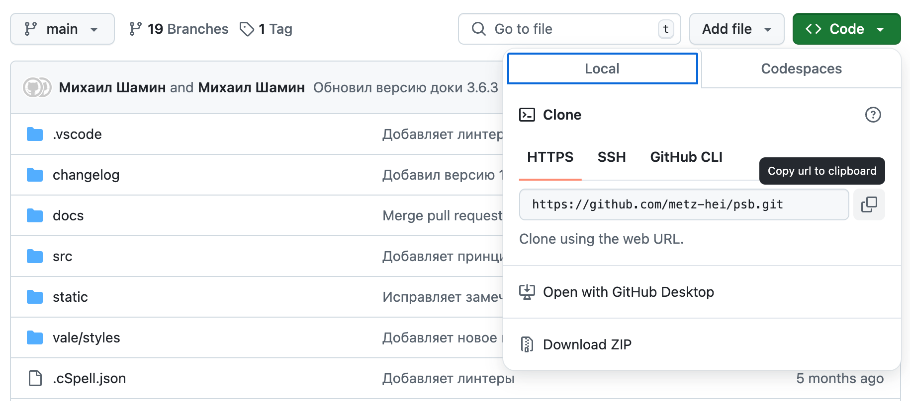

# Как присоединиться к команде паттернов

1. Завести аккаунт [на Гитхаб](https://github.com/)
2. Скачать и установить [VS Code](https://code.visualstudio.com/)
2. Скачать и установить [Node](https://nodejs.org/en/download/prebuilt-installer)
3. Скачать и установить Xcode: 
   - если вы [на маке](https://developer.apple.com/xcode/)
   - если вы [на винде](https://git-scm.com/downloads/win)
4. Скопировать ссылку на проект
   
5. Открыть VS Code и склонировать проект на свой компьютер: ```git clone https://github.com/metz-hei/psb.git```
6. Установить зависимости: ```npm i```
7. Запустить проект: ```npm run start```