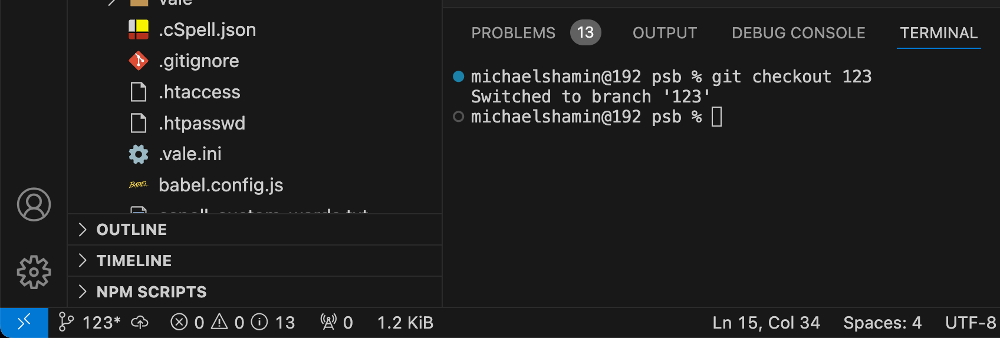
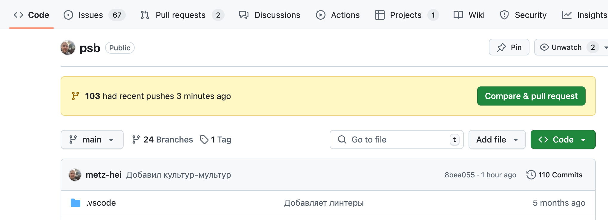

# Как внести изменения в документацию

1. Иметь задачу [в проекте ПСБ Гайды](https://github.com/users/metz-hei/projects/3/views/1).
2. Провести задачу по типичному воркфлоу паттернов.
3. Когда задача готова к созданию MR, актуализировать main-ветку:
   - Убедиться, что ветка main активна: ```git checkout main```:
     - система переключит вас на main,
     - либо выдаст сообщение: Already on 'main'.
   - Подтянуть все изменения из main-ветки: ```git pull```:
     - система обновит содержимое ветки,
     - либо выдаст сообщение: Already up to date.
4. Создать новую ветку от мастера ```git branch 123```, где 123 это номер задачи в проекте ПСБ Гайды.
5. Переключиться на созданную ветку: ```git checkout 123```. Система выдаст сообщение: Switched to branch 'new-branch' 
6. Внести соответствующие изменения в документацию psb → docs → patterns:
   - создать папку с файлом index.md,
   - перенести в папку все изображения, видео и прилагаемые документы,
   - убедиться, что все наименования папок и файлов заданы в английском формате записанные способом kebab-case.
   - убедиться, что все изображения экспортированы в формате @2х, для поддержки ретины.
7. Подготовить файлы к внесению изменений в ветку: ```git add *```.
8. Внести изменения в ветку и оставить комментарий к изменениям: ```git commit -m "Комментарий на русском языке"```
9. Отправить все изменений в репозиторий: ```git push -u origin 123```, где 123 это ветка задачи.
10. Создать Pull Request по кнопке ```Compare & pull request``` в репозитории или по ссылке в терминале.
    
11. Лид паттернов ревьюит PR.
