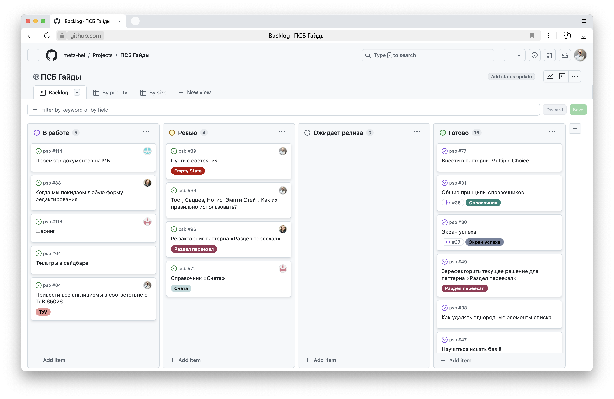

# Культур-мультур
В этом документе описаны правила взаимодействия и внутренней культуры команды паттернов. 

## Что мы тут делаем
Мы унифицируем, разрабатываем и документируем дизайн-паттерны в ПСБ.

Для паттерна у нас есть свое определение: шаблонное решение частой дизайнерской задачи.

Паттерны — это пилотный проект, мы не знаем будет ли он успешным и принесет ли пользу компании, но у нас есть цели, которые помогут нам определить пользу через некоторое время:
1. Сформировать у пользователей привычку к интерфейсам ПСБ, узнаваемость функций и единый юзер экспириенс.
2. Не тратить время на проектирование и реализацию однотипных сценариев.
3. Повысить качество реализации сценариев за счет коллективного проектирования.

При проектировании паттернов мы руководствуемся фундаментальными принципами паттернов.

## Фундаментальные принципы паттернов
### Полезный​
Все решения проектируются через призму пользы для пользователя и банка. В этом нам помогает DoR и набор вопросов с которых дизайнер начинает работу над задачей:
- Что делаем?
- Для кого делаем?
- Зачем это пользователю?
- Как он сейчас решает эту проблему?
- Сколько людей будут этим пользоваться и как часто?
- Какие метрики бизнеса будут затронуты?
- Что будем считать показателем успеха внедрения?

В итоге у дизайнера должен получиться простой и понятный сценарий, движение по которому можно описать фразеологизмом «Как по маслу».

Вопросы помогают нам разобраться не только в болях и потребностях пользователя, но и в пользе для банка. Не стесняйтесь говорить об этом и искать коммерческую или репутационную выгоду.

### Идеальный​
При проектировании сценариев мы руководствуемся ТРИЗовским принципом об идеальном конечном результате и только после консультации с командой упрощаем его, если в этом есть необходимость и достаточные основания.

### Почтительный​
С большим уважением относимся ко времени, деньгам и доверию наших клиентов.

### Фундаментальный​
Мы отдаем предпочтение устоявшимся передовым практикам и избегаем нестандартных паттернов проектирования.

Что нам близко:
- [Закон Фиттса](https://bureau.ru/bb/soviet/20160517/)
- [Эвристики Нильсена](https://habr.com/ru/companies/tele2/articles/708452/)
- [Показатели Шнейдермана](https://habr.com/ru/articles/449994/)
- [Стандарты W3C](https://www.w3.org/) и три столпа: семантичность, адаптивность, кроссбраузерность
- Принцип [Пользовательские данные священны](https://bureau.ru/bb/soviet/20150505/)
- Принцип [Пусть потеет машина](https://www.maximilyahov.ru/blog/all/must-sweat/)
- Принцип [Интерфейс — зло](https://bureau.ru/about/interface-is-evil/)

### Унифицированный​
Все наши продукты и решения выглядят и ощущаются одинаково. Они основываются на дизайн-системе, паттернах и VoT. Все это придает им узнаваемый стиль ПСБ и формирует доверие к бренду.

## Кто делает паттерны​
- Никита Трунов, арт-директор
- Михаил Шамин
- Мария Коршунова
- Маргарита Троянская
- Анна Быковская

## Где берём задачи​
Задачи поступают от дизайн-сообщества банка или от нас самих.

### От нас самих
Тут мы выступаем в качестве экспертов, анализируем сервисы компании, вычленяем однотипные сценарии и заносим их в бэклог. 

Кроме поиска однотипных сценариев, мы должны поддерживать всю имеющуюся документацию в актуальном состоянии, это значит, что мы следим за изменениями в дизайн-системе и VoT и корректируем паттерны. Или наоборот, корректируем дизайн-систему и VoT. Действуем по обстоятельствам, опираясь на здравый смысл и принципы паттернов.

### От дизайн-сообщества
Любой дизайнер и другой стейкхолдер может принести нам задачу. Такие задачи мы принимаем в произвольном виде. Мы не заставляем описывать паттерн и готовить концепты. Мы берем задачу по принципу «как есть». И уже дизайнер из команды паттернов будет разбираться с задачей.

## Где хранятся задачи
[В Джире](https://jira.psbnk.msk.ru/secure/RapidBoard.jspa?rapidView=3142&projectKey=DS&quickFilter=24073): это некая отчетная система, сюда я сам завожу крупные задачи, например, написать новый паттерн и двигаю эти задачи на участников команды, чтобы Никита мог прочекать наши задачи.

[В Гитхабе](https://github.com/metz-hei/psb/issues): наш основной бэклог. Заводите сюда любые задачи, которые посчитаете нужным. Формат заведения — произвольный.

В будущем мы должны прийти к одному инструменту. Скорее всего, это случится, когда Джира импортозаместится. 

## Занятость и встречи​
Команда паттернов работает над паттернами в тех. день — по вторникам. Если вторник выходной, то тех. день пропускается, если не было иных указаний от руководства.

В тех. день мы НЕ работаем на свои команды: не ходим на встречи, не делаем задачи, не созваниваемся на 5 минут. Предупредите об этом свои команды.

### Как проходит день​
- ВТ 10:00. Митинг. Это внутренняя встреча команды, которая проходит по Scrum-регламенту, где каждый член команды отвечает на вопросы: Чем занимался в предыдущий день? Чем будет заниматься сегодня? С какими проблемами столкнулся? На этой же встрече происходит планирование и ретро, пока в произвольном формате.
- ВТ 10:00–17:30. Работаем над своими задачами из бэклога.
- ВТ 17:30. Синк с командой дизайн-системы. На этой встрече мы синхронизируемся с ребятами, рассказываем о своих задачах, узнаем про их. На встрече может присутствовать руководство, отчитываемся о задачах по необходимости.

## Регламент движения задач​
Все задачи живут [на Канбан-доске](https://github.com/users/metz-hei/projects/3/views/1):

### No Status​
Список задач, которые на планировании были набраны из бэклога.

У задач допускается разная степень готовности к проектированию, это значит, что у задачи может не быть никакого описания.

В этом статусе у задачи уже есть ответственный, который определяется на планировании. Когда он готов взять задачу в работу, то перетаскивает её в колонку В работе.

### В работе​
Исполнитель начинает работу над задачей: 
- Создает файл [в Гугл Докс](https://drive.google.com/drive/folders/1hcFq4I5y3dN66uJcqSUnRjLjkFo8QWHa?usp=sharing). 
- Создает файл [в Фигме](https://www.figma.com/files/team/1111976483190922204/project/220159328/%D0%9F%D0%B0%D1%82%D1%82%D0%B5%D1%80%D0%BD%D1%8B?fuid=1177893067449977856).
- Прикладывает ссылки на файлы к своей задаче в Гитхабе.

В первую очередь он разбирается в сути задачи, понимает её пользу, значимость и влияние на текущее положение дел. 

Разобравшись — пишет своё понимание задачи и согласовывает его с командой.

После он начинает детально погружаться в задачу и готовит паттерн к прохождению ревью.

По готовности дизайнер двигает задачу в колонку Ревью.

### Ревью​
В этом статусе дизайнер показывает задачу внешним стейкхолдерам:

#### Обязательно
Одному из лидов дизайн-системы:
- Евгений Баринов
- Роман Ярв

Всем исследователям:
- Алина Новикова
- Мария Симонова
- Ольга Шеметова
- Татьяна Харьковская

#### Опционально
- Лидам разработки (см. в ЕДС: Старшие сотрудники дизайн-системы)
- Никите Трунову, артдир МСБ

Они должны проверить задачу и задать свои вопросы, а исполнитель должен снять эти вопросы и убедиться в готовности задачи к публикации в паттернах.

Если инспекция пройдена, то дизайнер двигает задачу в статус Ожидает релиза. 

Если инспекция не пройдена, то задача возвращается на доработку.

#### Как отправлять доку на ревью
Произвольно. Дизайнер по задаче сам «ловит» всех стейкхолдеров. Отправляйте в Молнию, Элемент, почту и на крайний случай в Телегу. Ваша задача — получить ок.

#### Как долго ждать ответа
Минимум неделю. Дальше действуем по обстоятельствам. Если процесс затягивается, можно поменять ответственного или ещё раз напомнить о задаче.

При этом, если вы отправили кому-то доку, теперь ок от него становится обязательным. Это правило действительно для всех, кроме исследователей.

#### Как понять кого и когда ставить ответственным
Опциональных ревьюеров мы привлекаем только в том случае, если вносим критические изменения в дизайн, которые сильно влияют на код или текущее положение дел. Либо, по собственному желанию, если хотим получить фидбэк по какой-то причине.

### Ожидает релиза на сайт
Здесь задача ждёт своей публикации на сайте.

Приоритет таких задач выше, чем у других. Важно как можно быстрее опубликовать новые изменения.

Опубликовать изменения на сайте можно по инструкции: [Как внести изменения в документацию](../changes/).

Когда дизайнер опубликовал изменения, он ждет, когда лид вольет изменения в мастер. Когда изменения окажутся в мастере, система автоматически передвинет задачу в статус Ожидает релиза на Ньютон.

### Ожидает релиза на Ньютон
Здесь задача ждёт своей публикации на Ньютоне.

## Чем руководствуемся в работе
[Принципами команды](../principles/).

## Release Notes
Периодически, на усмотрение лида, мы публикуем новости об изменениях в проекте. 

Формат публикации произвольный.

О чем важно рассказать:
- о новых паттернах,
- об изменениях в старых,
- о новых задачах в работе.

Публикация осуществляется:
- на сайте в разделе Что нового,
- в Элементе в комнате Паттерны