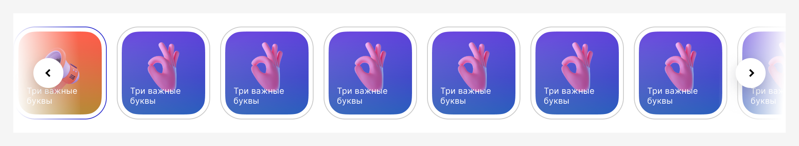
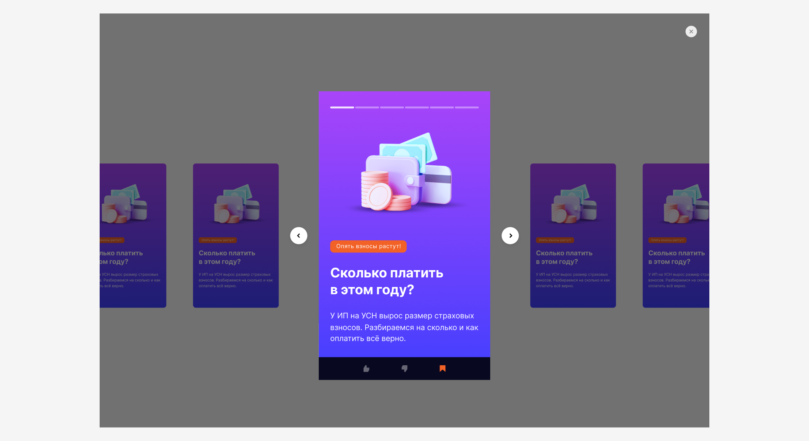
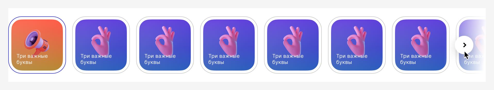
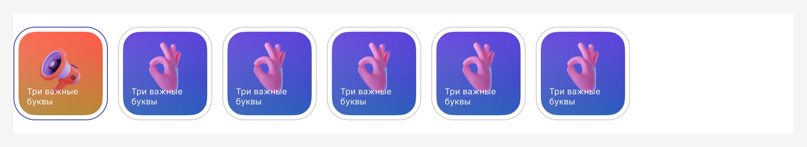

# Carousel
[Фигма](https://www.figma.com/design/gkvm2ZhN87pJWZcD7OLkR0/07-%E2%9C%85-Tools%2C-Carousels%2C-Cards?node-id=0-1&node-type=canvas&t=tPNBB56zwqTz4GwN-0) 

## Когда использовать

1. Ограниченное пространство на экране. 
Карусель эффективно экономит место, показывая несколько элементов в одном блоке.
2. Контент одной категории.
Карусель подходит для связанных элементов, таких как товары, изображения или статьи.
3. Низкоприоритетный контент. 
Если информация не критична для пользователя, карусель помогает визуально сократить пространство без потери ценности.

## Правила пролистывания элементов
### Десктоп

1. Если в карусели в зоне видимости всего 1 элемент (баннер), то пролистывание осуществляется по одному элементу.

2. Если в каруселе 2 и более элементов, то пролистывание осуществляется:
- На величину элементов в карусели, если их достаточно для такого пролистывания, в противном случае на все доступные элементы.
- На величину элементов в карусели −1, если их достаточно для такого пролистывания, в противном случае на все доступные элементы.
- На один элемент.

### Мобайл

1. Пролистывание осуществляется по одному элементу с подскролливанием. Пагинатор обязателен. 

2. Если виднеется начало второго элемента, а пагинатор отсутствует, то пролистывание осуществляется:
- Прокрутка без подскролливания, когда мы можем прокрутить до того момента, когда хотим.
- По одному элементу с подскролливанием.

3. Если виднеется начало второго элемента, пагинатор присутствует, то пролистывание осуществляется:
- По одному элементу с подскролливанием.

Если виден край второго элемента, зона кликабельности виднеющейся зоны должна быть не менее 44 px для удобного нажатия. 

## Способы пролистывания и отображения элементов
### Десктоп

Если в карусели несколько слайдов, то для компонента доступен следующий набор настроек:

Отобразить обе кнопки-стрелки в активном состоянии. В этом случае, карусель зациклена, после последнего слайда, осуществляется переход к первому. И наоборот, от первого к последнему:

Отобразить пагинатор (доступно только для каруселей с 1 элементом в зоне видимости):

Показывать стрелки только при наведении курсора в область компонента:

Если первый или последний элемент карусели находятся в зоне видимости, то не показывать левую и правую стрелки соответственно:

Если первый или последний элемент карусели находятся в зоне видимости, то блокировать левую или правую стрелки соответственнo:

Степпер является дополнительным элементом навигации, а значит каждый степ кликабелен и пролистывает карусель в выбранную часть слайдера. При наведении на степ слайдера немного увеличивать его.

На десктопе способ пролистывания с помощью мыши, методом зажать и тянуть — запрещён. Drag-to-scroll можно оставить для мобильных и touch-устройств, где он уместен.

### Мобайл

Кнопки-стрелки никогда не отображаются в мобильном представлении. 
Тип отображения (пролистывания) с десктопного меняется на отображение 1 элемента, виднеется начало 2 элемента, с пагинатором: 

Если элемент карусели занимает весь экран, то скрывать степпер нельзя:

## Рекомендации по количественному наполнению карусели

Количество элементов в зоне видимости:
- Для десктопа: не более 5 элементов.
- Для мобильных устройств: ограничиться 1–3 элементами.

Максимально допустимое общее количество элементов в карусели:
- Для десктопа: не более 7–10 элементов.
- Для мобильных устройств: до 5–7 элементов.

Рекомендуем дать пользователям возможность достичь последнего элемента в карусели за 3-4 шага (т. е. тапа или свайпа):
Если в зоне видимости карусели отображается 1 элемент — используйте до 5 элементов в общей сложности.
Если в зоне видимости 2 элемента — до 10 элементов.
Если в зоне видимости 3 элемента — до 15 элементов.

## Анимация
### Десктоп

Анимация смены баннеров осуществляется по принципу «уехал — приехал» со скоростью 200 ms. Анимация при перелистывании через степпер такая же.
Анимация перехода от последнего к первому, НЕ через возврат.

### Мобайл
Если элементы карусели расположены таким образом, что на экране видно начало второго элемента, то анимация подскролливания элементов отключается и элементы внутри карусели просто крутятся.

## Горячие клавиши
Убедитесь, что все интерактивные элементы карусели (кнопки "Вперед", "Назад", индикаторы страниц) доступны через клавишу Tab, а Enter активирует выбранный элемент управления. 