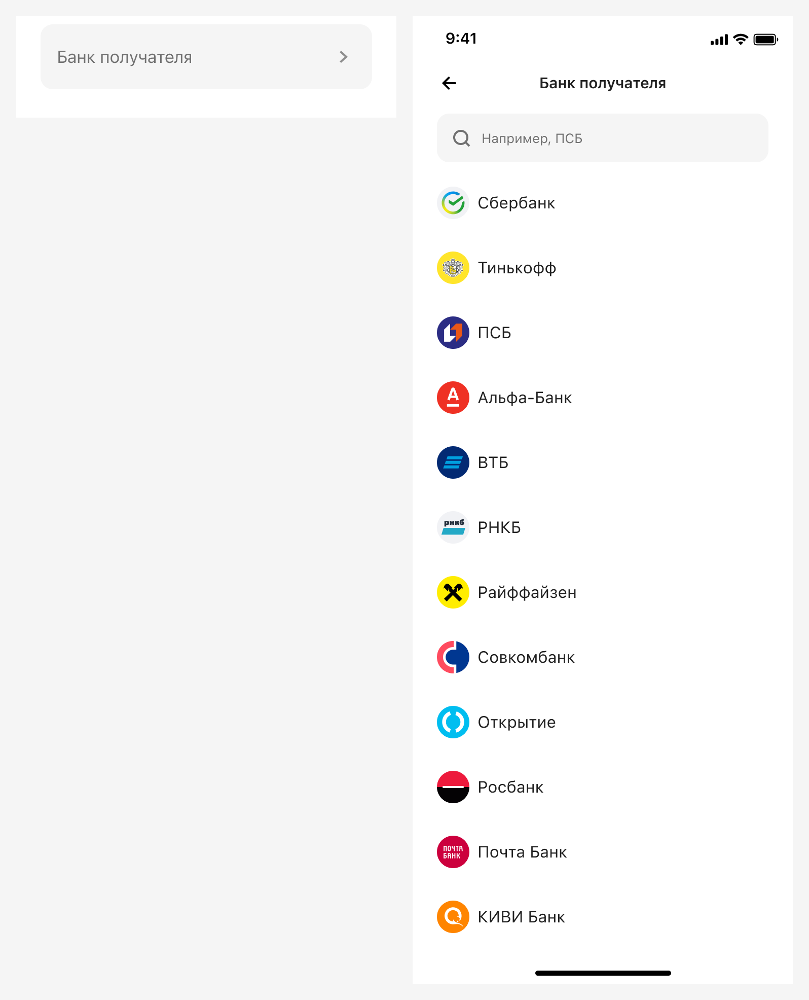
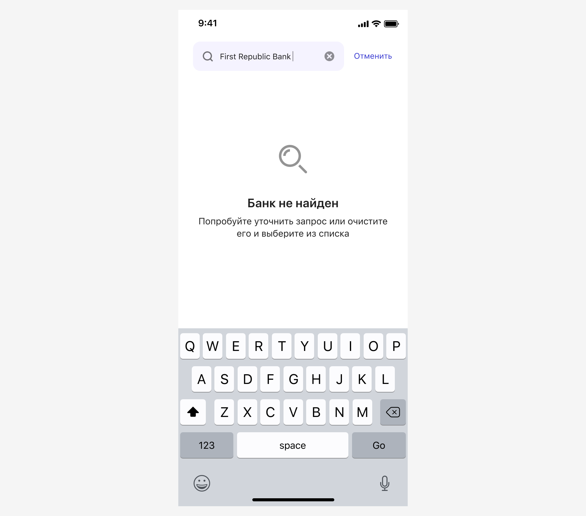

# Банки
[Фигма](https://www.figma.com/design/vcJnk1pjqywou7To3O52Rq/%D0%A1%D0%BF%D1%80%D0%B0%D0%B2%D0%BE%D1%87%D0%BD%D0%B8%D0%BA%D0%B8?node-id=52%3A2562&t=ctPGjlvNgPsIrjJY-1) · [Бэклог](https://jira.psbnk.msk.ru/secure/RapidBoard.jspa?rapidView=3142&projectKey=DS&quickFilter=24073)

## Базовые параметры
| Параметр          | Значение        |
|:----------------- |:----------------|
| Название          | Произвольно     |
| Вызов справочника | Input Select    |
| Обязательность    | Да/Нет          |
| Предзаполнено     | Да/Нет          |
| Порядок значений  | Настраиваемый   |
| Названия значений | Нередактируемые |

## Вызов и отображение справочника

Значения банков выводятся по принципу популярности: от более популярных к менее популярным.

Популярность может быть:
- статичной: когда популярность построена вручную и не меняется при вызове справочника. Например, есть некоторый топ-банков, а остальные банки выводятся в алфавитном порядке. 
- динамичной: когда популярность определяется на основании некоторых критериев, которые команда может определить на свое усмотрение. Например, можно анализировать некоторое количество последних операций с банками и строить список на основании этих данных, показывая выше те банки, которые выбираются чаще. 

Каждый банк имеет иконку, которая обязательно представлена [в библиотеке логотипов](https://www.figma.com/file/QQPmkY46t5KL7meRyJh6bc/%E2%9C%85%F0%9F%93%9A%E2%80%93-%F0%9F%99%8FIcons?type=design&node-id=16213%3A6220&mode=design&t=FzBz3Koiz7BzJffX-1).

## Содержимое и ключевые слова

### Названия
Следите за названиями банков: 
- не пытайтесь в перечислить в названии все возможные варианты написания,
- выберите одно официальное написание: подсмотрите его на сайте банка,
- если встречается краткое и полное написание, выбирайте краткое,
- не пишите слово «банк», если это не официальная часть названия.

| Правильно        | Неправильно                  |
| ---------------- | ---------------------------- |
| Русский Стандарт | RSB+ (Банк Русский Стандарт) |
| VK Pay           | VK Pay - РНКО Деньги.Мэйл.Ру |
| НОВИКОМ          | Банк НОВИКОМ (НОВИКОМБАНК)   |

### Ключевые слова
При всей скудности названий, дайте пользователю возможность найти банк по любым возможным написаниям банка. Например, `Т-Банк` должен найтись при поисковом запросе `Тинькофф`, а `ПСБ` — по `Промсвязьбанк`.

## Предзаполнение
Предзаполнить поле можно любым значением из справочника, на усмотрение дизайнера.

## Валидация
Если поле является обязательным, то выполнять валидацию поля. Текст ошибки может быть изменен в зависимости от названия поля, но начинаться он должен со слова «Выберите», например:

## Поиск
Используется [типовой алгоритм поиска](../search).

Если поиск не дал результатов, то выводим сообщение об этом. Текст ошибки может быть изменен в зависимости от названия поля.

