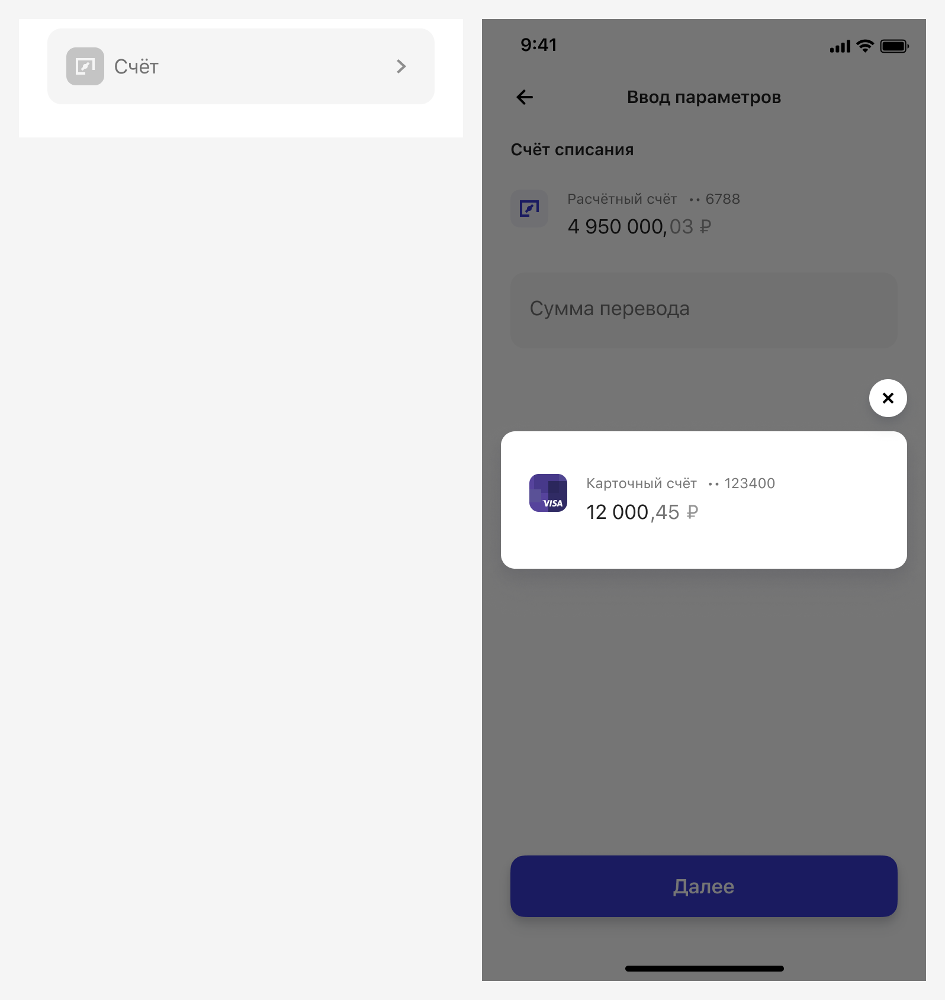
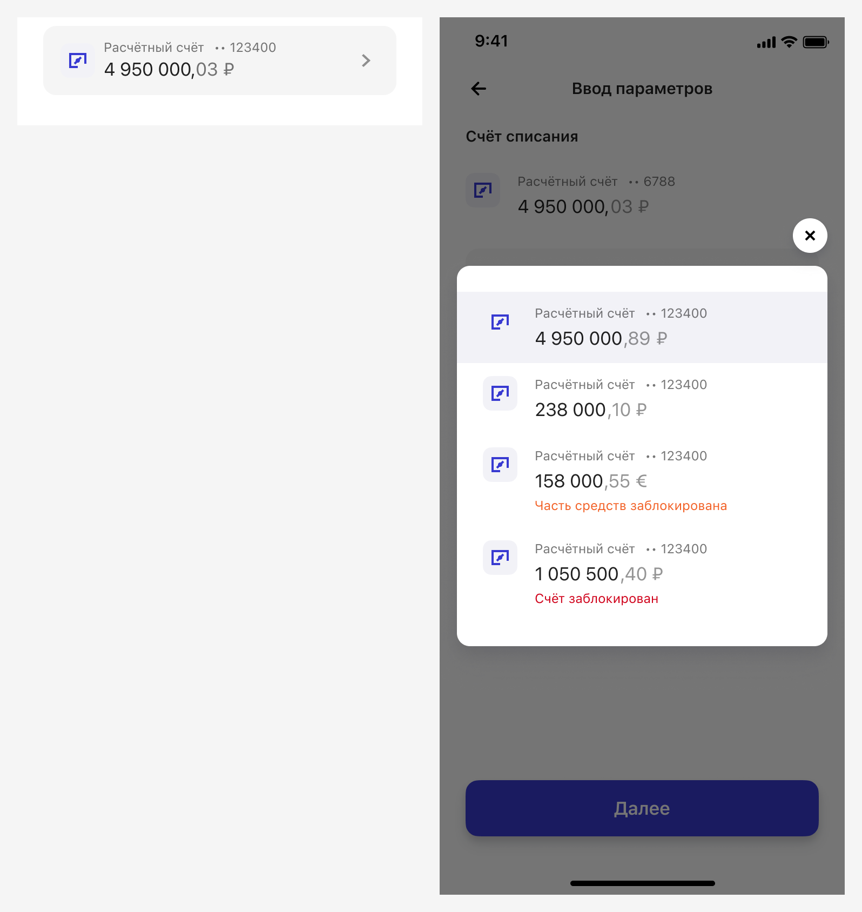
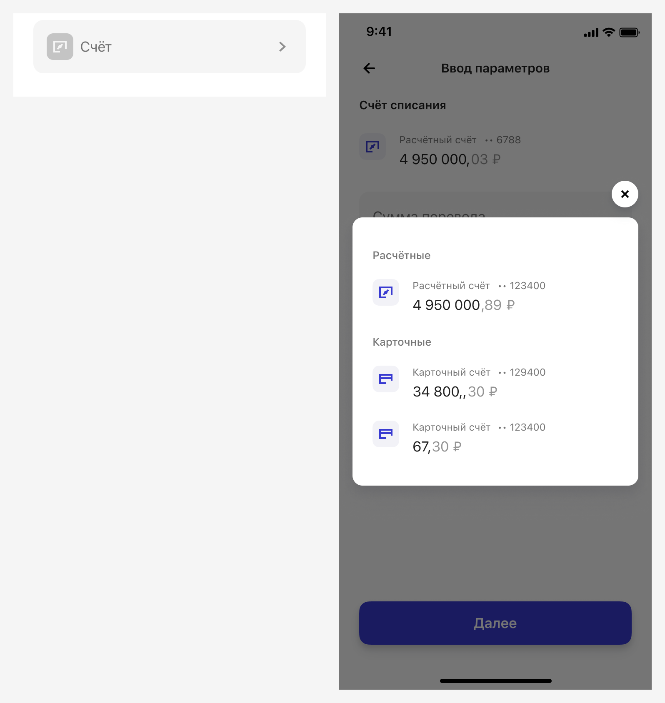
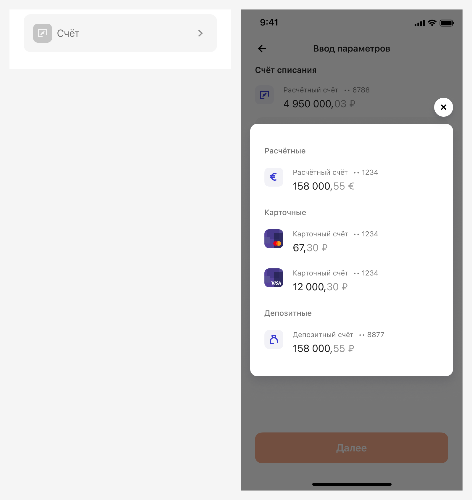
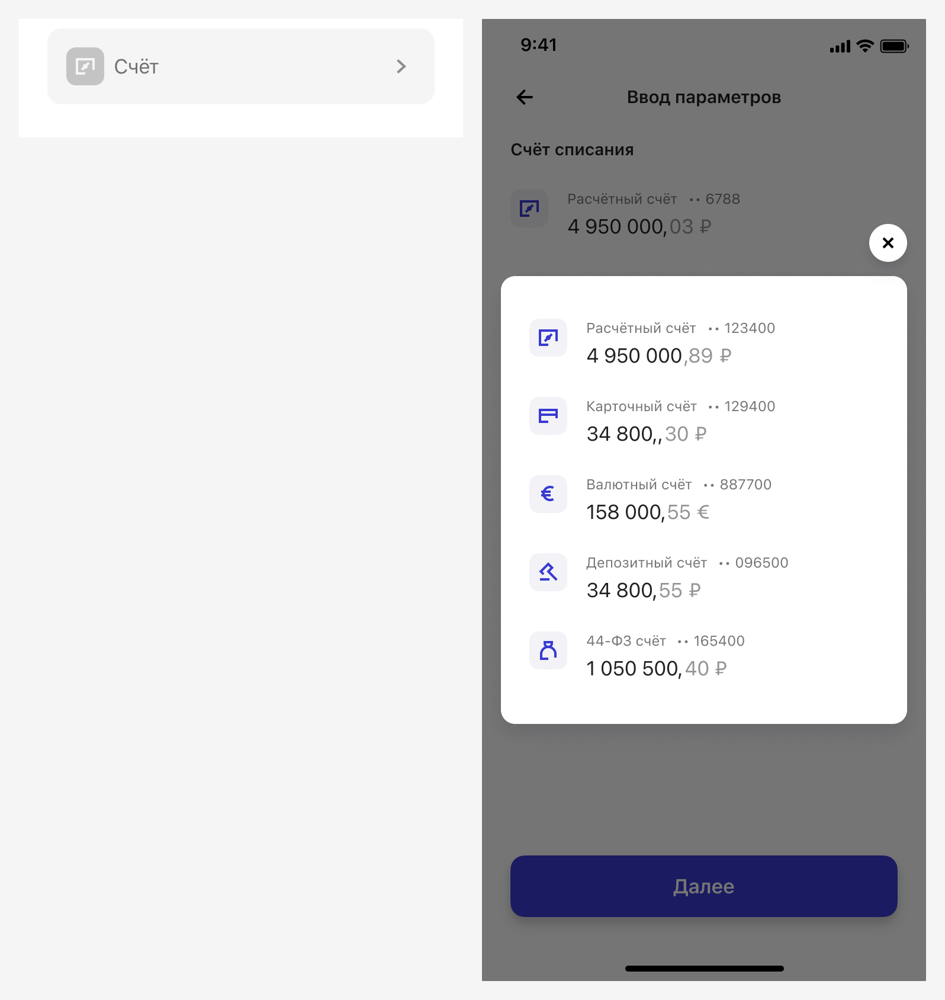
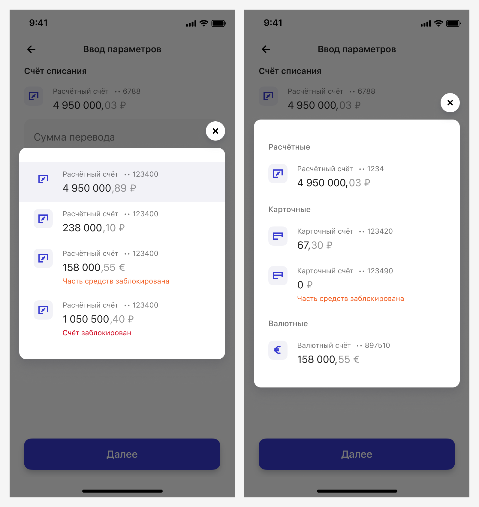
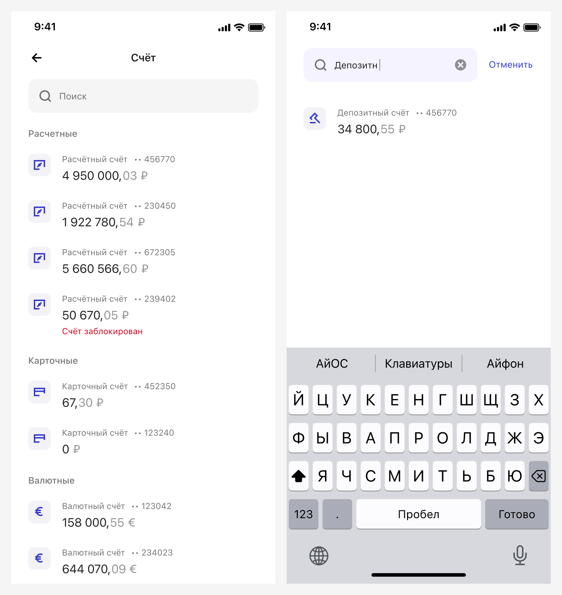

# Счета
[Фигма](https://www.figma.com/design/vcJnk1pjqywou7To3O52Rq/%D0%A1%D0%BF%D1%80%D0%B0%D0%B2%D0%BE%D1%87%D0%BD%D0%B8%D0%BA%D0%B8?node-id=906-24499&node-type=section&t=lOvmFshvJ0XCfVwi-11)

## Базовые параметры
| Параметр          | Значение        |
|:----------------- |:----------------|
| Название          | Произвольно     |
| Вызов справочника | Input Account-Select|
| Компоненты в pop-up selector | Control List: Service component / Retail, Investment, Forward, Forward 2, Account #2, List Card|
| Обязательность    | Да/Нет          |
| Предзаполнено     | Да/Нет          |
| Порядок значений  | Настраиваемый   |
| Названия значений | Нередактируемые |

## Отображение справочника с одним счётом

### Справочник загружен вместе с формой

Если при загрузке формы справочник загрузился, и в нём только один счёт, используем `Control List / Service component / Retail` без возможности перехода в справочник:

### Справочник не загружен вместе с формой

Если при загрузке формы вы не смогли получить список счетов, то используем `Input Account-Select`. 

Подробнее о временных промежутках загрузки справочников читайте в паттерне [«Когда загружать справочники»](../when-to-upload/index.md).

### С несколькими счетами одного типа

### С несколькими счетами разных типов

Если счета разных типов, и хотя бы одного типа > 1, то все счета группируются.

`СМБ`

`РБ`

Если у каждого типа по одному счёту, группировка не производится.

### Сортировка

Группировка по типам: расчётные, карточные, валютные, депозитные, 44-ФЗ.

Дополнительная сортировка: заблокированные счета и счета с нулевым остатком перемещаются в конец группы или списка всех счетов, если они не сгруппированы.

Дизайнер может изменить порядок сортировки по своему усмотрению.

### Предзаполнение

Любое значение из справочника может быть предзаполнено.

Механику предзаполнения можно построить на следующих принципах:
* Счет который выбирался последним в предыдущем прохождении сценария.
* Счет который выбирается чаще остальных.
* Счет который выбирается чаще остальных с этим контрагентом.

Если все счета заблокированы, поле предзаполняется произвольным счётом.

### Поиск по счетам

Можем использовать поиск по счетам, когда приходит большое количество счетов (например, в номинальных счетах). В этом случае используется [типовой алгоритм поиска](../search/index.md).

Искать можно по названию, полному номеру счёта, или другим параметрам, заданными дизайнером. 

### Валидация

Если поле обязательно, то выполнять валидацию поля. Текст ошибки может быть изменён в зависимости от названия поля, но начинаться он должен со слова «Выберите», например:

Валидация заблокированных счетов осуществляется для всех заблокированных или частично заблокированных счетов:

Решение о том, показывать ли заблокированные счета в справочнике, зависит от конкретного случая и остаётся на усмотрение дизайнера.

### Маскирование счёта

Маскирование на текущий момент не установлено. 
Можно ориентироваться на текущее отображение счетов в РБ и МСБ. 

`СМБ`

Последние 6 цифр счёта.

`РБ`

Последние 4 цифры счёта.

