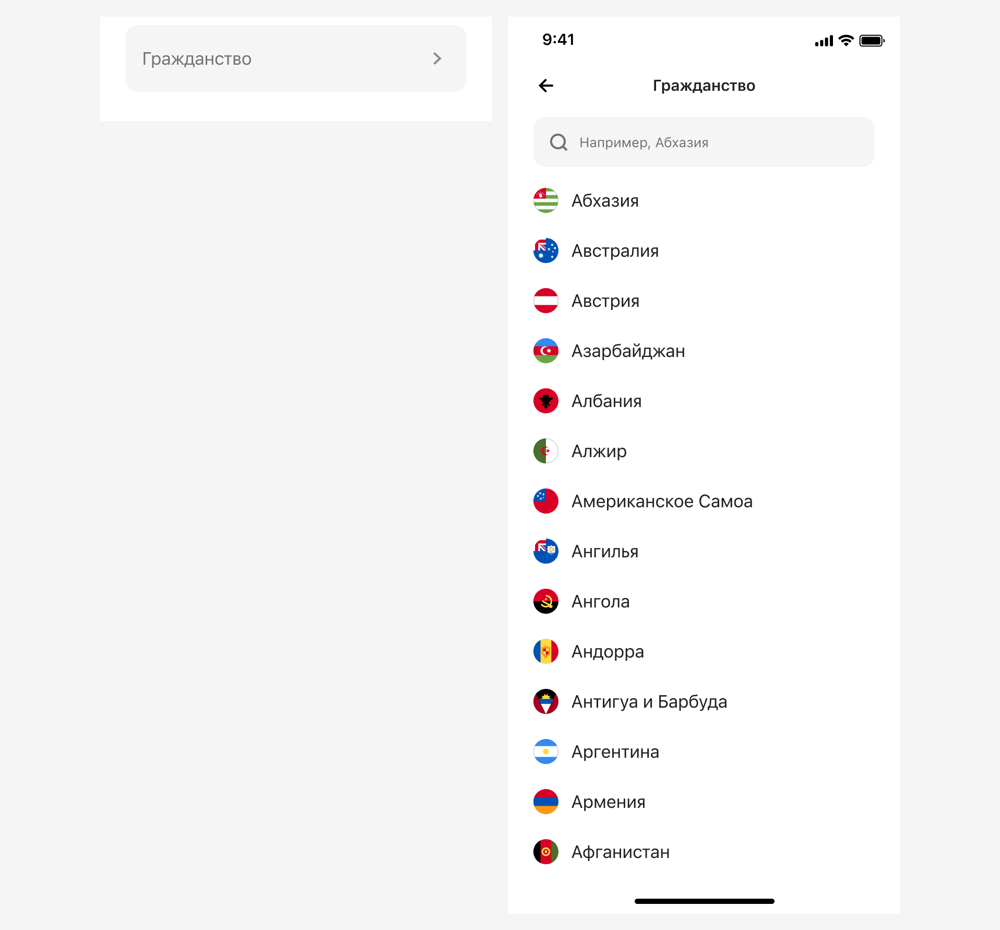
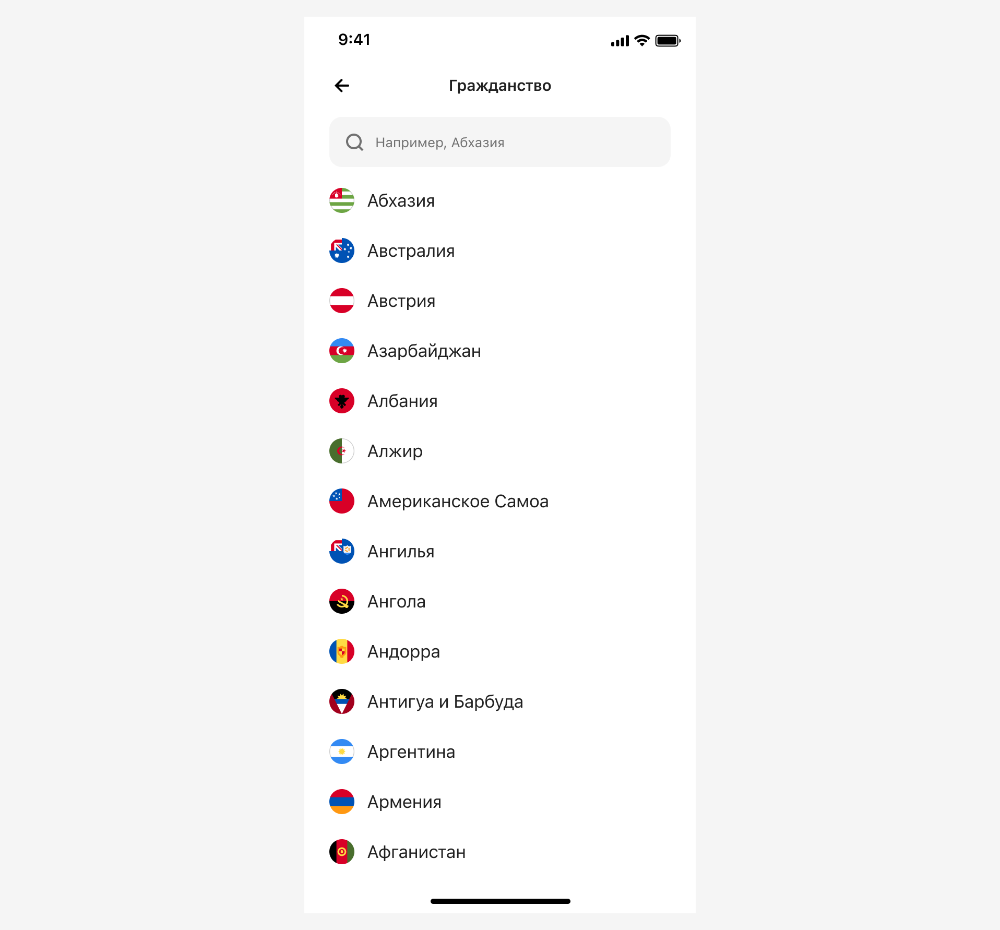
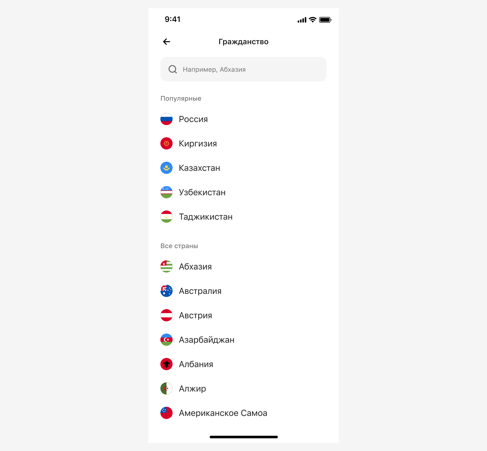
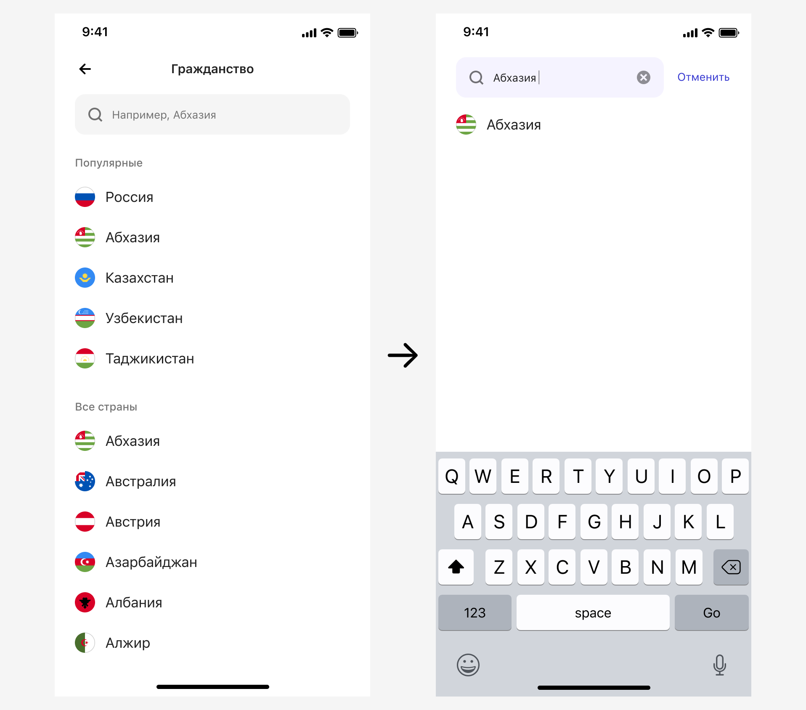

# Страны
[Фигма](https://www.figma.com/design/vcJnk1pjqywou7To3O52Rq/%D0%A1%D0%BF%D1%80%D0%B0%D0%B2%D0%BE%D1%87%D0%BD%D0%B8%D0%BA%D0%B8?node-id=118%3A3606&t=ctPGjlvNgPsIrjJY-1) · [Бэклог](https://jira.psbnk.msk.ru/secure/RapidBoard.jspa?rapidView=3142&projectKey=DS&quickFilter=24073)

## Базовые параметры
| Параметр          | Значение        |
| :---------------- | :-------------- |
| Название          | Произвольно     |
| Вызов справочника | Input Select    |
| Обязательность    | Да/Нет          |
| Предзаполнено     | Да/Нет          |
| Порядок значений  | Настраиваемый   |
| Названия значений | Нередактируемые |

## Вызов и отображение справочника
В справочнике представлены все признанные Россией страны.

Каждая страна имеет иконку, которая обязательно представлена [в библиотеке стран](https://www.figma.com/design/QQPmkY46t5KL7meRyJh6bc/%E2%9C%85%F0%9F%93%9A%E2%80%93-%F0%9F%99%8FIcons?node-id=29498%3A2036&t=5FtdDF4qMHswU6y6-1).

Страны можно выводить одним списком, а можно делить их на группы.

### Группа «Популярные»
Группа всегда выводится первой в списке групп. Количество стран в группе не ограничено.

Популярность может быть:
- статичной: когда популярность построена вручную и не меняется при вызове справочника. 
- динамичной: когда популярность определяется на основании некоторых критериев, которые команда может определить на свое усмотрение. Например, можно анализировать какие страны в вашем сценарии выбираются чаще остальных и на основании этих данных строить список популярных.

Сортировка значений по популярности, где самое популярное значение выше остальных.

### Группа «Все страны»
Здесь всегда отображаются все страны, независимо от того, какие еще группы выведены в справочнике. Например, если в справочнике есть группа «Популярные» и там есть Россия, а за группой «Популярные» выводится группа «Все страны», то здесь Россия тоже будет присутствовать.

Сортировка значений в алфавитном порядке.

### Вывод одной из групп
Предусмотрен вывод одной из групп, например, только группы «Все страны». В этом случае, заголовок группы не отображается.

### Вывод нескольких групп

## Выбранное значение
Выбранное значение подсвечивается в справочнике, но позиция такого элемента, относительно других элементов не меняется.

Если справочник построен на основе нескольких групп и выбранная страна встречается в обеих, то и подсвечена она будет в обеих группах.

## Поиск
Используется [типовой алгоритм поиска](../search/).

Поиск осуществляется по значениям из всех групп, а задублированные значения выводятся в единственном числе. Кроме того, если в справочнике было представлено несколько групп, то при поиске заголовки групп не выводятся.

Если поиск не дал результатов, то выводим сообщение об этом. Текст подсказки не меняется.

## Предзаполнение
Предзаполнить поле можно любым значением из справочника, на усмотрение дизайнера.

## Валидация
Если поле является обязательным, то выполнять валидацию поля. Текст ошибки может быть изменен в зависимости от названия поля, но начинаться он должен со слова «Выберите», например:

