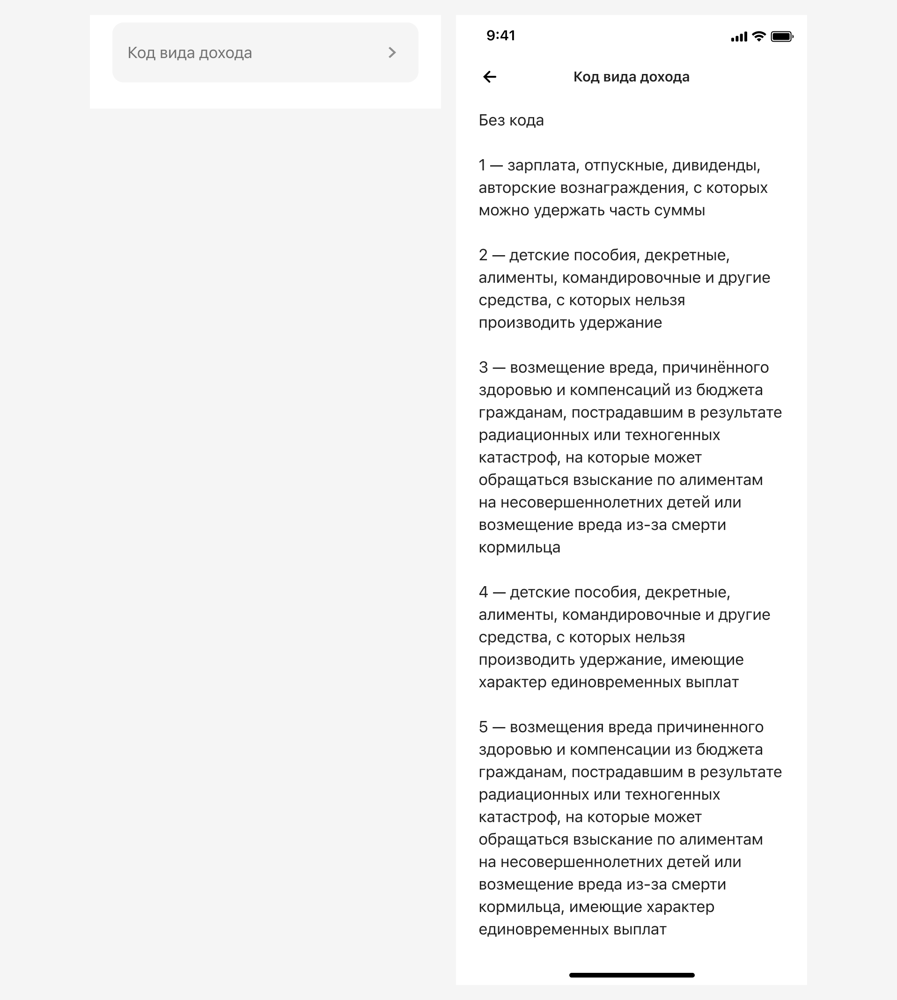

# Код вида дохода
[Фигма](https://www.figma.com/design/vcJnk1pjqywou7To3O52Rq/%D0%A1%D0%BF%D1%80%D0%B0%D0%B2%D0%BE%D1%87%D0%BD%D0%B8%D0%BA%D0%B8?node-id=22%3A1491&t=ctPGjlvNgPsIrjJY-1) · [Бэклог](https://github.com/metz-hei/psb/labels/Код%20вида%20дохода)

## Базовые параметры
| Параметр          | Значение        |
| :---------------- | :-------------- |
| Название          | Код вида дохода |
| Вызов справочника | Input Select    |
| Обязательность    | Да/Нет          |
| Предзаполнено     | Да/Нет          |
| Порядок значений  | Фиксированный   |
| Названия значений | Нередактируемые |

## Вызов и отображение справочника

Так как значения в справочнике длинные, но являются устойчивыми в обиходе, мы не выводим в поле все значение целиком. Выводим только цифру.

## Предзаполнение
Предзаполнить поле можно любым значением из справочника, на усмотрение дизайнера.

## Валидация
Если поле является обязательным, то выполнять валидацию поля. Текст ошибки изменить нельзя.

