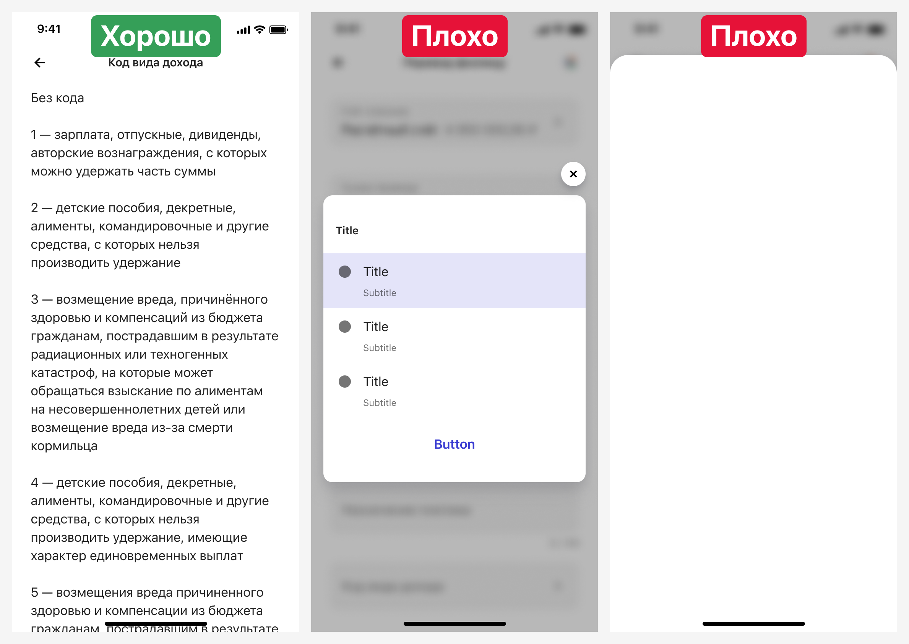
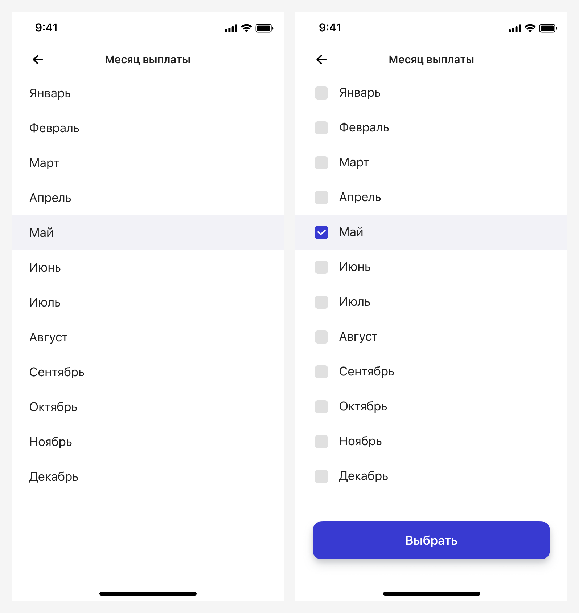
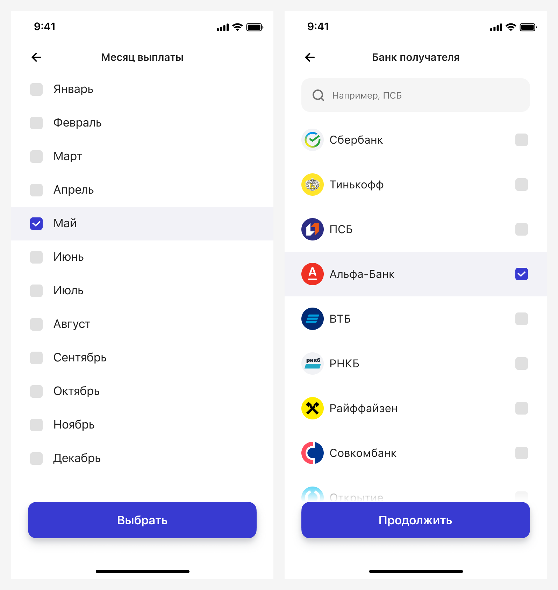

# Справочники
[Фигма](https://www.figma.com/design/vcJnk1pjqywou7To3O52Rq/%D0%A1%D0%BF%D1%80%D0%B0%D0%B2%D0%BE%D1%87%D0%BD%D0%B8%D0%BA%D0%B8?node-id=0%3A1&t=rBxW1OOzYNj348qg-1) · [Бэклог](https://jira.psbnk.msk.ru/secure/RapidBoard.jspa?rapidView=3142&projectKey=DS&quickFilter=24073)

Справочник — это набор данных, имеющих одинаковую структуру и списочный характер.

Некоторые справочники задокументированы, если не нашли свой справочник, спроектируйте его самостоятельно, опираясь на общие принципы.

## Общие принципы для мобильных справочников
- При вызове справочника через `Input Select`, справочник отображается на отдельном экране.
  
- При вызове справочника через `Input Account Select` [справочник отображается в поп-апе](./bill/index.md).  
- Выбранное значение в справочнике подсвечивается через токен `colorOnBackgroundThird`.
  
- Если сценарий подразумевает одиночный выбор, то значение из справочника выбирается сразу, без дополнительного подтверждения.
- Если сценарий подразумевает множественный выбор значений из справочника и справочник является частью формы, то используем компонент `Input Select Multiple Choice`.
- При множественном выборе во все элементы списка добавляются чекбоксы. Если у элементов списка слева есть иконки, то чекбокс добавляется справа. Если иконок нет, то — слева. Кроме того, на экране справочника появляется кнопка в реализации `Button Gradient`.
  
- Справочник всегда появляется справа налево, неважно как он был вызван.
- Поиск по справочнику осуществляется через компонент `Input Search Bar`.
- Если справочник вызывается из компонента `Input Select`, то: 
  - в названии поля мы никогда не пишем слово «Выберите»,
  - лейбл и экран справочника должны иметь одинаковые названия.
- В случае, если значение из справочника было предзаполнено или выбрано ранее и вызвано повторное открытие справочника:
  - то, позиция выбранного значения не меняется, оно не переносится вверх списка нарушая принципы сортировки,
  - подскролл к выбранному значению не происходит.
- Дизайнер никогда не прячет значения справочника, потому что внешний вид этих значений помогает пользователю быстрее сориентироваться в поиском запросе, чем просто подсказка в поле поиска.

