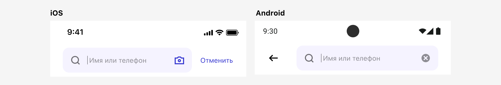
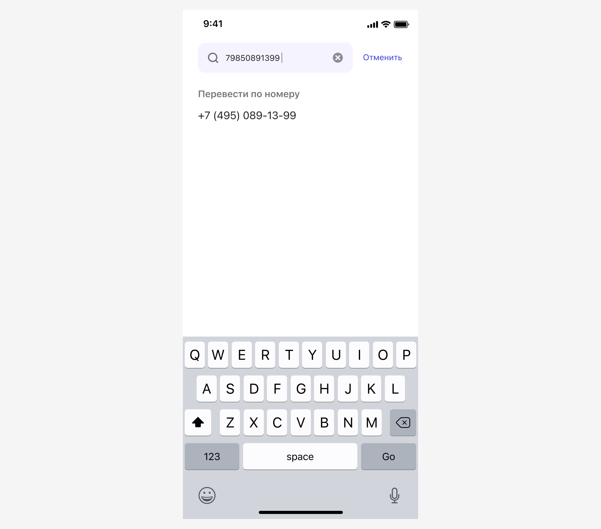
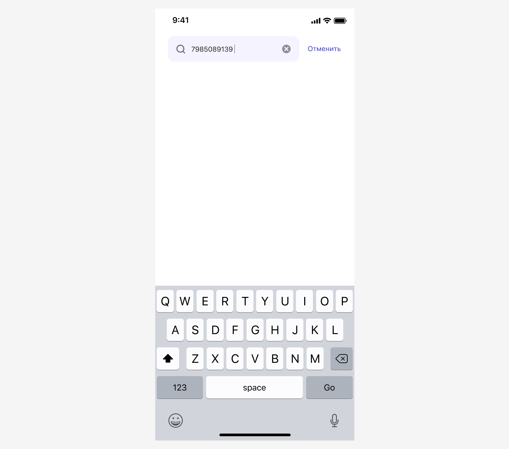
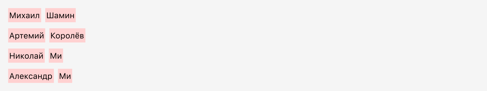
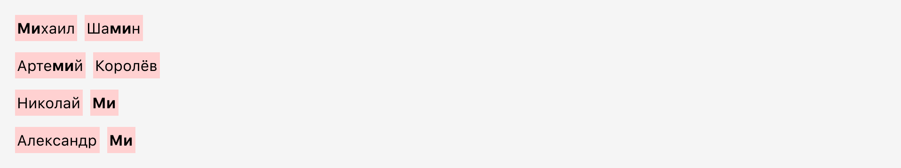
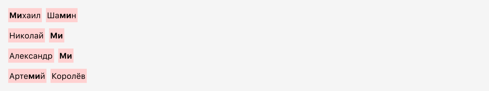
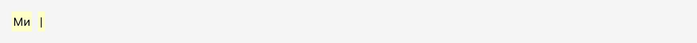
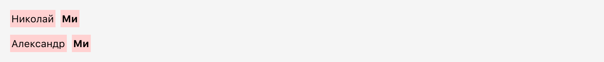
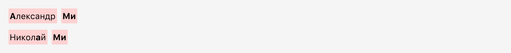
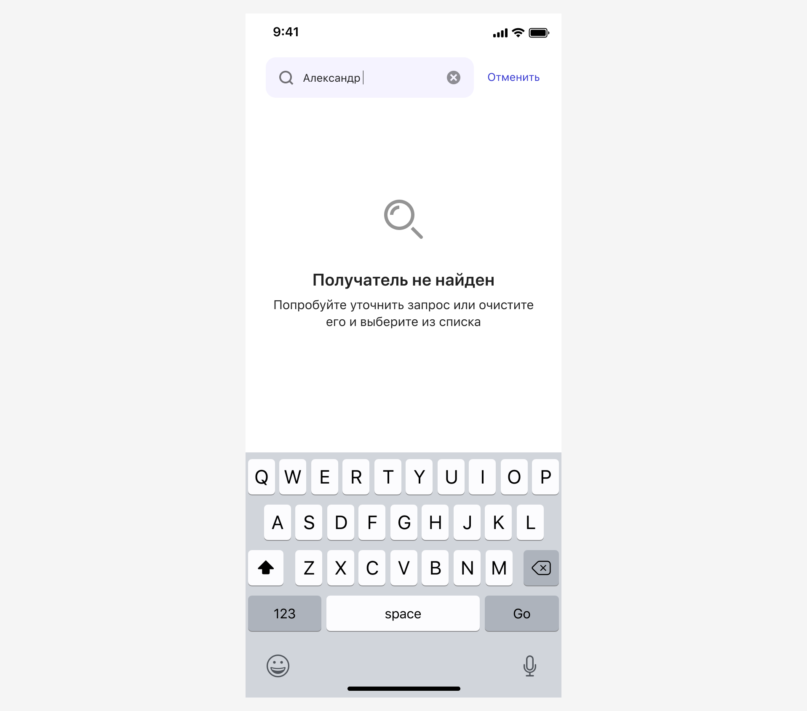

# Поиск по справочникам

[Бэклог](https://github.com/metz-hei/psb/labels/Поиск%20по%20справочникам)

Алгоритм поиска подходит для использования в любом справочнике. Ниже описана работа алгоритма на примере справочника «Телефонная книга».

## Компонент

| Параметр          | Значение        |
| :---------------- | :-------------- |
| Компонент         | Input Search bar   |
| Плейсхолдер       | Произвольно    |
| Маска    | Нет          |
| Фокус по умолчанию     | Да/Нет          |
| Снятие фокуса  | 1. Если тапнуть по неактивному месту 2. Если проскроллить листинг значений 3. Нажать на кнопку Отменить |
| Клавиатура | iOS: `asciiCapable` по умолчанию. [В других ситуациях](https://developer.apple.com/design/human-interface-guidelines/virtual-keyboards). Android: ??. Если клавиатура буквенная, то в зависимости от контекста, пытаемся поднять клавиатуру в нужной раскладке. Например, если в поле ожидается ввод русских символов, то поднимаем клавиатуру с русской раскладкой. |

## Алгоритм поиска
### Общие принципы
1. Если вывод значений был с группировкой, то отключать группировку при поиске.
2. Не выделять найденные совпадения в значениях
3. Начинать поиск при вводе первого символа.

### Поиск по телефону
Очищать значение из поиска от всех символов, кроме цифр. Искать совпадения по вхождению без учета всех символов, кроме цифр. Ранжировать выше значения с совпадениями вначале значений.

Если в процессе поиска не нашлось совпадения, но значение в поле поиска похоже на телефон, то форматировать такое значение по маске и предлагать его к выбору:

**Какие значения считать похожими на российский номер телефона?**
- Любая комбинация из 10 цифр, если она начинается не на 7.
- Любая комбинация из 11 цифр начинающаяся с 7 или 8.

Если пользователь использует при наборе не цифры, то позволять их вводить, но игнорировать при определении номера.

Форматировать российские номера по маске: +7 (000) 000-00-00

Если значение в поле поиска похоже на телефон, но полностью не удовлетворяет принципам похожести, оставлять зону результатов поиска пустой.

### Поиск по имени контакта
В справочнике контактов есть несколько контактов. DISPLAY_NAME каждого контакта засплитовано по пробелу:

Пользователь вводит значение:

Система осуществляет поиск по вхождению в каждое значение справочника:

Так как у трех значений есть совпадение вначале слов, такие контакты показываются выше:

Пользователь продолжает ввод и ставит пробел:

Система интерпретирует это как фиксацию первого ключевого слова. И перестает искать совпадения по вхождению, переходит на поиск по точному совпадению среди найденных ранее значений.

Совпавшие значения исключаются из дальнейшего поиска.

Пользователь продолжает ввод и ставит букву А:

Система продолжает поиск с учетом первого ключевого слова. Система проверяет на предмет вхождения второе ключевое слово во всех значениях найденных ранее контактов.

Совпадения найдены в обоих контактах, но у одного из них есть совпадение вначале значения. Система повышает позицию такого контакта:

Пользователь продолжает ввод и ставит букву л:

Система проверяет на предмет вхождения второе ключевое слово во всех значениях найденных ранее контактов.

Совпадения найдены только в первом:

Если поиск не дал результатов, то выводим сообщение об этом. Текст ошибки может быть изменен в зависимости от названия поля.

