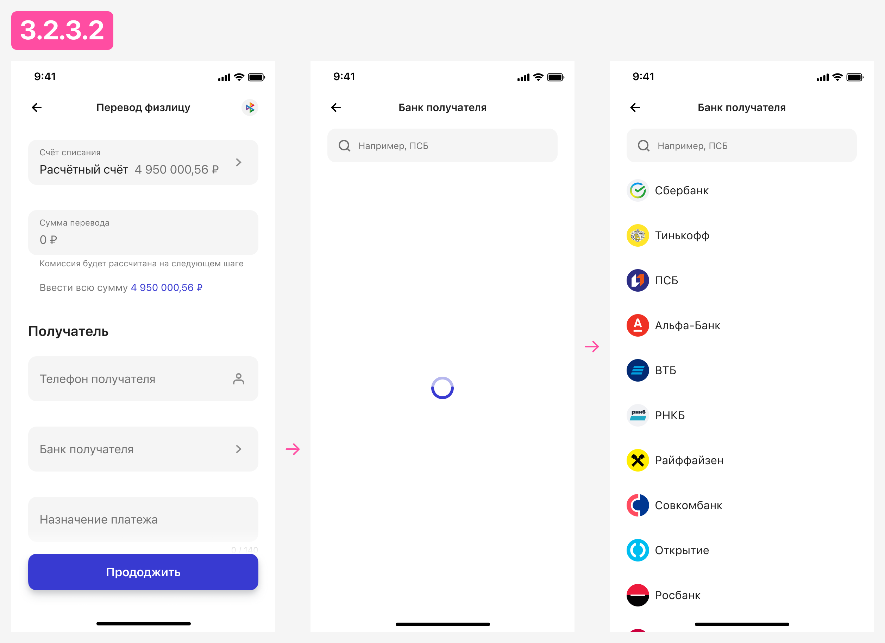
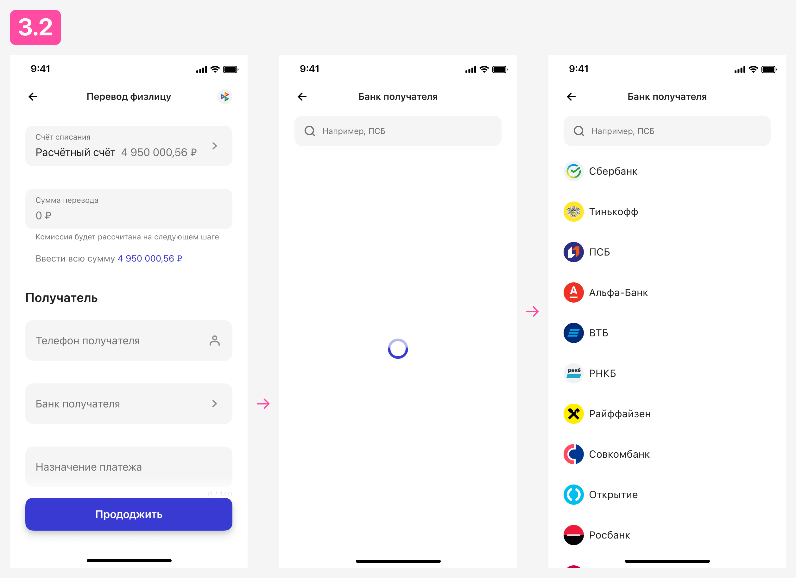

# Когда загружать справочники
Загрузить справочник можно в разный отрезок времени. Выбирайте наиболее подходящий вариант, чтобы создать приятный юзер экспириенс.

## В момент загрузки страницы
Справочник загружается вместе со страницей с которой он вызывается.

### Подойдет
Когда поле со справочником имеет предзаполненное значение. Соответственно, чтобы его предзаполнить придется загрузить справочник, если бэкенд не умеет отдавать только предзаполненные значения, в этом случае см. вариант «При вызове».

Когда поле со справочником не предзаполняется, но находится в начале страницы и велика вероятность, что пользователь вызовет его в первую очередь. В этом случае, логично подгрузить справочник сразу, чтобы при вызове справочника страница с ним открылась мгновенно.

### Плюсы
Все загруженные ранее справочники откроются мгновенно.

### Минусы
- На загрузку справочника уходит какое-то время, и всё это время пользователь не может пользоваться основной страницей.
- Справочники, которые не загружались, придется загружать отдельно.
- Если хотя бы один справочник на странице не загрузится, то формой ввода уже не воспользоваться и надо перезапускать экран.

### Как это выглядит
* 1\. Пользователь вызывает экран с предзаполненными справочниками.
* 2\. Система осуществляет переход на экран.
* 3\. Система визуализирует загрузку данных: 
  * 3\.1\. Система отображает навбар + Skeleton. Предпочтительный вариант.
  * 3\.2\. Система отображает пустой экран с незаполненными полями, накладывает Popup Overlay + Preloader и блокирует взаимодействие с экраном.
  * 3\.3\. Система отображает только навбар + Preloader.
* 4\. Система начинает выполнять необходимые проверки и загружать данные, в том числе для справочников.
* 5\. После полной загрузки всех данных, система закрывает Popup Overlay + Preloader и обновляет экран, обогащая незаполненные поля загруженными данными.

## Асинхронно
Справочник загружается в фоне, после загрузки страницы с которой он вызывается.

### Подойдет
Когда поле со справочником не предзаполняется и не является первым в сценарии взаимодействия пользователя со страницей.

### Плюсы
- Пользователь быстрее начинает взаимодействовать с материнской страницей.
- Пользователь не ждет загрузки справочника.
- Если справочник успел загрузиться до его вызова пользователем, то страница со справочником откроется мгновенно, что создаст ощущение быстродействия системы.

### Минусы
Если справочник не успеет загрузиться, то нам все равно придется показать его загрузку при вызове.

### Как это выглядит
* 1\. Пользователь вызывает экран с непредзаполненными справочниками.
* 2\. Система осуществляет переход на экран.
* 3\. Система начинает в фоне загружать необходимые справочники:
  * 3\.1\. Система успевает их загрузить до вызова этих справочников пользователем.
    * 3\.1\.1\. Пользователь вызывает произвольный справочник.
    * 3\.1\.2\. Система отображает его мгновенно.
  * 3\.2\. Система не успевает их загрузить до вызова этих справочников пользователем:
    * 3\.2\.1\. Пользователь вызывает произвольный справочник.
    * 3\.2\.2\. Система осуществляет переход на экран со справочником, где сразу отображается Nav Bar или Input Search bar.
    * 3\.2\.3\. Система дожидается завершения асинхронного запроса и визуализирует этот процесс:
      * 3\.2\.3\.1\. Через Skeleton. Предпочтительный вариант.
      * 3\.2\.3\.2\. Через Preloader.

## При вызове
Запрос на загрузку справочника отправляется при вызове этого справочника.

### Плюсы
Если у вас есть предзаполненные поля, а бэкенд умеет возвращать значения для этих полей без загрузки справочника. Такой подход значительно сэкономит время и ресурсы. Особенно, если на экране требуется не один справочник, а несколько. 

Идеально подойдет, если в сценарии используются справочники, предзаполненные значения которых изменяются пользователями крайне редко.

### Минусы
Справочник всегда открывается с задержкой, большой или маленькой: зависит от сервера и канала связи. Из-за задержки пользователь сталкивается с появлением лоадера, что вызывает ощущение тормознутости интерфейса и системы.

### Как это выглядит
* 1\. Пользователь вызывает экран с произвольным справочником.
* 2\. Система осуществляет переход на экран со справочником, где сразу отображается Nav Bar или Input Search bar.
* 3\. Система загружает данные справочника, выполняет необходимые манипуляции со списком значений и визуализирует загрузку данных: 
  * 3\.1\. Система отображает навбар + Skeleton. Предпочтительный вариант.
  * 3\.2\. Система отображает только навбар + Preloader.
* 4\. Загрузив справочник система отрисовывает листинг значений.

## Что мы рекомендуем
Подходите к выбору с умом, у каждого способа есть преимущества и недостатки. Опирайтесь на свой сценарий и комбинируйте варианты. Предполагаем, что большинство кейсов можно покрыть симбиозом способов «Асинхронно» и «При вызове».

Загружайте справочники асинхронно, а если они не загрузились, например: не успели или загрузились с ошибкой, то вызывайте их загрузку повторно при вызове.

## Ошибки при загрузке справочника
Если при загрузке справочника произошла ошибка, то отображаем Empty State:

И даем пользователю возможность перезапросить справочник через жест Pull to Refresh или вернуться на предыдущую страницу и снова вызвать справочник.
