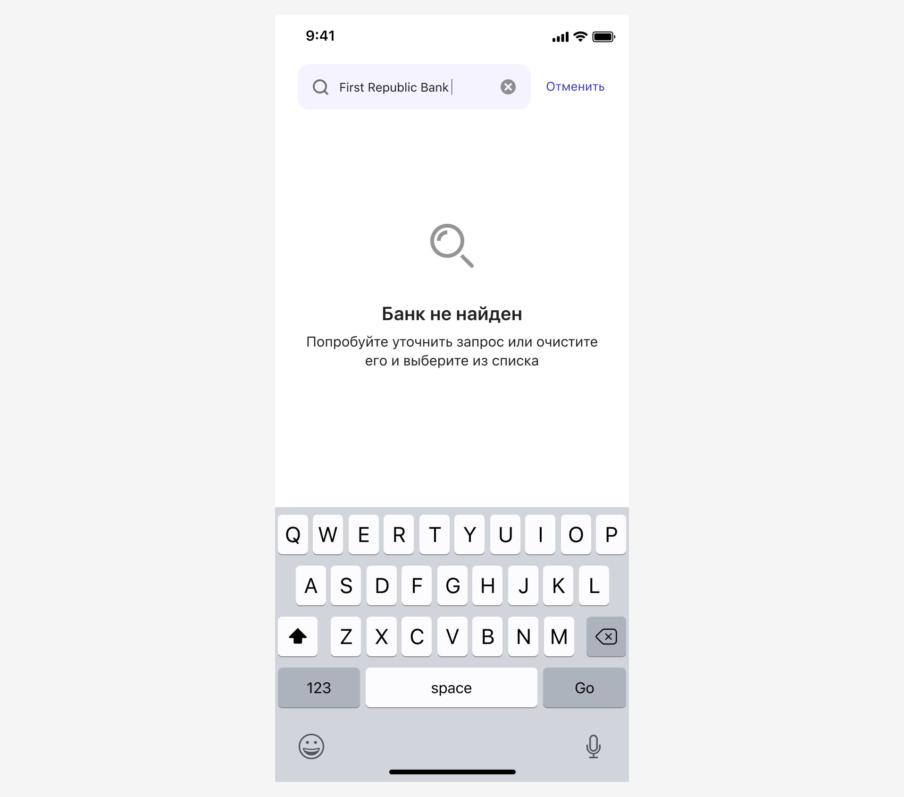
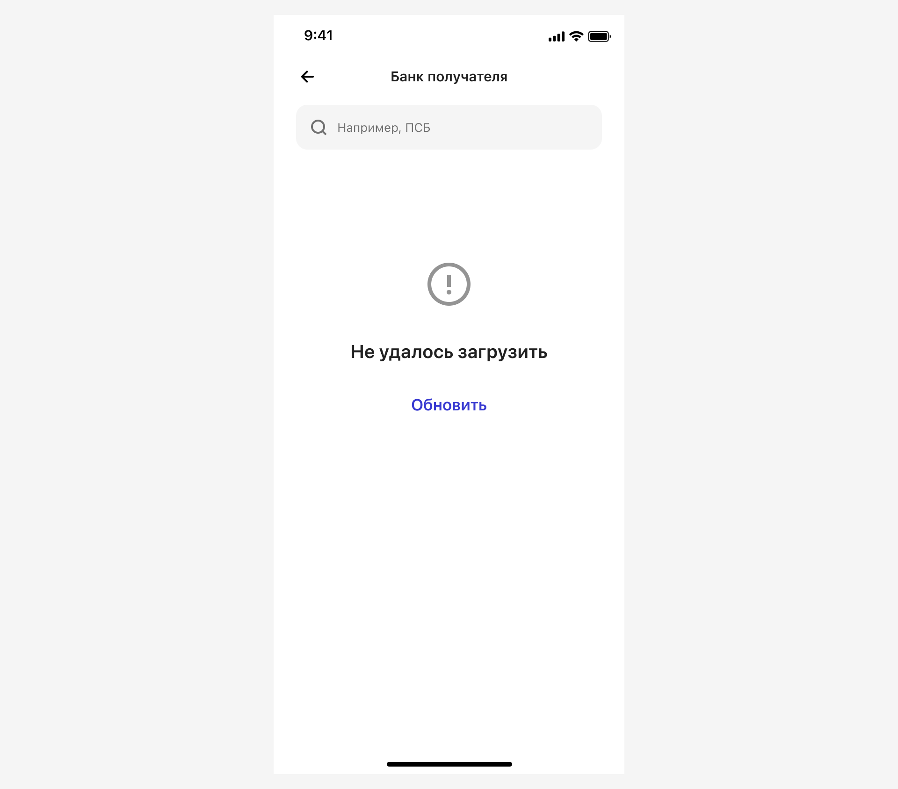
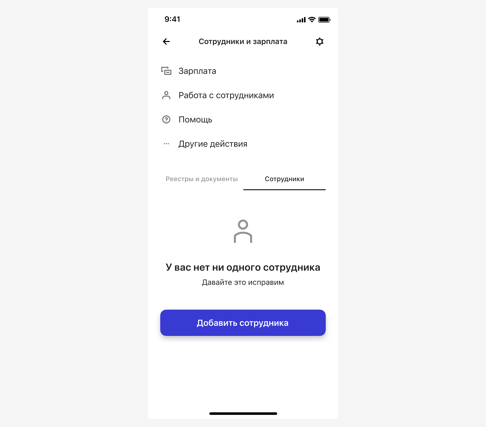
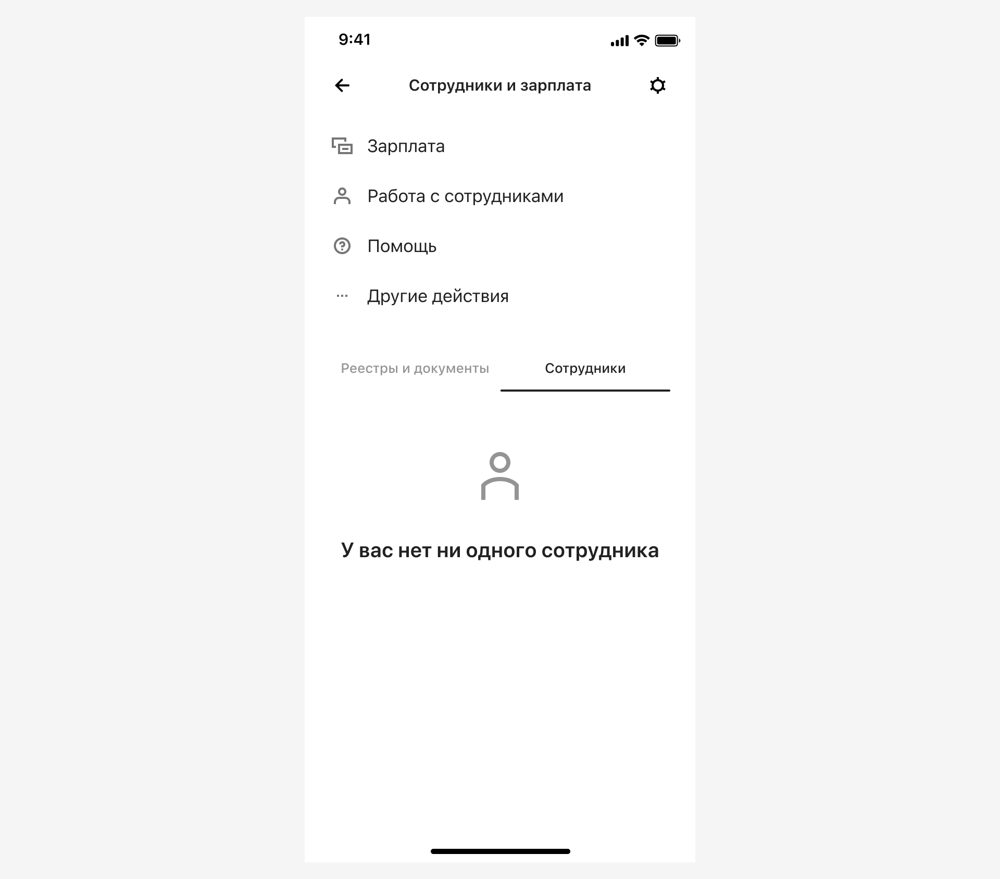
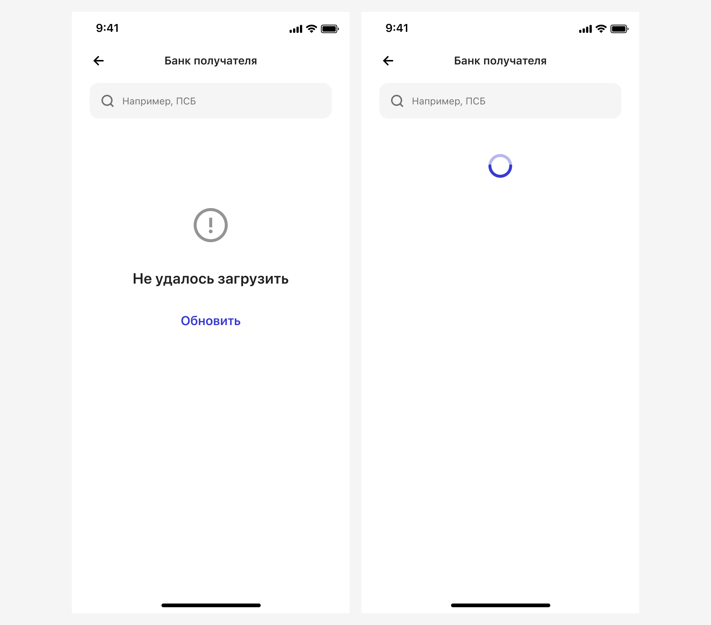
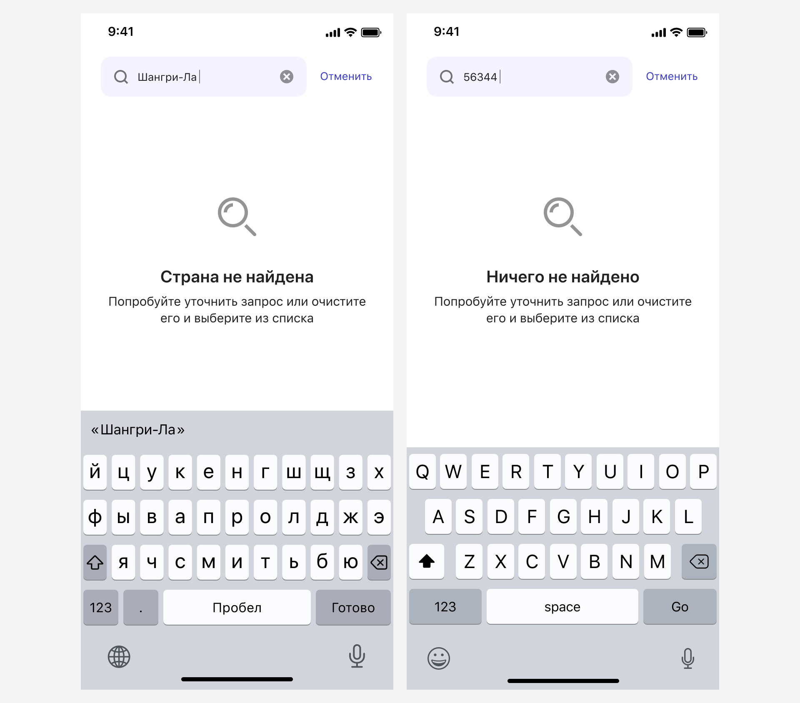
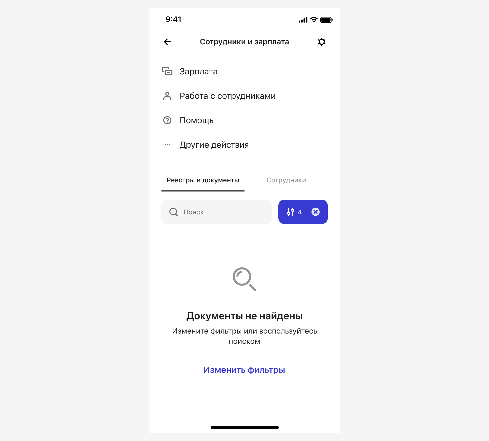
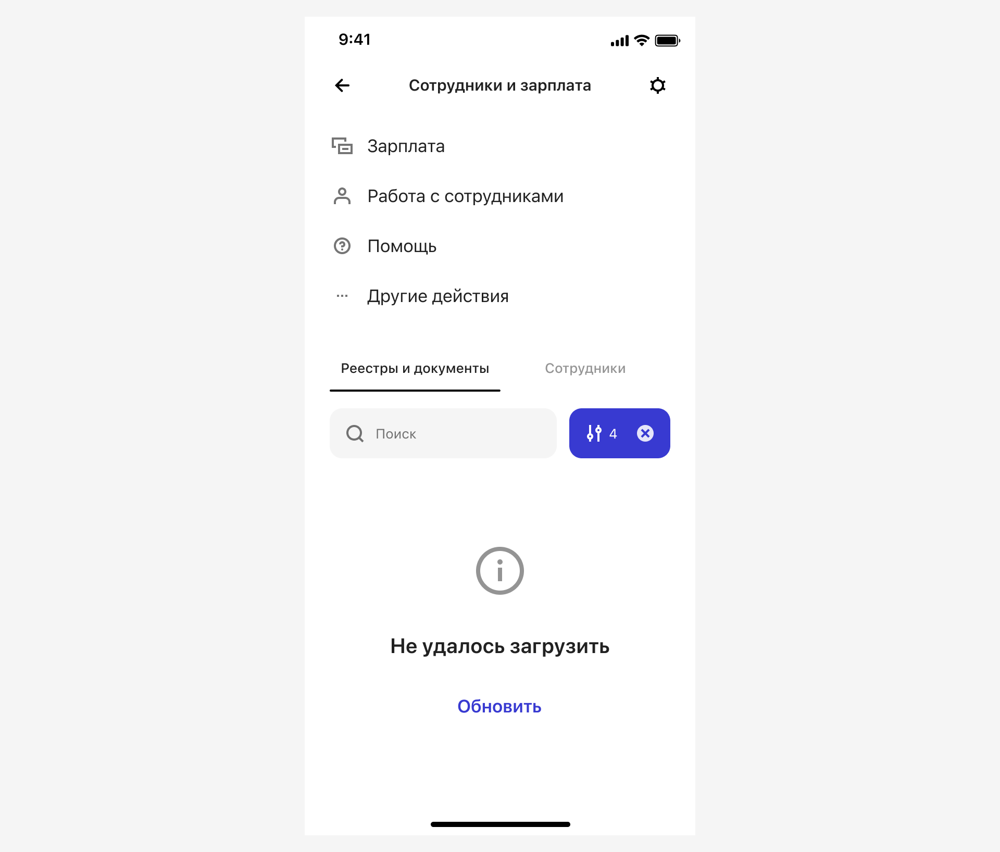

# Пустое состояние

[Экраны](https://www.figma.com/design/r1I7dP440MhW5G4i8PrYrN/%D0%9F%D1%83%D1%81%D1%82%D1%8B%D0%B5-%D1%81%D0%BE%D1%81%D1%82%D0%BE%D1%8F%D0%BD%D0%B8%D1%8F?node-id=0-1&t=NCAkSZGiiYcX03Oo-1) · [Компонент](https://www.figma.com/design/G4Y5zzmntFmcu9DQ0XbyGa/06-%E2%9C%85-Table-Controls?node-id=17120-166450&t=vMjJbJPSoMIoiy9d-1)

Подходит для отображения состояния экрана или области экрана, который содержит или может содержать какой-либо список элементов с которым пользователь может взаимодействовать: создавать, удалять, фильтровать, выбирать:

Под списком элементов следует понимать любой список значений приходящий к нам с бэка или зашитый на фронте. Но, например, список преимуществ продукта на лендинге сюда не следует относить, это список с которым нельзя взаимодействовать, а значит и Empty State он получить не сможет.

Empty State подойдет и для отображения ошибок в этих же списках:

Мы выделяем несколько видов пустых состояний:

## Нет данных
Если пользователь получил пустое состояние просто перейдя на экран.

### Может повлиять на список
В случае, когда пользователь может наполнять список, предусмотрена возможность добавления специальной кнопки. Добавлять или не добавлять кнопку решает дизайнер.

### Не может повлиять на список

### Ошибка
Если пустое состояние случилось в результате ошибки загрузки списка значений:

Предусмотрите возможность для пользователя переотправить запрос.

Экран сочетает в себе два способа переотправки запроса:
- Через кнопку «Обновить», 
- Через жест «Pull To Refresh».

Выбирайте подходящий вариант на основании сценария и функциональных возможностей.

Например, если пустое состояние занимает всю область экрана, то Pull To Refresh подходит, а если пустое состояние это лишь часть экрана, например, содержимое какого-то модуля или блока, то Pull To Refresh конкретно для него не получится вызвать — используйте только кнопку.

## В результате поиска или применение фильтров
Это пустое состояние, которое пользователь получит в результате поиска или применения фильтров.

### Поиск
Если экран содержит список значений, но в результате поискового запроса система не смогла найти релевантное значение, то формируем экран по следующим принципам:

#### Иконка
Необходимо использовать иконку Search из сета.

#### Заголовок
Если поиск осуществляется по списку с однотипными данными, то на первый план выносим объект поиска в виде существительного и добавляем к нему краткое причастие «не найден» в соответствующей форме.

Например:
- Если поиск осуществляется по справочнику стран, то пишем: Страна не найдена.
- По списку вкладов: Вклад не найден.
- По списку контрагентов: Контрагент не найден.

Если поиск осуществляется по списку в котором встречаются разные данные, например, платёжные поручения, операции сбп, различные документы, то можно написать «Ничего не найдено».

#### Описание
Попробуйте уточнить запрос или очистите его и выберите из списка.

Если экран содержит список значений и, кроме поиска, у пользователя есть альтернативный вариант фильтрации этих значений с помощью заготовленных фильтров:

|           |                                                         |
| --------- | ------------------------------------------------------- |
| Иконка    | [см. Поиск](./#поиск)                                   |
| Заголовок | [см. Поиск](./#поиск)                                   |
| Описание  | Попробуйте уточнить запрос или воспользуйтесь фильтрами |

Если экран **не** содержит списка значений:

|           |                            |
| --------- | -------------------------- |
| Иконка    | [см. Поиск](./#поиск)      |
| Заголовок | [см. Поиск](./#поиск)      |
| Описание  | Попробуйте уточнить запрос |

### Применение фильтров
Когда пользователь применил фильтры и получил пустое состояние:

|           |                            |
| --------- | -------------------------- |
| Иконка    | [см. Поиск](./#поиск)      |
| Заголовок | [см. Поиск](./#поиск)      |
| Описание  | Измените фильтры или воспользуйтесь поиском |
| Кнопка    | Изменить фильтры: открывает экран с применёнными фильтрами |

### Ошибка
Когда мы сформулировали запрос к системе, но он вернулся с ошибкой:

