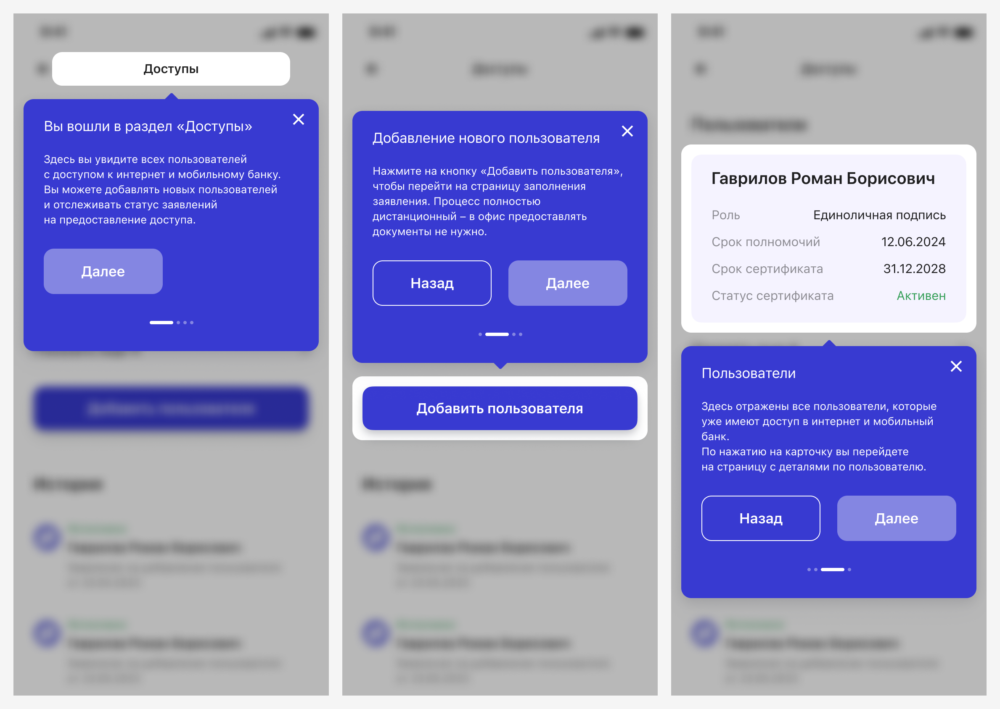

# Онбординг
[Фигма](https://www.figma.com/design/Q7fudU163hGIixeUOqhcbU/%D0%9E%D0%BD%D0%B1%D0%BE%D1%80%D0%B4%D0%B8%D0%BD%D0%B3?node-id=0-1&t=kr2gvtyx1iTgeBgk-1) · [Бэклог](https://github.com/metz-hei/psb/labels/Онбординг)

:::warning[Это черновик]
Мы еще работаем над этим паттерном, но вы уже можете использовать его по принципу «как есть».
:::

