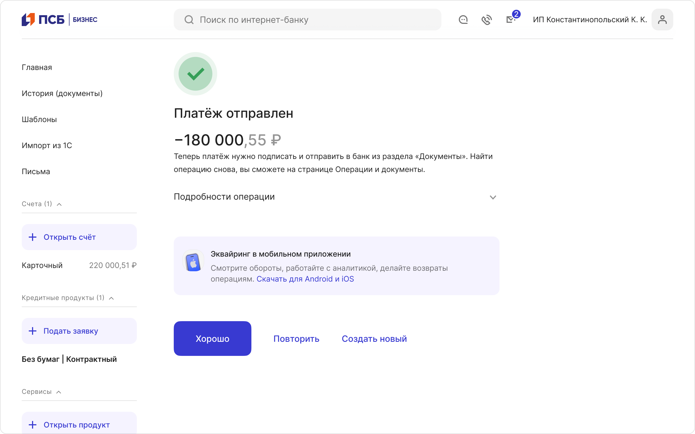
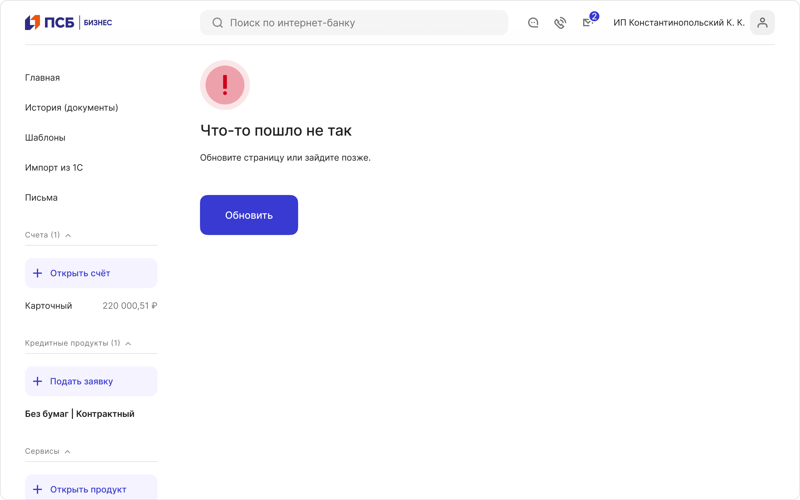
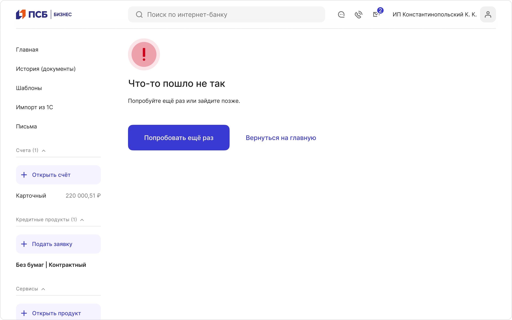
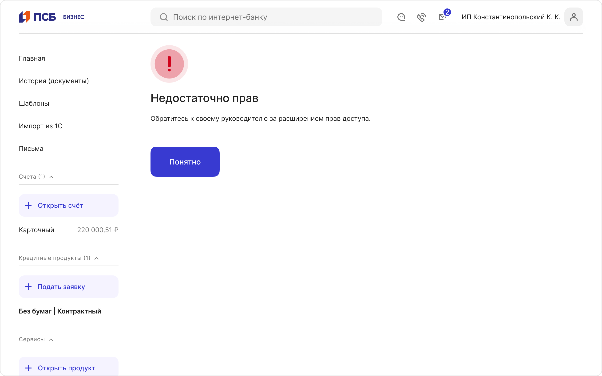
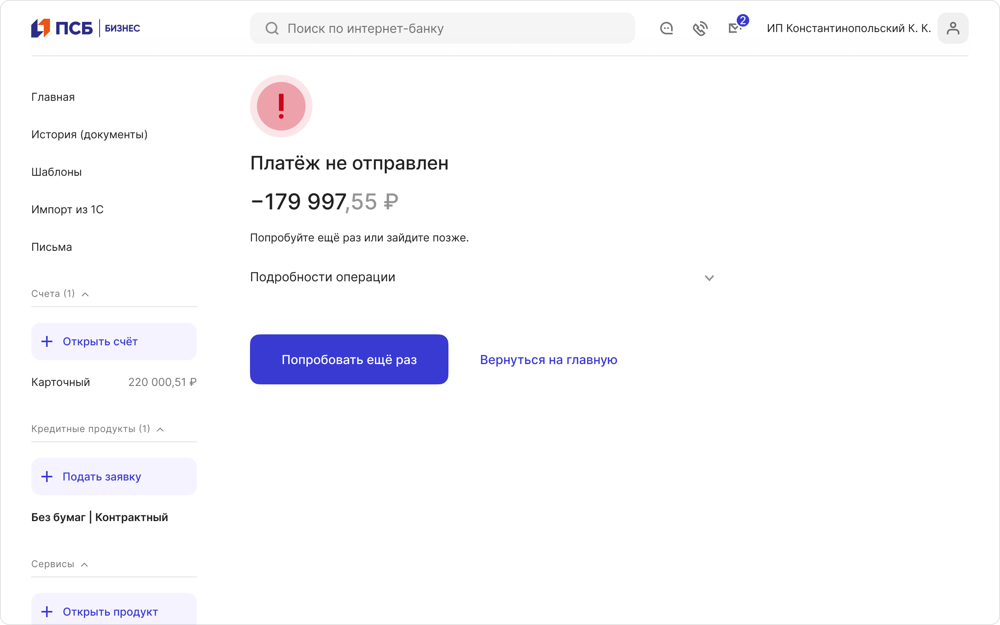
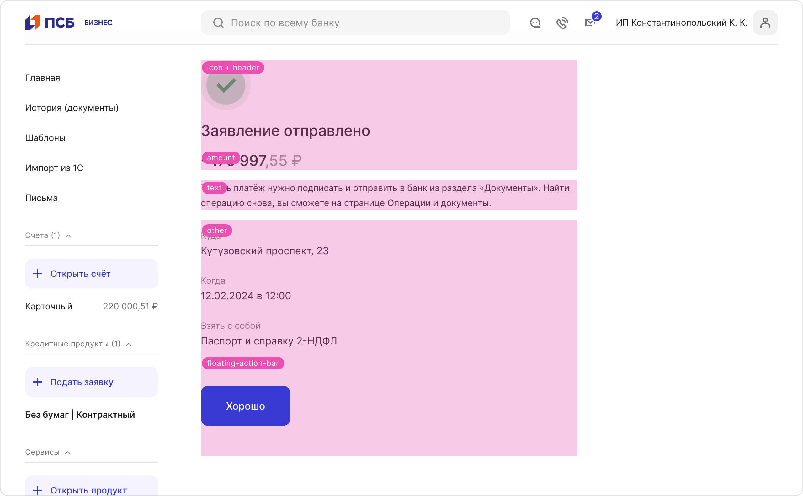
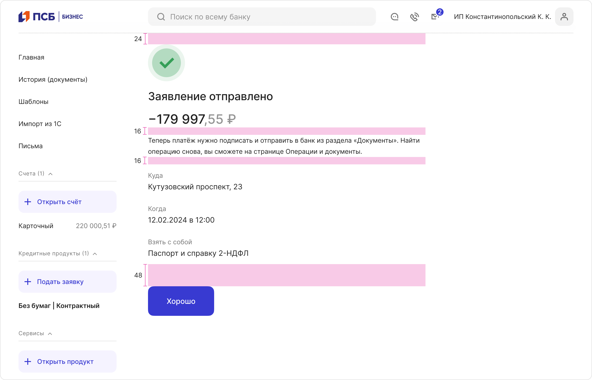

# Экран успеха
[Фигма](https://www.figma.com/design/qAKyYDP9J4ELzP75aDyE1X/%D0%AD%D0%BA%D1%80%D0%B0%D0%BD-%D1%83%D1%81%D0%BF%D0%B5%D1%85%D0%B0?node-id=0%3A1&t=pCt7FcMtHqh78M6v-1) · [Бэклог](https://jira.psbnk.msk.ru/secure/RapidBoard.jspa?rapidView=3142&projectKey=DS&quickFilter=24073)

## Заголовок окна
Заголовок страницы обязательно должен попасть в маску тега `<title>`. Обычно тайтл генерируется по маске:
*Название страницы* — ПСБ Бизнес

## Состояние «Успех»
Используйте в конце любого сценария завершившегося успехом и факт успешного прохождения сценария не подходит под иные ситуации: Toast, [успех в инпуте](https://www.figma.com/design/sklOa7L8pvWQ1QzD8HZIYw/03-%E2%9C%85-Input?node-id=190%3A45482&t=N5K9WmHxSXhlDo8B-1).

Страница может служить не только для того, чтобы сообщить пользователю, что сценарий завершен успешно, но и рассказать о том, что делать дальше, предложить скидку на другой продукт или собрать обратную связь.

### Синтаксис элементов страницы
#### Заголовок
Говорим о самом главном. Коротко суть того, что получилось сделать. Никогда не добавляем «успех» или «успешно». Если сценарий завершился, это уже успех.

✅ Можно: `Платёж отправлен`, `Счёт открыт`, `Сервис подключён`

❌ Нельзя: `Платёж успешно отправлен`, `Счёт успешно открыт`, `Сервис успешно подключён`

Никогда не используем кнопку Назад на экранах успеха. Кроме того, экран успеха никогда не является частью хлебных крошек.

#### Текст
Подробности о том, что произошло и, например, где найти документы об операции. 

#### Кнопка Primary
Действие, которое можно совершить прямо сейчас. Если ничего сделать нельзя, то мы используем кнопку «Хорошо», как некое нейтральное подтверждение, что сообщение прочитано. 

#### Кнопка Text
Навигация в раздел, на главную или действие, которое можно совершить прямо сейчас.

### Платежная страница
Это страница результатом которой стал перевод какой-либо суммы куда-либо.

В этом случае, в обоих сценариях к структуре страницы в обязательном порядке добавляется сумма перевода с минусом и аккордеон.

Аккордеон отображается в свернутом виде и называется «Подробности операции». Внутри лежит список ключевых параметров операции. Используйте для его вывода компонент `List / Base #2` с пропсом `Title+Data`.

Подробности операции помогут пользователю убедиться в том, что он все сделал правильно, поэтому старайтесь не выводить туда бесполезные данные, например, айдишники, а выводить данные, которые сформируют у пользователя нужное ощущение:

### Что делать дальше
Если ваш сценарий не заканчивается на экране успеха, а требует от пользователя дополнительных действий — проведите его за ручку:

### Сбор обратной связи
Собирайте отзывы о своем продукте или создавайте небольшие формы с опросами для исследования своей аудитории. Для этого просто добавьте на экран успеха компонент Lead Hunter и настройте его:

### Продающая страница
Страница успеха может стать отличным инструментом допродажи. Для этого добавьте на страницу один или два баннера, если они поддерживают парное размещение. Если статичного размещения 1–2 баннеров для вас недостаточно, то используйте ротацию баннеров:  

### Результирующая страница
Подойдёт, если в результате сценария получился некоторый новый набор данных, которые очень важны или требуется повторение уже озвученной ранее информации. 

В этом случае, мы не рекомендуем добавлять на страницу баннеры или опросы. Во-первых, это усложняет структуру страницы, а во-вторых, перетягивает на себя внимание с информации, которая действительно важна.

## Состояние «Ошибка»
Экраны ошибок показывают, что что-то пошло не так. Где-то «моргнул» сервер, отвалилась интеграция или попались «неправильные» данные. Наша задача помочь пользователю выбраться из этой ситуации и вернуться к своему сценарию.

Используйте экран с выводом ошибки только в том случае, если ошибку нельзя показать иным способом: через Snackbars или валидацию формы.

Иногда ошибки возникают в чувствительных ситуациях, например когда пользователь долго заполнял анкету со сложными данными или переводил деньги. В этих случаях мы должны сохранить данные пользователя любыми средствами, руководствуясь принципом «Данные пользователя священны».

Но старайтесь не просто сохранить данные, а максимально быстро выполнить задачу пользователя, например, переотправить форму или вернуться в форму, где все его данные будут предзаполнены.

### Синтаксис элементов страницы
#### Заголовок
Говорим о самом главном — что НЕ сработало, НЕ подключилось, НЕ одобрили.

✅ Можно: `Не получилось отправить платёж`, `Реестр не обработан`, `Не удалось сохранить изменения`

#### Текст
Подробности о том, что произошло и почему. Что можно сделать прямо сейчас.

#### Кнопка Primary
Действие, которое можно совершить прямо сейчас. Если ничего сделать нельзя, то мы используем кнопку «Понятно», как некое нейтральное подтверждение, что сообщение прочитано. 

#### Кнопка Text
Навигация в раздел или на главную.

### 500-я при загрузке страницы
Когда произошла ошибка при загрузке страницы и мы не знаем суть ошибки, не можем перевести её на человеческий язык или это 500-я:

### 500-я при отправке формы
Когда произошла ошибка при отправке данных на сервер и мы не знаем суть ошибки, не можем перевести её на человеческий язык или это 500-я:

### Недостаточно прав
Когда вернулась 403-я ошибка или не вернулась, но у пользователя все-равно недостаточно прав для работы с функцией или разделом:

### Платёжная страница
Используйте при возникновении блокирующей ошибки при переводе какой-либо суммы куда-либо.

Если произошла ошибка, которую мы не можем по-человечески идентифицировать, то структура страницы и обязательность элементов наследуется из успешного сценария:

Если пользователь может самостоятельно устранить ошибку, например, вернуться в форму и исправить данные, то структура страницы меняется.

Нам важно, чтобы пользователь увидел проблему, поэтому убираем все лишнее. А по базовой кнопке действия ведём пользователя к исправлению ошибки:

### Истечение сессии
Появляется при протухании пользовательской сессии. Это 30 минут бездействия. Отключены все возможности закрытия модального окна. Кнопка Войти заново переводит пользователя на страницу авторизации:

## Состояние «Предупреждение»
Подойдет для вывода сообщения об операции, которая выполнена частично:

## Состояние «Ожидание»
Подойдет, если выполнения сценария растянуто во времени. Например, формирование отчета или подготовка выписки:

## Состояние «Инфо»
Подойдет, если необходимо о чем-то проинформировать пользователя. Например, для подключения некой услуги пользователю обязательно нужен подтвержденный адрес электронной почты.

Состояние «Инфо» не может быть концом сценария, а значит используется только в модальном окне:

## Структура и размеры
У страницы всегда есть:
- img: ModalSuccess, ModalError, ModalInfo, ModalWaiting, ModalWarning
- h1
- floating-action-bar

Все остальные структурные элементы являются необязательными и могут быть изменены:

Все отступы на странице статичны и регламентируются, либо текущей документацией, либо документацией компонента, размещаемого на странице.

Если после компонента text идёт любой компонент из группы баннеров, Lead Hunter, таблица или заголовок, то отступ = 40px, иначе — 16px:

## Ссылки
[Writing guidelines - Success message - Content - Atlassian Design System](https://atlassian.design/content/writing-guidelines/writing-a-success-message)

Так же при написании текстов обращайтесь к нашему VoT, который хранится в Confluence.

## Условие об адаптивности Floating Action Bar

### Отображение Floating Action Bar в виде кнопок
Если весь контент экрана, включая Floating Action Bar (FAB), умещается во вьюпорт (без необходимости прокрутки), то FAB отображается в виде кнопок:

### Отображение Floating Action Bar в виде закреплённой панели (FAB)
Если контент не умещается во вьпорт (например, при раскрытии аккордеона), то FAB становится плавающим и закрепляется в нижней части экрана: 

Что считать вьюпортом:

Отступ от последнего элемента на странице до FAB составляет 48px:

 