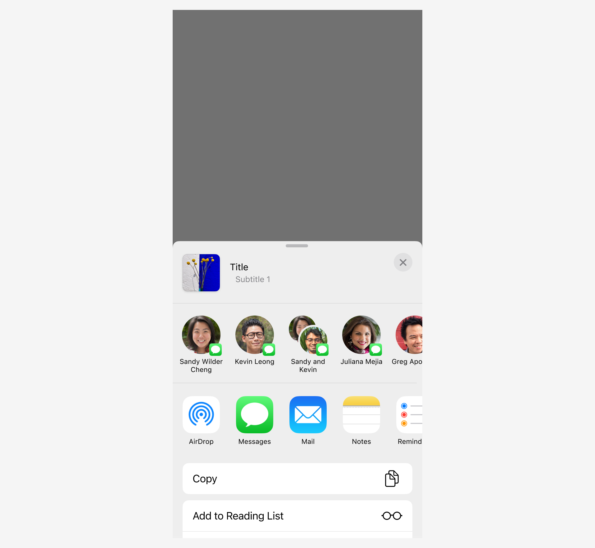
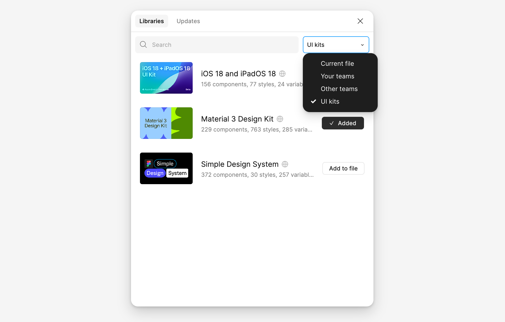
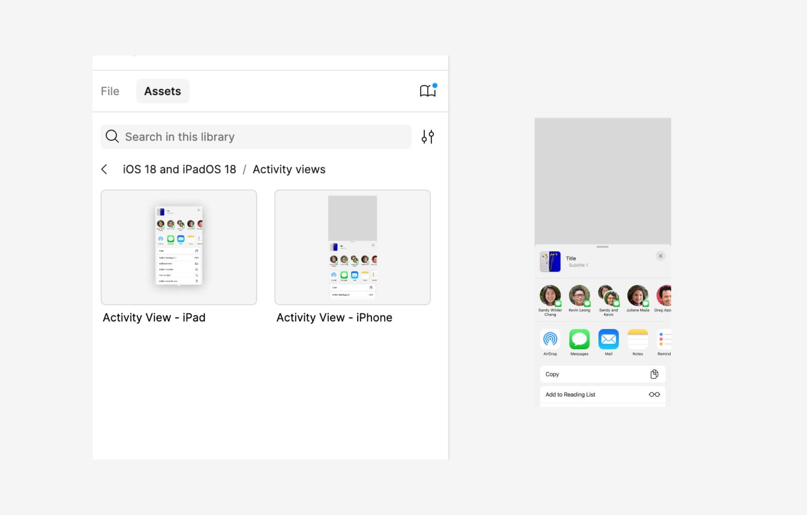
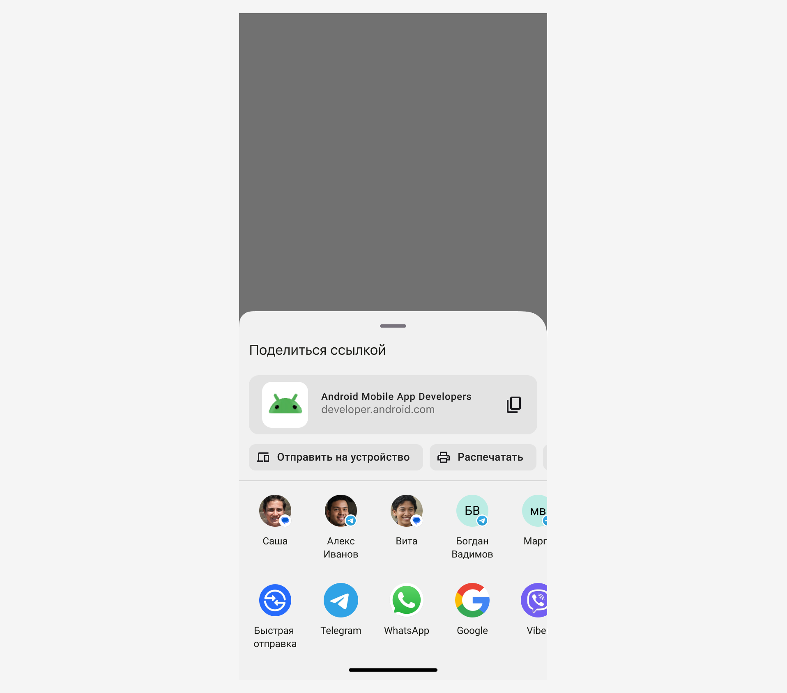
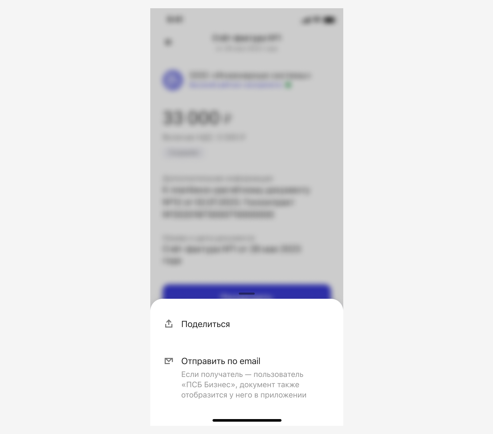
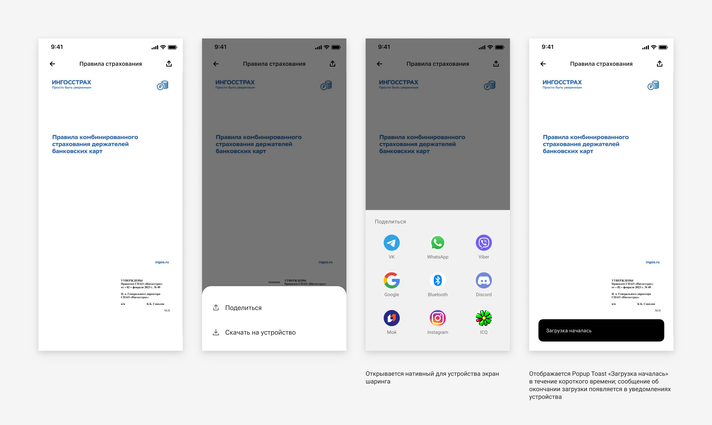
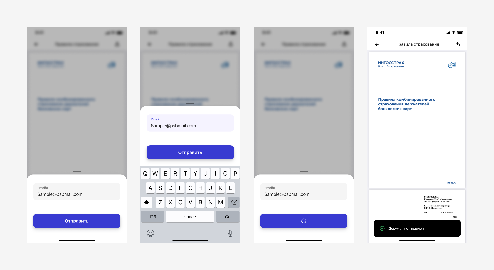

# Share Screen

Чтобы поделиться файлом, документом или изображением, мы используем нативные решения: системный модуль [Sharesheet](https://developer.android.com/training/sharing/send?hl=ru) для Android и [Activity View](https://developer.apple.com/design/human-interface-guidelines/activity-views) для iOS.

## Как использовать на iOS

[Документация](https://developer.apple.com/design/human-interface-guidelines/activity-views) · [Figma](https://www.figma.com/design/dFsFwfJ7xbZZzyEoNpwXW1/%F0%9F%8D%8E%F0%9F%A4%96-Share-Screen?node-id=243-14536&node-type=instance&t=aik6U7ukD9r3KzyT-11)

Чтобы использовать нативное решение шеринга в своём сценарии, подключите [библиотеку iOS](https://www.figma.com/community/file/1385659531316001292/ios-18-and-ipados-18).

Для этого зайдите в `Libraries` в своём файле и выберите `UI Kits` в выпадающем списке, как показано на скриншоте:

В списке появится кит `iOS 18 and iPadOS 18` из комьюнити — добавьте его в свой файл, чтобы использовать компоненты из `Assets`.

Готово! 🥳

Возьмите Activity View из компонентов и используйте в своём сценарии. 

## Как использовать на Android

[Документация](https://developer.android.com/training/sharing/send?hl=ru) · [Figma](https://www.figma.com/design/dFsFwfJ7xbZZzyEoNpwXW1/%F0%9F%8D%8E%F0%9F%A4%96-Share-Screen?node-id=285-6764&node-type=frame&t=aik6U7ukD9r3KzyT-11)

Используем нативное решение для обмена контентом — [Android Share Sheet](https://www.figma.com/design/dFsFwfJ7xbZZzyEoNpwXW1/%F0%9F%8D%8E%F0%9F%A4%96-Share-Screen?node-id=285-6764&node-type=frame&t=aik6U7ukD9r3KzyT-11). Это стандартный системный инструмент, который позволяет пользователям выбирать приложения для отправки файлов, документов или ссылок.

Обратите внимание, что фактический внешний вид и функциональность Share Sheet могут отличаться в зависимости от производителя устройства или его оболочки. 

Например, такие производители, как Samsung или Xiaomi, могут изменять интерфейс или добавлять дополнительные функции. К сожалению, на это мы повлиять не можем, так как Android позволяет каждому производителю адаптировать систему под свои нужды.

Мы рекомендуем ориентироваться на основные функции, которые остаются неизменными, независимо от устройства.

## Дополнительные действия

### Отправка по электронной почте 

Альтернативный способ шаринга может использоваться , например, когда есть различия между отправкой документов по электронной почте и через системный share screen, если важно получить подтверждение доставки, включить дополнительные материалы, которые не связаны напрямую с документом (рекламные предложения, полезные ссылки).

В этом случае используется компонент [Bottom sheet](https://www.figma.com/design/bYUKHrjBAhYPLdug8qfzFc/09-%E2%9C%85-Popup?node-id=1526-72908&node-type=section&t=pazeqJgr76ec2CEq-11):

 

### Скачивание документа

На андроиде ниже 14 версии на нативном экране шеринга, нет контрола «Скачать на устройство», его нужно добавить отдельно. По нажатию на кнопку «Отправить» открывается модальный 🍎Popup Bottom sheets с развилкой — поделиться и скачать на устройство:

 

Экраны в рамках сценария также отображаются внутри модального Popup Bottom sheets:

 