# Фильтры в сайдбаре

## Анатомия

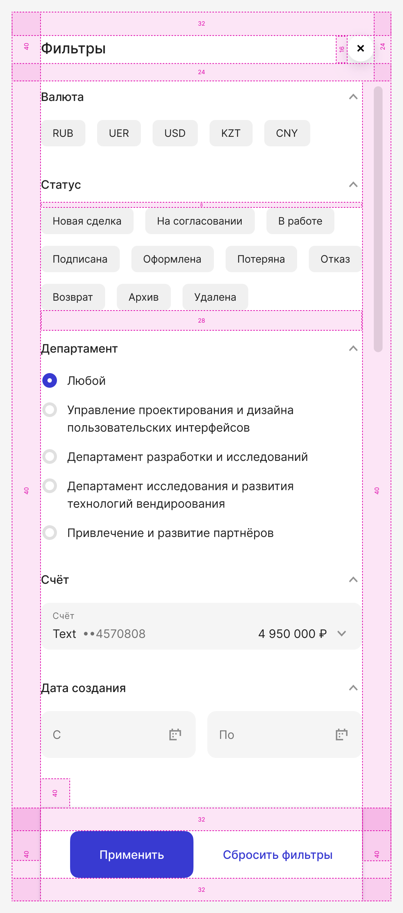

## Общие принципы

### Заголовок

«Фильтры» — используется, когда фильтров несколько:

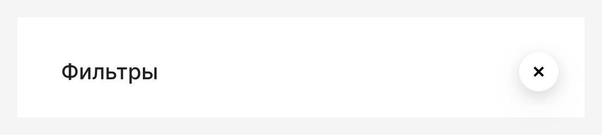

«Название фильтра» — используется, когда фильтр один:

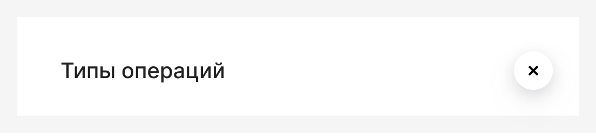

### Название фильтров

Используйте именительный падеж без предлогов.
Пример: «Счёт» вместо «По счёту»

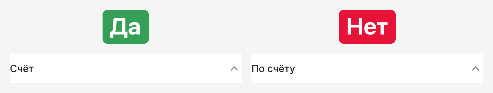

### Структура и порядок

1. Самые популярные и часто используемые фильтры располагаются сверху
2. Самые релевантные значения внутри фильтров располагаются сверху
3. Применяйте [динамическую фильтрацию](#динамические-фильтры):
   Скрывайте недоступные значения и фильтры, на которые пользователь не может повлиять

### Пункт «Все»

Не используйте пункт «Все» или «Любой» в выпадающих списках.
Отсутствие выбора = показ всех данных без применения фильтра

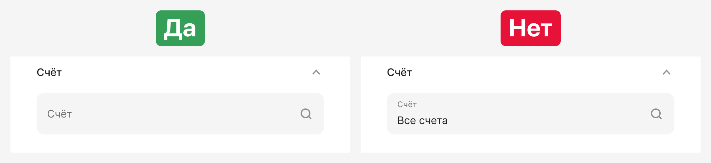

Исключение: радиобаттоны должны иметь выбранное значение по умолчанию:

### Взаимодействие

**Сброс фильтров**

Используйте кнопку [«Сбросить фильтры»](#заголовки-фильтров) для отмены выбранных значений

**Закрытие сайдбара**

Сайдбар можно закрыть тремя способами:
1. По крестику в хедере
2. Кликом по зоне вне сайдбара
3. Нажатием клавиши Esc

## Наполнение

### Одиночный выбор

**Чипсы**

Когда используем: выбор 1 элемента среди маленького количества значений с коротким текстом.  
1. В состоянии по умолчанию:  
— Может быть не выбран ни один чипс  
— Можно задавать самый популярный  
2. Максимум 3 строки  
3. Текст в чипсе должен влезать в 1 строку в мобильном представлении. Если не влезает, используем радиобаттоны  
4. Не используем чипс с тремя точками, показываем сразу все. Если не влезают в 3 строки, используем радиобаттоны (до 5 пунктов), если пунктов больше — выпадающий список или автокомплит

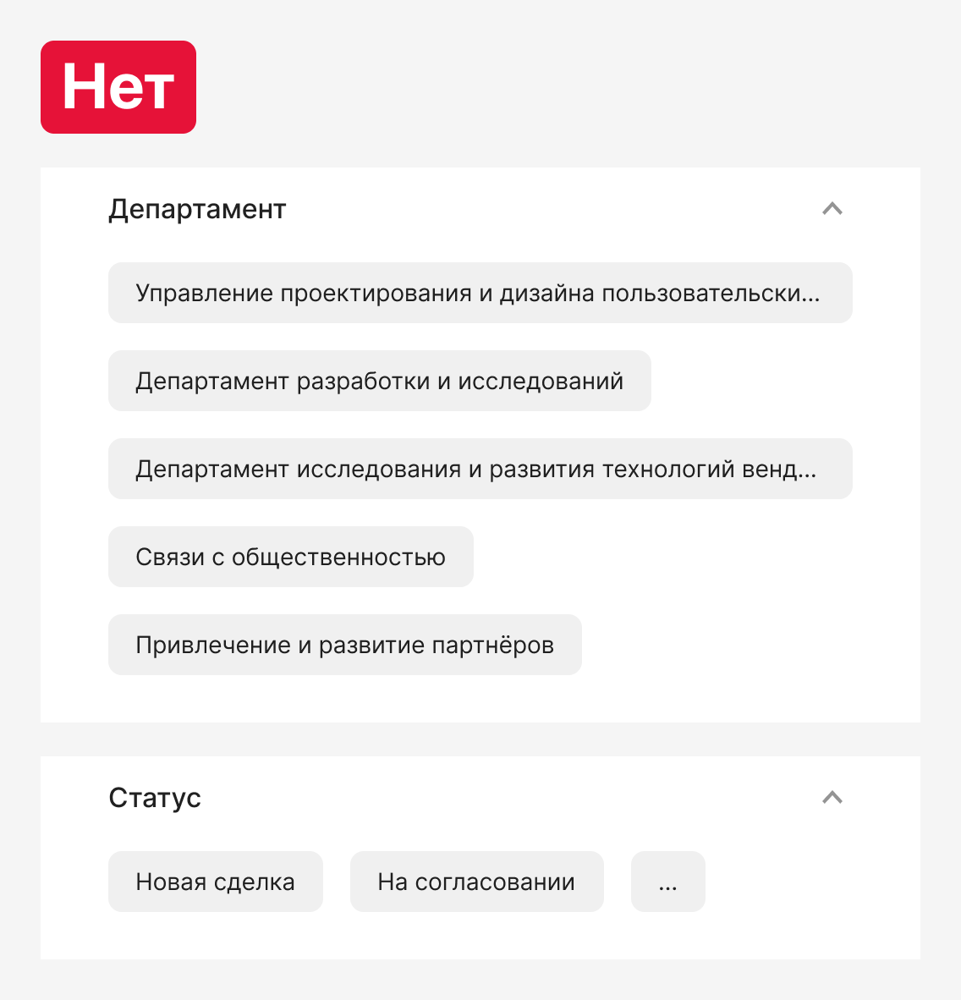
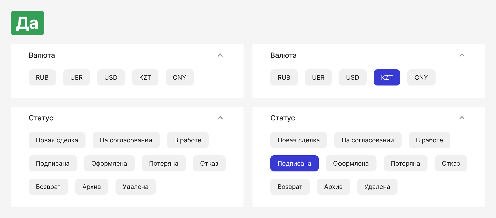

**Радиобаттоны**

Если значения длинные, используем радиобаттоны (до 5 пунктов). 

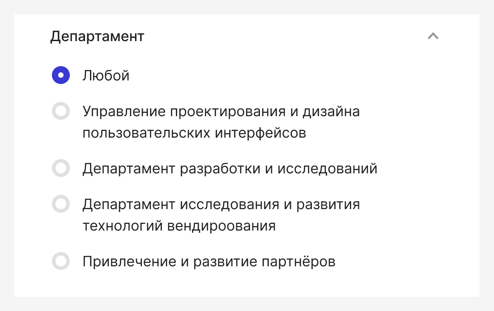

**Выпадающий список**

Используется для списка из 6-25 пунктов.

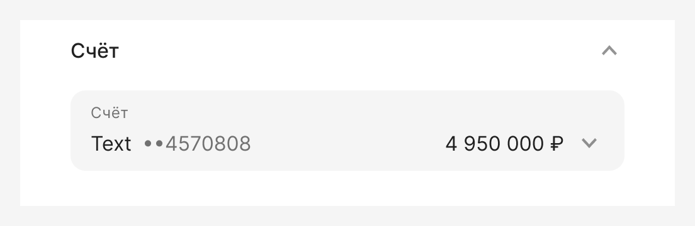

**Автокомплит**

Используется для списка из 25+ пунктов.

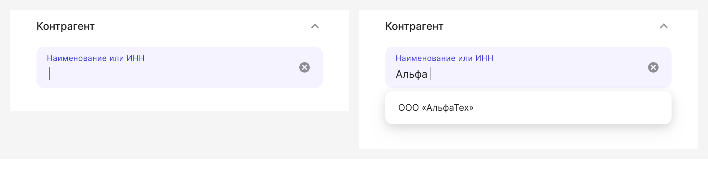

**Дата**

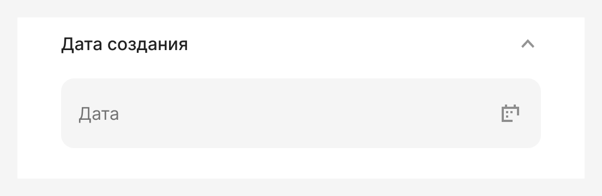

**Период**

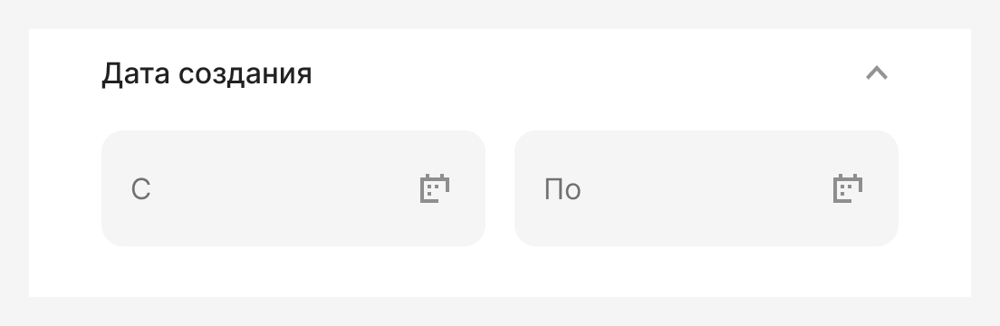

**Период с чипсами**

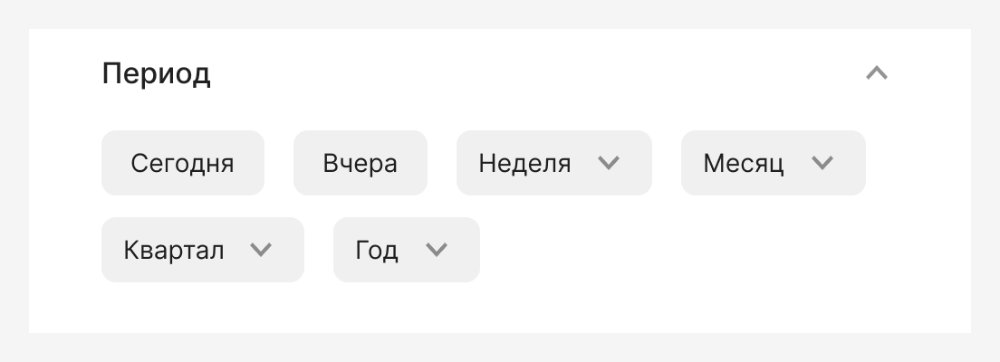

**Диапазон значений**

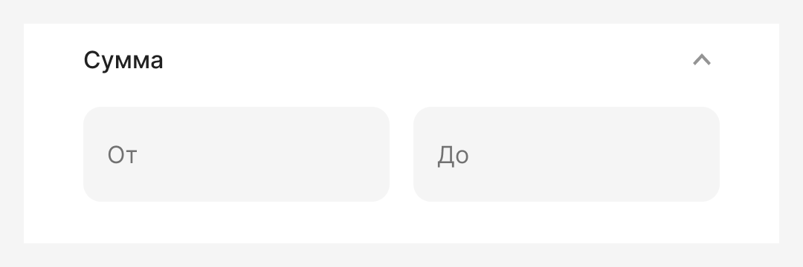

### Множественный выбор

**Чипсы**

Когда используем: выбор нескольких элементов среди маленького количества значений с коротким текстом. 

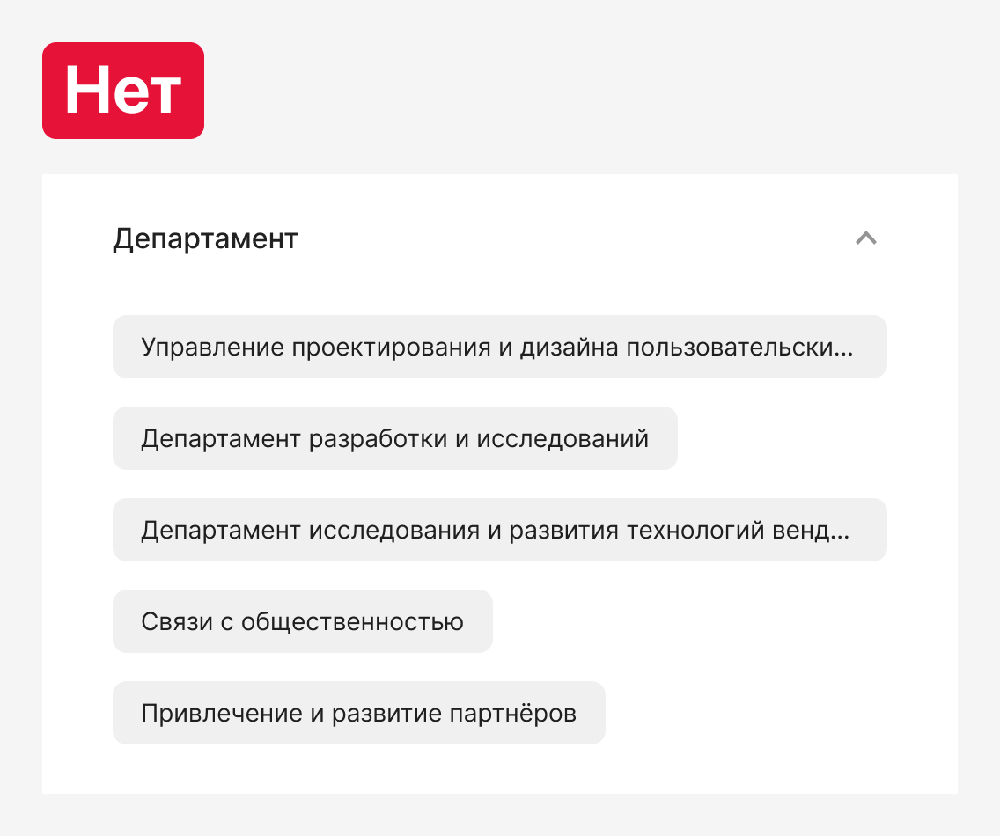

**Чекбоксы**

* До 15 пунктов. Подходит для пунктов с длинным текстом.
* По умолчанию не выбран ни один пункт.
* Если пунктов больше 5, по кнопке «Показать всё» раскрываем список всех значений.

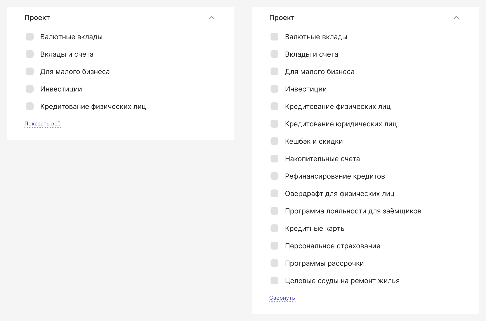

**Чекбоксы с поиском**

* Для 15+ пунктов. Подходит для пунктов с длинным текстом.
* По умолчанию не выбран ни один пункт.
* По кнопке «Показать всё» раскрываем список до 8 значений со скроллом и по необходимости используем поиск:

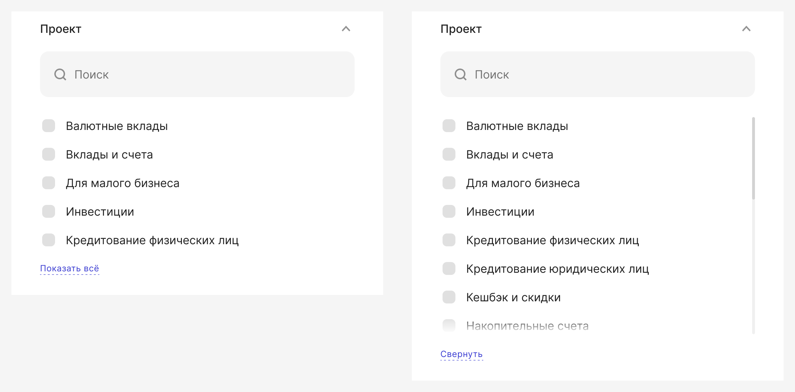

**Без поиска:**

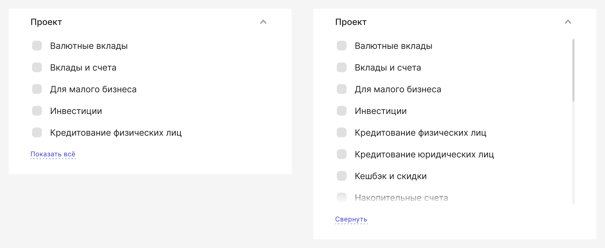

Возможно использование пункта «Выбрать все» в начале списка:

Механика работы фильтра «Чекбоксы + поиск»:

1. Нажали на «Показать всё».

2. Начали вводить символы в поиск, но ничего не нашлось.

3. Ввели символы, увидели совпадения и выбрали нужное. При выборе значений в каунтере отображается количество выбранных значений, а также кнопка «Сбросить»

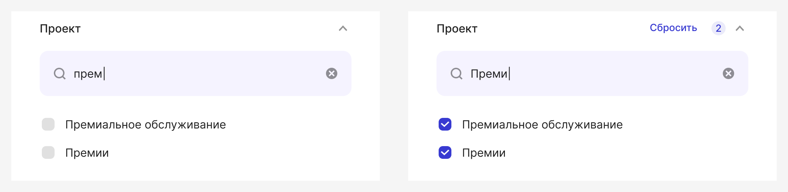

4. Стёрли поиск, выбранные значения будут первыми в списке, свернули список:

## Поведение и взаимодействие с сайдбаром

При скролле контента header и footer зафиксированы.
Экран под сайдбаром не скроллится, накладывается overlay.

Если пользователь кликнул вне сайдбара, то сайдбар закрывается, а уже настроенные в нём данные сохраняются до перезагрузки страницы пользователем. 

## Динамические фильтры

Динамические фильтры — это фильтры, которые обновляют доступные значения и количество результатов сразу после изменения одного из параметров.

Принципы работы:

1. При выборе значений во время загрузки данных и процесса подсчёта доступных значений показываем лоадер в кнопке «Применить»:

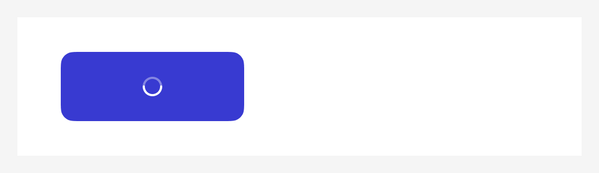

При появлении лоадера ширина кнопки остаётся фиксированной.

2. Если не удалось подсчитать доступные значения, показываем ошибку в компоненте toast:

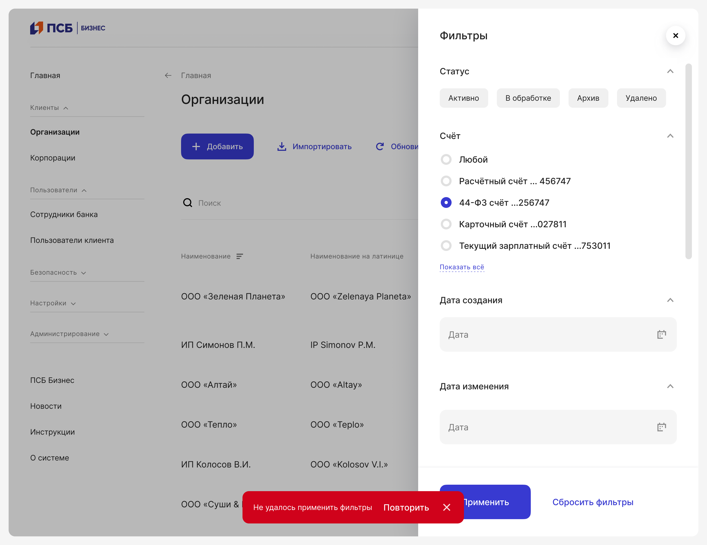

3. Показываем в кнопке «Применить» количество значений, доступных при выставленных фильтрах:

4. Применяем динамическую фильтрацию: недоступные значения и фильтры, на которые пользователь не может повлиять, следует скрывать:

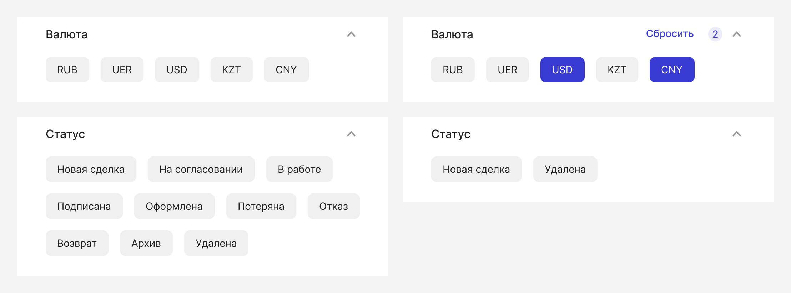

5. Количество результатов в кнопке:
- До тысячи без округления: 1–999
- Начиная с тысячи округляем до тысяч и пишем в формате «X тыс.»

6. Данные на странице под сайдбаром обновляем только после клика на кнопку «Применить».

7. Ошибки:
- Если ничего не найдено, показываем пустое состояние
- Если не удалось применить фильтр, показываем toast с ошибкой

## Структура

### Заголовки фильтров

Используем компонент List Accordion:

- По умолчанию все аккордеоны раскрыты.

- При настройке фильтра появляется кнопка «Сбросить».

- Если в фильтре мультиселект, при выборе появляется счётчик.

### Футер

- Футер с кнопками закреплен внизу экрана и всегда виден. Сделан по аналогии с Floating action bar.
- По умолчанию показываем кнопку «Применить». Если применён хотя бы один из фильтров, показываем рядом кнопку «Сбросить фильтры».
- Рекомендуется делать фильтры динамическими и показывать количество найденных результатов в кнопке.