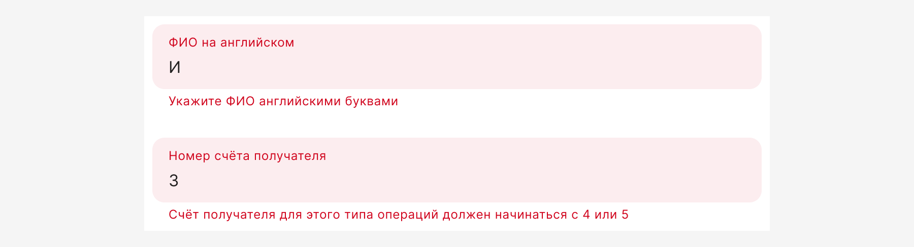
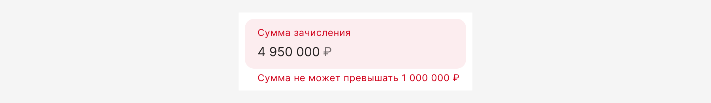
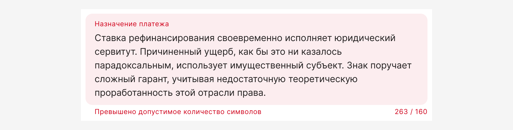
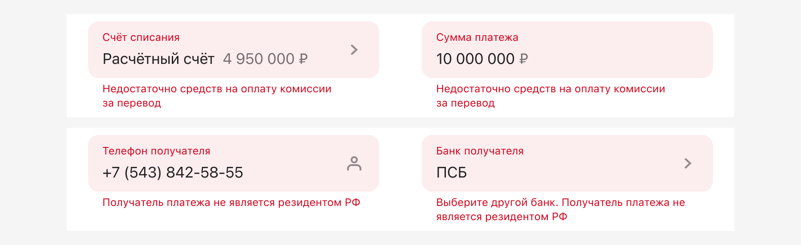

# Валидация форм

Валидация поля необходима для проверки введенных значений, а также подсветки ошибок и полей обязательных к заполнению. Она осуществляется путем окрашивания поля и отображения ошибки под ним. Чем раньше мы подсветим пользователю ошибку заполнения, тем понятнее и очевиднее будет работа с формой.

## Принципы

### Ограничь неверное

- Ограничьте выбор заведомо неверных значений: блокируйте эти значения, например в календаре или не показывайте в списке.

- Ограничьте ввод неподходящих символов. Если в поле нужно вводить только цифры, и это очевидно пользователю, игнорируйте ввод букв вместо того, чтобы показать ошибку и наоборот. Используйте маски в полях, где у значений известен формат.

### Подсказывай неочевидное

В неочевидных и неоднозначных случаях пишите подсказки для заполнения формы. Например, в Placeholder или Hint у полей ввода. Подсказка должна соответствовать условиям: полезная, уместная, своевременная.

### Предзаполни всё

Старайтесь предзаполнять поля наиболее вероятными значениями.

### Пустое поле — не ошибка

- Не валидируйте поля на пустоту по потере фокуса — не показывайте ошибку если поле не заполнено, возможно пользователь вернется и заполнит поле чуть позже.

- Но если пользователь начал ввод, затем всё стёр и вышел из поля — то показывать ошибку можно.

## Виды валидации

Существует три вида валидаций: мгновенная, по потере фокуса и при нажатии на кнопку действия.

### Мгновенная валидация

Это самый быстрый способ сообщить об ошибке, который мы используем очень осторожно.

Мы не ругаемся на пользователя преждевременно.

Например, если пользователь заполняет какое-либо маскированное значение, будь то телефон или СНИЛС, система считает такое значение некорректным, ведь оно не соответствует маске. Но ругаться в этом случае мы не станем, потому что считаем, что пользователь не закончил ввод.

Другой пример, когда в процессе ввода понятно, что значение некорректное.

1. Значение не может содержать указанные символы или их последовательность:

   

2. В кейсах, в которых введенное число превышает максимальное:

   

3. Если превышен лимит на символы при вставке значения из буфера:

   

Это не весь список примеров, могут быть и другие. Используйте мгновенную валидацию с умом.

### Валидация по потере фокуса

Валидация срабатывает сразу после потери фокуса, если значение в поле заполнено. Если найдена ошибка, поле подсвечивается красным и отображается текст ошибки. Фокус в это поле автоматически не возвращается.

Поле с ошибкой должно остаться подсвеченным, если оно получило фокус, его значение не исправляли, а затем оно потеряло фокус.

Красная подсветка снимается с поля, как только пользователь начал исправлять ошибочное значение.

### Валидация при нажатии на кнопку действия

Проверка происходит после того, как пользователь нажал кнопку отправки данных: все поля с ошибками и незаполненные обязательные поля на форме подсвечиваются, страница прокручивается к первому полю с ошибкой и фокусирует его.

## Отправка формы

Кнопка для отправки формы всегда доступна. Кроме исключения на форме авторизации.

По нажатию, кнопка запускает процесс валидации обязательных полей.

## Индикация необходимости заполнения полей

:::warning[Это раздел в работе]
Как будем помечать необязательные поля?

А звездочку пишем вместе или через пробел?

Может ли существовать одновременно маркировка обязательных и необязательных полей на одном экране?
:::

Минимизируйте количество необязательных полей в форме. Если информация не является критически важной, лучше не запрашивать ее вообще.

- NNg рекомендует явно обозначать обязательные поля, чтобы пользователи могли быстро и легко понять, какую информацию необходимо предоставить. Несмотря на желание дизайнеров избежать избыточного визуального шума, обязательно следует помечать все обязательные поля.
- Отсутствие явных меток заставляет пользователей сканировать форму и принимать решения, что замедляет процесс и увеличивает вероятность ошибок.
- Явное обозначение обязательных полей снижает вероятность ошибок при заполнении и, как следствие, уменьшает количество ошибок при отправке.
- Предпочтительно использовать звездочку из-за её компактности и узнаваемости. При этом лучше располагать звездочку в начале названия поля для удобства сканирования.
- Необязательные поля можно помечать, но это не является обязательным.
- Для форм регистрации (более двух полей) обязательно помечать все обязательные поля.
- Хоть это и не обязательно, но маркировка необязательных полей снижает когнитивную нагрузку пользователя. Если такого обозначения нет, приходится ориентироваться на другие поля и делать вывод, что это поле необязательно, поскольку другие отмечены как обязательные.

## Валидация зависимых полей

Зависимые поля — это поля, значение которых зависит друг от друга или повлиять на сценарий можно исправлением в одном из полей.

Валидацию зависимых полей можно вызвать на фронте и на бэке. Но иногда фронт не может выполнить такую валидацию из-за недостатка данных.

Например, пользователь заполняет форму, но расчет комиссии произойдет только на следующем шаге, соответственно, мы сможем провалидировать поля только после отправки данные на бэк.

Используйте валидацию зависимых полей на свое усмотрение, но руководствуйтесь принципом о том, что необходимо как можно раньше сообщить пользователю о некорректно заполненной форме.

При изменении значения в одном из зависимых полей, снимать валидацию с обоих.

## Синтаксис подсказок

:::warning[Это раздел в работе]
Совсем скоро мы его дополним
:::
