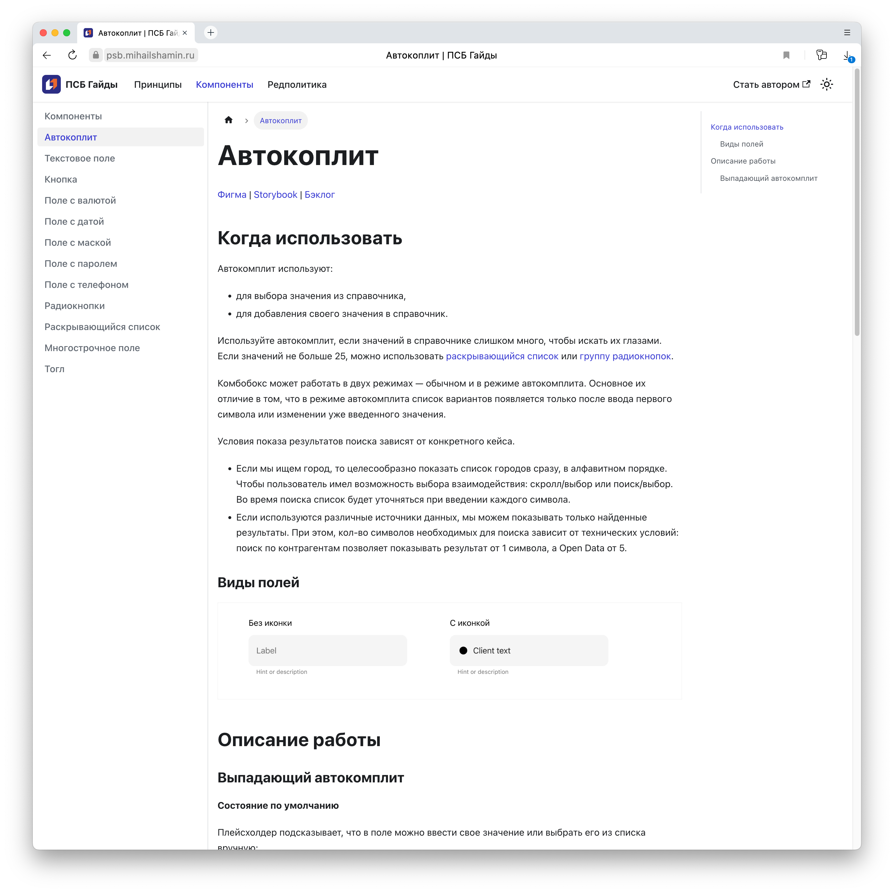
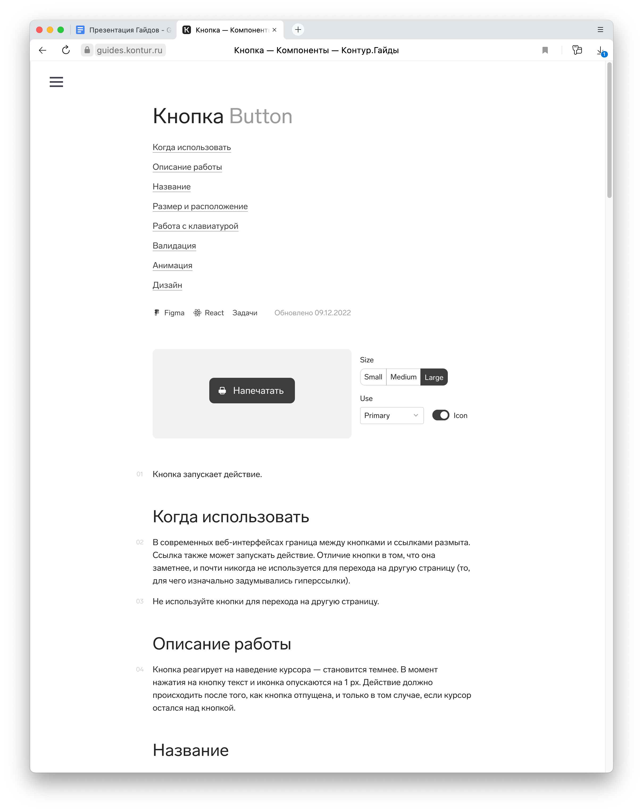
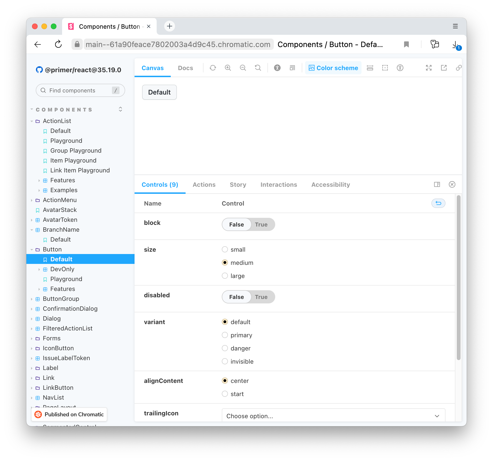
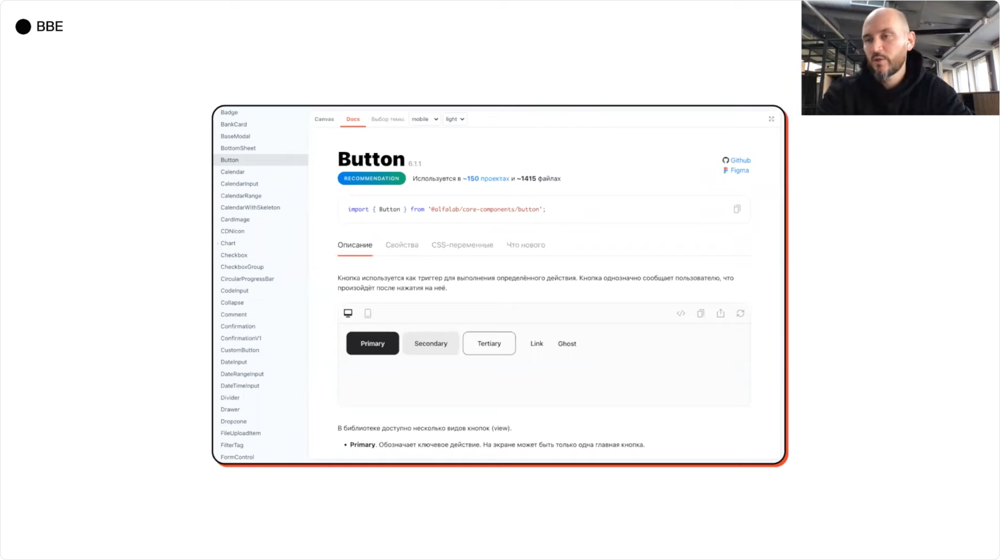
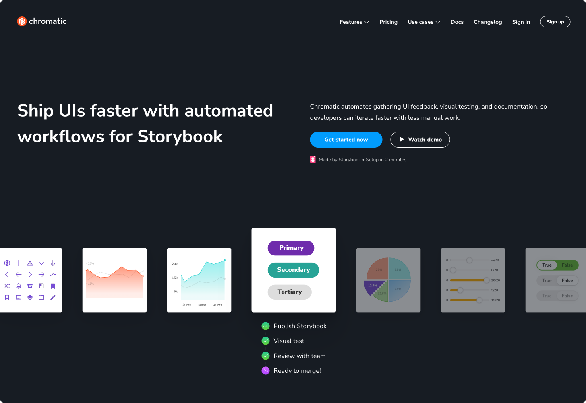
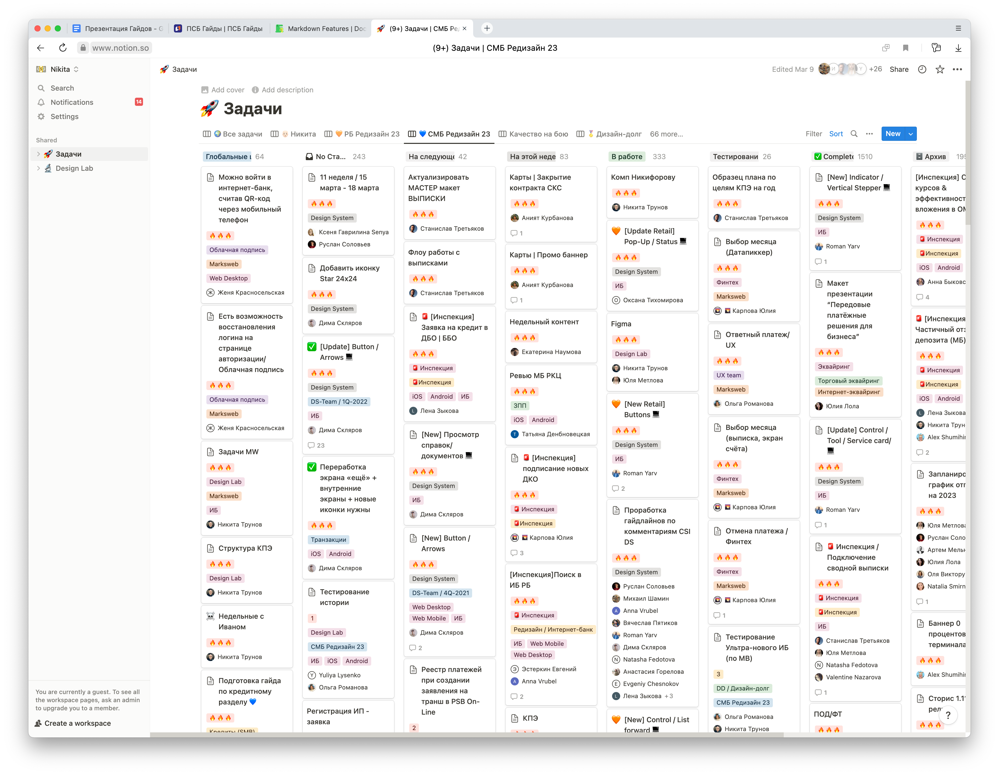
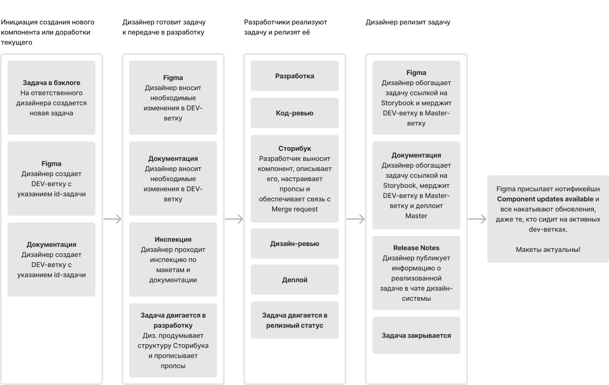

# ПСБ Гайды

Работая с дизайн-системой и наблюдая за процессами команды ДС, появилось несколько предложений по улучшению или изменению текущих подходов к проектированию, содержанию и использованию дизайн-системы. 

Этот документ содержит краткое описание проблем, предлагает решения и описывает их пользу для бизнеса и для нас, как команды.

Документ затрагивает следующие вопросы:
1. Хранение документации по дизайну
2. Витрина компонентов и хранение фронтовой документации
3. Автоматическое регрессионное тестирование компонентов
4. Актуальность дизайн-системы
5. Бэклог

## Хранение документации по дизайну
### Проблематика
* Нет единого источника правды по компонентам: 
    * Часть описания хранится в Фигме, а часть в Ноушене.
    * Непонятно какое описание самое актуальное.
    * Приходится следить и поддерживать два источника.
    * У разработчиков есть сторибук, но нет перелинковки между желаемым результатом и реализацией.
* Нет перелинковки с бэклогом по компоненту, непонятно когда будет реализован компонент, взят ли он в работу, какие дефекты есть по реализованному компоненту.
* Фигма не подходит для хранения документации.
* Ноушен подходит лучше, но возникает зависимость от платформы:
  * **Риск блокировки и потери данных.** С точки зрения бизнеса, этот пункт самый важный, так как есть риск потери всех инвестиций в документацию.
  * Платные функции (домен, хостинг файлов, ролевая модель, аналитика), за которые еще надо как-то смочь заплатить.

### Решение
* Отказаться от хранения текстового описания компонентов в Фигме. Хранить там только состояния компонентов и типовые экраны.
* Отказаться от хранения документации в Ноушене.
* Перейти на хранение документации в формате .md и .mdx в репозитории банка.
* Использовать для сборки документации опенсорсные решения: Docusaurus, VuePress, 11ty.

### Польза
* Защитимся от рисков блокировки, а значит обезопасим инвестиции в документацию.
* Создадим единый источник правды для всех участников процесса разработки: дизайнеров, аналитиков, разработчиков и тестировщиков.
* Свяжем документацию, фигму, сторибук и бэклог.
* Сделаем документацию публичной. Такой подход может стать генератором имиджевого капитала среди it-специалистов, через демонстрацию нашей инженерной культуры.
* Сможем настроить версионирование документации.
* Разрешим предлагать изменения к документации всем участникам. Т.е. необязательно быть членом команды ДС, чтобы что-то написать в ДС, можно предложить изменения к документации не имея прав. А редактор/дизайнер ДС решит принимать изменения или нет.
* Внедрим глобальный поиск по содержимому.
* Поднимем аналитику использования документации через Яндекс.Метрику и начнем сбор обратной связи:
  * Узнаем какие вопросы возникают у пользователей чаще всего.
  * Каким вещам нужно уделить больше внимания.
  * Сколько людей вообще пользуются документацией.
  * Удовлетворены ли они качеством документации.

### Новизна идеи
Такой подход к организации хранения документации не новый, вот несколько примеров с похожей реализацией:
* [Дизайн-система Ростелекома](https://design.rt.ru/components/btn/guide)
* [Контур Гайды](https://guides.kontur.ru/)
* [Дизайн-система Альфа-банка](https://www.youtube.com/watch?v=vKqh7VO9E3I)

## Витрина компонентов и хранение фронтовой документации
### Проблематика
Так как Фигма хранит лишь ожидаемый результат, должен быть инструмент,
который хранит — фактический.

### Решение
Внедрить в релизный цикл работу со опенсорсным решением — Storybook. Он уже используется для вебовских компонентов, но доступен только локально. Надо расшарить его на всех участников производственного цикла и связать со всеми остальными инструментами путём добавления перелинковки.

### Польза
1. Визуализация фактическое состояние компонента для дизайнера.
2. Удобный и быстрый поиск нужного компонента для фронта.
3. Вся необходимая документация для фронта по использованию компонента.
4. Встроенная функция комментирования компонентов, аналогичная Фигме.
Проходить дизайн-ревью, можно так же быстро и удобно как инспекцию в
Фигме.
5. Возможность внедрения регрессионного тестирования
компонентов с помощью автотестов через Chromatic. Это логичный
следующий шаг развития Сторибука, который позволит ускорить процесс
тестирования (выявлять проблемы на ранних этапах, быстрее проводить
регресс) и повысит уверенность в сборках. Так как тесты
визуализируются в хроматике, принимать решения о принятии изменений
или их отклонении могут помогать дизайнеры.

### Новизна идеи
Такой подход к организации хранения фронтовой документации и визуализации компонентов применяется в [дизайн-системе Альфа-банка](https://www.youtube.com/watch?v=vKqh7VO9E3I).

На рынке присутствует много решений для создания витрины компонентов: Storybook, knapsack.cloud, supernova.io. Не знаю насчет остальных инструментов, но Сторибук опенсорсный и мне уже приходилось с ним работать.

## Автоматическое регрессионное тестирование компонентов
### Проблематика
ПСБ владеет довольно большой дизайн-системой и активно её развивает. Это фундамент всех проектов банка.

При этом дизайн-система не считается каким-то отдельным проектом и ей пытаются заниматься как-то там на коленке раз в неделю и то, если нет каких-то важных задач у дизайнера на собственном проекте. Конечно же, дизайн-система должна выделиться в отдельный проект и жить по собственному релизному циклу.

Это не значит, что стоит отменить тех. дни, неважно кто пушит в дизайн-систему, главное, чтобы у неё был хозяин, владелец, тот кто отвечает за весь релизный цикл.

Одна из задач, которая встает перед ним заключается в ответственности за стабильность сборки и соответствие дизайн-системы всем договоренностям с дизайн-сообществом банка.

### Решение
Одним из инструментов, который позволит быть уверенным в стабильности сборки, является Chromatic.

### Польза
Chromatic отвечает за автоматическое регрессионное тестирование всей библиотеки компонентов во всех популярных браузерах и установленных разрешениях. Встраивается в CI/CD и на ранних этапах разработки сообщает о проблемах в новом коде. Содержит все необходимые инструменты для визуализации ошибок, обсуждения проблемы с другими членами команды и принятия решения.

## Актуальность дизайн-системы
В этом вопросе хотелось бы начать с общего понимания зачем нам дизайн-система. В основу дизайн-системы можно положить много всяких принципов, но главный — скорость производства фич измеряемая через метрику Time to Market.

Если это так, то пользуясь дизайн-системой мы не должны задумываться реализован ли какой-то компонент. Если он есть в ДС, значит он реализован — главное правило ДС.

### Проблематика регламента движения задач
* Мы каждый день сталкиваемся с неактуальной версией компонентов в Фигме. Это происходит из-за того, что дизайнер вливает изменения в мастер-ветку раньше фронта.
* Нам приходится использовать старые компоненты, находящиеся под меткой «Dont Use».
* Это противоречит правилам инспекций и по идее, такие макеты не должны пройти инспекцию, но мы закрываем на это глаза.
* Мы не подтягиваем изменения из ДС в наши макеты из-за страха поломать всё вокруг. Так быть не должно, потому что ДС — это мастер-ветка и все наши макеты должны жить в полном соответствии.
* Доработка или разработка новых компонентов в рамках текущих продуктовых команд невозможна, так как оттягивает сроки реализации продукта.

Принудительное обновление макетов до нереализованных компонентов не решает проблему. Проблема несоответствия макетов возникнет позже, в момент дизайн-ревью и передачи задач в тестирование.

Это происходит из-за текущего регламента движения задач внутри дизайн-системы. Давайте посмотрим на него:

>1. Инициация задачи на доработку текущего или разработку нового компонента в ДС (Запрос в чате ДС на реализацию компонента или стейта со ссылкой на концепт)
>2. Лиды ДС (Руслан) фиксируют задачу в бэклоге дизайна в ТГ.
>3. В тех-день задачи из бэклога переносится в Notion и задачи распределяются между командой ДС
>4. Компонент собирается в песочнице (отдельная страница в ките), проверяется по чек-листу и отдается на дизайн-ревью лидам из ДС
>5. Также пишется документация (краткие инструкции в Figma + полные описания в Notion).
>6. **Компонент утверждён готов к разработке и переносится в основной кит ДС. Указывается автор-дизайнер компонента, для обращений к нему, если возникают вопросы**
>7. В Notion компонент вносится в бэклог разработки. (Не работает)
>8. В тех-день программистов лид берёт задачи из бэклога ДС и распределяет между программистами. (Не работает)
>9. Либо второй случай, когда компонент нужен в продуктовом сценарии команды. Тогда продукт не ждёт, пока компонент будет сделан в рамках общей очереди, а инициирует разработку сам, силами программистов команды, не в технические дни, а в продуктовые.
>10. В обоих случаях, после разработки — программист проходит дизайн-ревью у дизайнера, который разрабатывал компонент.
>11. После прохождения дизайн-ревью, компонент проходит код-ревью и вливает компонент в общую библиотеку, сообщает дизайнеру класс в коде.
>12. Дизайнер вносит в ДС автора на конкретной платформе, и указывает класс в коде данного компонента.

Суть проблемы кроется в 6 пункте. Мы выливаем изменения в мастер-ветку дизайн-системы до момента реализации задачи.

### Проблематика бэклога
* Лежит в Ноушене. Есть шанс потери данных и полной остановки производственного цикла.
* Не связан с бэклогом разработки:
  *  нет связи между задачей и результатом интеллектуальной деятельности
  *  непонятен объем очередей и узкие места
  *  живет своей жизнью, не учитывая релизный цикл фронта
* Является одной большой кашей: здесь и задачи ДС и личные задачи ребят или каких-то команд. Внутри происходит какая-то магия движения задач, а магии быть не должно, должен быть четкий, понятный и прозрачный процесс.
* Он весь горит.

### Решение 
Необходимо объединить бэклоги дизайнеров и фронтов внутри системы контроля версий, и внести изменение в регламент движения задач.

### Польза
1. Победа над неактуальными компонентами в ДС. Дизайнер вливается в мастер позже разработчика.
2. Полная прозрачность движения задач за счет объединения бэклогов: понятны объемы, узкие места и сроки реализации.
3. Наведение порядка в процессах через внедрение скрамовских событий: планирования и груминга.

## Идеология инструментов
Мы уже обсудили много разных инструментов и чтобы в них не запутаться и не начать снова смешивать одно с другим, следует определить зону ответственности каждого из них.

1. Фигма — хранит ожидаемый результат по внешнему виду компонентов, примеры и шаблоны экранов.
2. Docusaurus — хранит текстовое описание работы и использования компонентов, принципы проектирования интерфейсов и редполитику.
3. GitLab — хранит бэклог задач на доработку дизайн-системы, баги и технический долг. Хранит исходный код Docusaurus, позволяет проводить ревью документации и деплоит её. 
4. Storybook — визуализирует фактический результат реализованных компонентов, хранит документацию для фронтенд-разработчиков, позволяет проходить дизайн-ревью.
5. Chromatic — покрывает компоненты автотестами и обеспечивает дополнительную уверенность в качестве сборок.

Ни один из инструментов не претендует на хранение исчерпывающей информации по компоненту и поэтому, содержит ссылки на остальные инструменты для взаимного дополнения.

Этот сайт был создан для демонстрации возможностей инструмента Docusaurus, предназначенного для хранения текстового описания работы компонентов. В качестве примера собрана одна образцовая страница о компоненте «[Автокомплит](https://psb.mihailshamin.ru/components/combobox)».

## Как это все запустить
### Диалог
1. Начать обсуждение с фронтами по поводу объединения бэклогов.
2. Узнать их мнение по поводу Storybook и Chromatic.
3. Узнать больше о регламенте движения задач:
   - как заводятся задачи,
   - куда заводятся задачи,
   - как понимают, что нужно делать,
   - как расставляют приоритеты,
   - как оценивают задачи,
   - каков релизный цикл задач ДС,
   - как релизится задача ДС, если дорабатывалась в рамках продуктовой,
   - как устроено версионирование компонентов,
   - какие еще есть нюансы в текущей работе.
4. Предложить объединить бэклоги, рассказать об изменениях в регламенте движения задач, договориться об общем планировании и груминге бэклога.
5. Узнать можно ли будет развернуть где-то документацию.

### Бэклог
1. Описать новый регламент движения задач, определиться со статусной моделью и структурой бэклога.
2. Если удастся быстро договориться с фронтами, то переехать в их бэклог. Очень надеюсь, что он в локальном GitLab или GitHub вне сети банка. Если это не так, то временно зарегистрировать персональный GitLab или GitHub аккаунт.
3. Провести первоначальную настройку аккаунта: создать лейблы, проект, настроить статусную модель.
4. Определить какие задачи являются критическими и должны быть реализованы в первую очередь. Узнать, совпадает ли это видение с видением фронтенда.
5. Определить их степень готовности к разработке: прорисованность, полнота и актуальность описания.
6. Завести все задачи в бэклог и проставить релевантный статус опираясь на степень готовности.
7. Продолжить перенос имеющихся и заведение новых задач в рамках нового бэклога.

### Документация по дизайну
1. Определиться со сборщиком статики. Например, взять Docusaurus.
2. Договориться о структуре документации и содержании.
3. Выпустить инструкцию по основам ветвления, работы с гитом и Docusaurus.
4. Залить Docusaurus в репозиторий GitLab или GitHub.
5. Развернуть документацию у всех участников дизайн-системы на их личном компьютере.
6. Перенести всю актуальную документацию в Docusaurus.
7. Организовать движение всех задач с учетом Docusaurus
8. Купить дешевый хостинг для развертывания документации.
9. Купить временный домен.
10. Развернуть документацию на хостинге.
11. Инициировать процесс переезда документации в репозиторий и на хостинг банка.

### Storybook и Chromatic
Тут мы бессильны, это не наша вотчина. Но нам надо проговорить следующие моменты:
1. Storybook должен быть доступен вне сети банка, лежать на поддомене в идеале.
2. Storybook должен быть включен в релизный цикл каждой задачи, если компонент не вынесен в Storybook — задача не сделана.
3. Ревью задачи должно осуществляться в Storybook, а значит он должен быть развернут на дев-стенде.
4. Структура и содержимое страниц Сторибука:
     - Релиз-ноутс
     - Последнее обновление
     - Версия
5. Одна страница = один компонент. Состояния компонента меняются через пропсы.
6. Набор нужных пропсов дизайнер и разработчик определяют совместно. Это должно биться с Фигмой.
7. Структура Storybook должна матчиться со структурой Фигмы.
8. Chromatic должен быть включен в релизный цикл каждой задачи, если коспонент не покрыт тестами — задача не сделана.

### Фигма
Провести небольшой [рефакторинг ДС](https://docs.google.com/document/d/1FGnhePut0HSxc-7y-L0YqwD6IOv8J4J5UpW8uBasy_U/edit?usp=sharing).

Начать использовать [ветвление](https://help.figma.com/hc/en-us/articles/360063144053-Guide-to-branching).

## Экономическое обоснование проекта
### Хранение документации
Хранить документацию мы будем в репозитории банка. Это защитит результаты интеллектуального труда от внешнего воздействия, а значит бизнес не потеряет инвестиции, вложенные в производство документации. Храниться документация будет в форматах md, mdx, jpeg. Для хранения понадобится около гигабайта дискового пространства. Скорее всего, у банка локальный гитлаб с бесплатными учётными записями. 

### Сборка документации
Для сборки будем использовать опенсорсные решения это бесплатно и надежно. Для примера можно выделить несколько решений: Docusaurus, VuePress, 11ty. Я склоняюсь к Docusaurus, эту тему можно обсуждать в отдельной ветке. Надежность подхода заключается в том, что любые решения по этой части легкозаменяемы. Это значит, что в случае компрометации выбранного нами решения мы ничего не теряем, так как используем стороннее решение только для генерации статики, а весь контент лежит в нашем репозитории. Поэтому, мы просто меняем генератор и все снова работает.

### Деплой документации
Нам нужен доступ на один из серверов банка. У нас низкотребовательная сборка, так как все хранится в статике. Т. е. нам подойдет самый простой сервер из имеющихся и 1 гигабайт места на дисковом пространстве. Возможно, можно будет положить на тот же сервер, что и сторибук. Для настройки автоматического деплоя документации на сервер необходимо будет разово привлечь девопса.

### Сертификат безопасности для поддомена
Так как документация будет храниться на поддомене банка, то каждый год, нам надо выпускать сертификат безопасности. Тут все зависит от текущих сертов банка, если они поддерживают поддомены, то ничего делать не придется, если не поддерживают, то придется купить новый сертификат или обсудить использование бесплатного сертификата. Платные сертификаты нам без надобности. Нечего защищать.

### Сторибук
Похож на Докусаурус, тоже бесплатный, требует место в репозитории, на сервере, автодеплой и сертификат, но дополнительно требует отдельной настройки для развертывания на дев и препрод стендах для прохождения дизайн-ревью.

### Chromatic
Если репозиторий с фронтом будет открытым, то использовать хроматик можно бесплатно. Иначе — от 150$ до 650$ в месяц. Но его использование следует обсуждать с фронтами. Каким они видят развитие ДС и как собираются тестить?

### Фигма
Для поддержки ветвления потребуется план Organization или Enterprise. Такой план нужен для всех участников ДС — 15 человек.

### Выделенная команда фронтов на ДС
Так как на реализацию ДС у разработчиков выделяется 1 день в неделю, а ни одна задача не успеет пройти по релизному циклу за такой срок, то задача будет переноситься на следующую неделю и так далее. Здесь у нас узкое горлышко. Прежде чем считать команду, следует определиться с объемом бэклога, использованием сторибука и хроматика. 

### Итого
| Расход                                                  | Стоимость                |
| ------------------------------------------------------- | ------------------------ |
| Хранение и серверные мощности для докусаурус и сторибук | 10 000 ₽ в год           |
| Настройка автоматического деплоя по ставке депопса      | 10 000 ₽ за раз          |
| SSL-сертификаты                                         | Бесплатно                |
| Фигма (Organization Plan)                               | 45$ * 15 = 675$ в мес    |
| Chromatic                                               | Бесплатно или 349$ в мес |
| Команда разработчиков                                   | —                        |
| Оснащение разработчиков                                 | —                        |