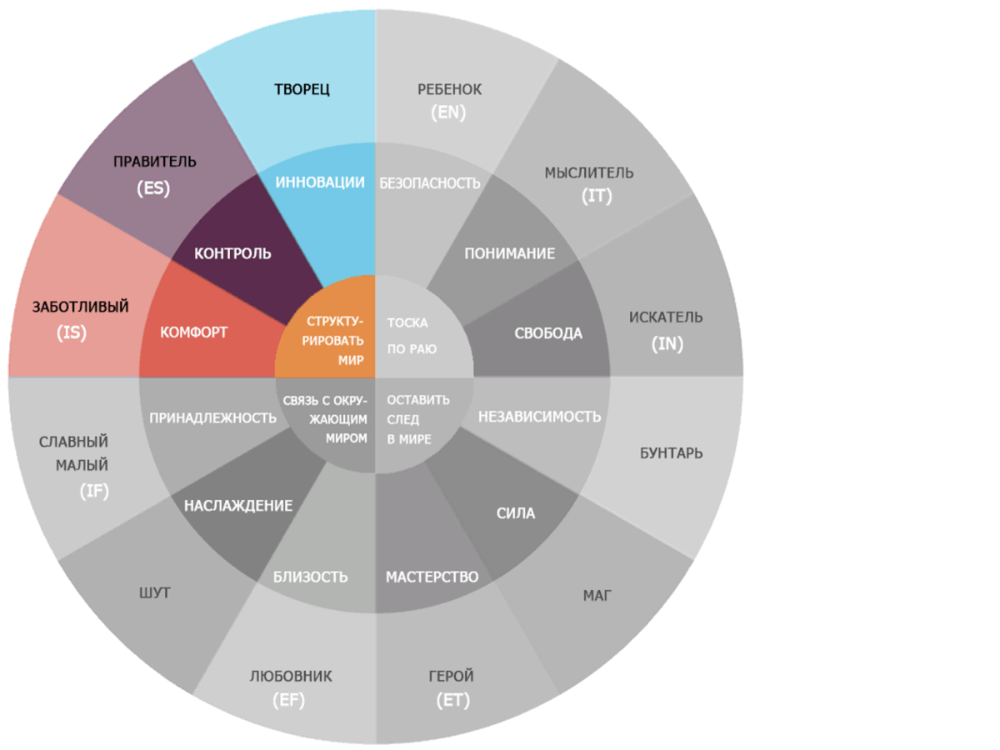
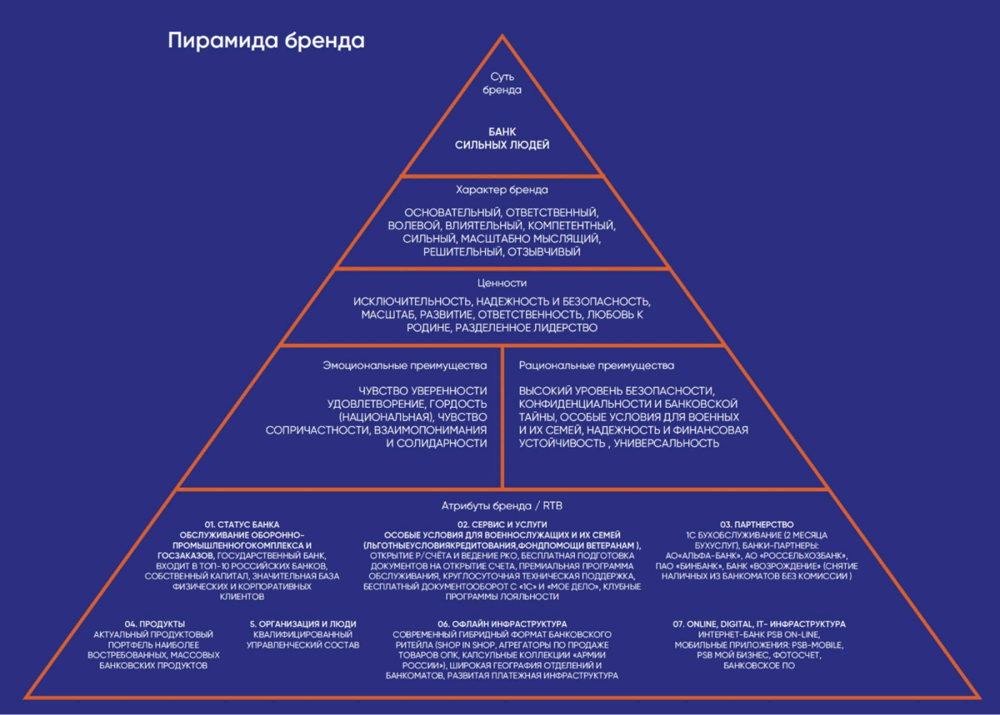
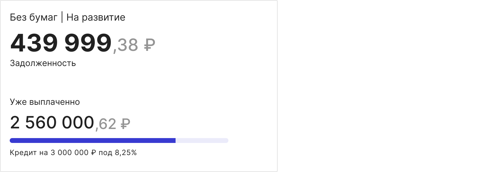

# Voice'n'tone (v 1.2)

**Что такое Voice'n'tone?**  
Это правила и рекомендации, помогающие всем, кто работает с текстами в интерфейсе, писать одинаково (в единой стилистике) от имени банка. Правила распространяются на все тексты в наших интерфейсах: от кнопок и подсказок до рекламы и названий разделов.

**Главные принципы**  
Текст должен выполнять полезное действие. 
Текст — элемент интерфейса, как кнопка или поле ввода. Он помогает решить интерфейсную задачу: объясняет непонятное и убеждает выполнить нужное действие. В интерфейсе ни одно предложение не появляется просто так. Уберите текст, если он не выполняет работу.

**Решаем задачу пользователя**   
Человек использует интерфейс, чтобы решить конкретную задачу или проблему. Мы пишем текст так, чтобы он помогал решить эту задачу здесь и сейчас. Если текст не делает этого или решает другую задачу — мы не используем его.  

**Говорим на языке пользователя**   
Интерфейс должен говорить на том же языке, что говорит человек. Мы создаём продукты для широкой аудитории, поэтому язык интерфейса должен быть универсальным и понятным для всех.
 
**Не перегружаем**  
Однородные члены предложения, сложный синтаксис и избыточная информация перегружают текст. Когда его сложно понять, он не помогает пользователю решить задачу. Чтобы этого избежать, мы пишем кратко, просто и по делу.  

**Для кого?**  
Представьте себе бухгалтера Марию Ивановну, которая 100500 лет проработала в обаятельном интерфейсе 1С. Она оплачивает налоги организации наличными в кассу и сдаёт декларацию заказным письмом. Она так привыкла, это её зона комфорта. Но мы отрубили ей PSB On-line и ей пришлось начать пользоваться «Мой Бизнес». В офисе ей ещё и мобильное приложение на айфон поставили. 
Представьте себе Еремея. Ему 23 и его стартап занимается созданием искусственного интеллекта на квантовом процессоре. Стартап успешно развивается и готовится к IPO. 
Оба этих человека должны легко пользоваться нашей экосистемой. Технические термины и правовые обороты должны быть понятны с первого прочтения обоим типам клиентов.  

**Как?**  
Когда мы пишем текст, мы должны придерживаться двух правил: 
Всегда задавать вопрос: как его поймёт Еремей и Мария Иванновна? Понимают? Отлично!
Мы заботимся о клиентах и делаем их общение с нами приятнее и проще. Задайте себе вопрос: помогает этот текст выполнить их «Job» или пройти сценарий? Неуверены или не поможет — переделывайте или удаляйте.
                                   
## 1. Личность бренда
### Персона
Представить тональность нашего бренда проще, если ассоциировать его с каким-то человеком (персоной). Его характер и стиль определяет то, как он говорит, мыслит, какие поступки он совершает. Попробуйте представить себе этого человека, проявите к нему эмпатию, вживитесь в его роль и вам будет намного проще соответствовать его тональности.
Создавая персону, мы провели серию воркшопов, на которых каждый член команды смог выразить своё видение этой персоны. В результате у нас получился собирательный образ олицетворяющий «банк сильных людей».

**Архетип**  
ПСБ призван структурировать мир — заботиться о своих клиентах, контролировать сферу ГОЗ. При этом у нас есть амбиции создавать инновационные продукты и сервисы.
Забота о клиентах проявляется в первую очередь в безопасности и надёжности. Это человек, на которого можно положиться, готовый помочь советом, когда он нужен.
Правитель и контролёр проявляется в мудрости и взвешенности решений. Он спокойный и вдумчивый, не распыляющийся на ненужные действия, понимающий ценность каждого слова и необходимость каждой фразы.
При этом наша персона молодая, но уже зрелая, имеющая свои амбиции, ум и желание познавать мир. Вместе эти качества создают желание творить новое и улучшать старое, не мирясь с компромиссами.

**Персона**  
Зрелый (35+), опытный профессионал. Он спокоен и уравновешен, умеет принимать решения и брать на себя ответственность за них. Всегда поможет в сложной ситуации, доведёт начатое до конца и при необходимости даст совет. Он лёгок на подъём, с чувством юмора и всегда общается с людьми на равных, будь то начинающий свой путь предприниматель или опытный профессионал.
Подойдут аналогии со знаменитостями: Константин Хабенский, Сергей Безруков, Владимир Машков

### Тональность
Дизайнить тон текста проще, если визуализировать его с персоной, которая его говорит.
В разных ситуациях тональность сообщений немного меняется.

#### Нейтральные сообщения
В нейтральных сообщениях мы эмоционально спокойны. Реплики профессиональны, показывают осведомлённость в тематике. Иногда можно обратиться на «вы», но только когда это диалог, в обычных интерфейсных текстах используйте обороты без личностных местоимений по отношению к пользователю.
Допускается немного индустриального жаргона, но в идеале его стоит избегать. Не все пользователи смогут его понять, даже если вы считаете это общеупотребимым во всей стране. Говорите как обычные люди, а не работники банка.

💚 Правильно:  
Бесплатно выпускаем облачную подпись для онлайн-отправки отчётности в любые контролирующие органы. 

❌ Неправильно:  
Бесплатный выпуск КЭП для отправки отчётности в ФНС.

#### Позитивные сообщения
В позитивных сообщениях используем разговорный язык (меньше официоза) и непринуждённую тональность.

💚 Правильно:  
Мы одобрили вам кредит: просто так, без документов и проверок. Зачисляем сразу.

❌ Неправильно:    
Вам одобрен кредит. Подача документов и их подтверждение не требуется. Зачисление в тот же операционный день.

#### Проблемные сообщения
Если у пользователя возникли какие-то трудности, эмоции и непринуждённое общение будут лишними. Он ждёт от нас хладнокровного, профессионального и быстрого решения проблемы. Официальное общение и индустриальный жаргон (термины) тут уместны.

💚 Правильно:   
Счёт заблокирован по решению финмониторинга. Позвоните нам с 9 до 18 по МСК. [Кнопка: Позвонить в банк] 

❌ Неправильно:  
Мы заблокировали ваш счёт. Позвоните или напишите нам.

### Банк сильных людей
Что значит быть «банком сильных людей»? В чём проявляется эта сила и что она даёт клиентам банка? Сила — в проявлении лучших качеств, которые сильный банк транслирует своим клиентам: щедрость, поддержка хороших начинаний, простота, забота, умение защитить.

👆 Выдержка из брендбука

Для нас «Сила»

В заботе: мы думаем о клиентах

💚 Правильно:   
Разобраться будет проще на примерах (в сравнении между кредитом и овером). 

❌ Неправильно:   
Примеры использования кредитных продуктов.
 
В простоте: мы обычные люди, а не «Великий и Могучий Банк»

💚 Правильно:   
Мы, вместе с 1С, сделали удобный сервис для ведения бухгалтерии. 

❌ Неправильно:   
Промсвязьбанк, совместно с компанией 1С, разработал удобный сервис для ведения бухгалтерии. 
 
В умении защищать

💚 Правильно:   
Осторожно! Удалённые документы не восстановить. 

❌ Неправильно:   
Подтвердите удаление документа.

## 2. Основное
### Время

Наши тексты должны быть всегда в настоящем времени. Мы уже предоставляем сервис и предоставляем его не только читающему текст, но и тысячам других клиентов. Это тоже социальное доказательство. 
Если это кнопка, то действие происходит в настоящее время (online). 
Если это реклама сервиса, то он уже работает и процесс уже идёт.

💚 Правильно:   
Бесплатно выпускаем облачную подпись. 

❌ Неправильно:   
Бесплатно выпустим облачную подпись.  

💡 Исключение:   
Скоро восстановить пароль можно будет через email. 
Возможно, только в анонсе сервисов, которых пока у нас нет. Редкий кейс.

### Активный залог
Текст в интерфейсе призван прояснить и мотивировать на действие. Текст помогает пользователю достичь результата быстрее. Пишите тексты в активном залоге.

💚 Правильно:   
Зажмите виджет, чтобы скрыть его с главного экрана.

❌ Неправильно:   
Скрыть виджет с главного экрана можно долгим нажатием.
 
🎓 Если вы не знаете о чём речь, не отчаивайтесь. Вот ссылка [на статью про залоги.](https://reallanguage.club/grammatika-russkogo-yazyka/grammaticheskie-i-sintaksicheskie-kategorii/zalog-v-russkom-yazyke/) 

### Построение «Мы → Вам»
Банк и наши клиенты — бизнес-партнёры, между которыми должны быть доверительные отношения. В бизнес-среде принято общаться на равных, уважая друг друга. Интерфейс — это инструмент общения клиента с банком и наоборот. Общаясь с обезличенным Банком, клиент чувствует на себе давление. Чувствует, что он общается с огромной машиной, которая может его раздавить или покалечить. Но в банке работают обычные люди, такие же как он.

В интерфейсе не должно быть границ. Мы должны общаться с пользователем на равных. Мы делаем наши сервисы и открываем их клиентам, считая, что они достойны их времени и внимания. Мы несём ответственность за те сервисы, которые даём клиентам.

Мы → Вам — основа построения текста. Банк, Команда, Продукт, Сервис → Мы

Основная идея лучше понятна на примере:

💚 Правильно:   
Теперь предварительный кешбэк по каждой покупке можно посмотреть в истории операций. Мы уже отправили все подробности на вашу электронную почту. 

❌ Неправильно:   
Промсвязьбанк разработал новую функцию отображения и учёта бонусных баллов в приложении PSB-Retаil.

Это мы. В интерфейсе тексты говорят от имени людей, работающих в банке, а не от имени сервиса. Тексты говорят от вашего имени. Когда описывается какое-то действие, то его делаем мы, команда банка, а не безликий сервис. Клиенту неважно кто это делает, человек или машина, ему нужен результат. Это важно нам, поэтому мы работаем вместе с нашими сервисами.
Мы несём ответственность за действия наших сервисов.

**Но:** 
Если текст связан с негативным сообщением, его надо обезличивать:

💚 Правильно:   
В прошлом месяц вам пришло больше кешбэка. 

❌ Неправильно:   
В прошлом месяце мы неверно рассчитали ваш кешбэк

### Вы или вы
В интерфейсе «вы» всегда пишем с маленькой буквы. 
С большой буквы «вы» пишется только в начале предложения или в письмах (только деловых). «Вы» с большой буквы не показывает уважение к клиенту. Уважение к клиенту показывает лаконичный и понятный текст, продукт, решающий его проблемы, и удобный интерфейс.

### Инфостиль
Это про то, как писать без воды. Использование инфостиля — главная метрика удачного текста в интерфейсе «Мой Бизнес». Лучше всех про инфостиль расскажет его популяризатор Максим Ильяхов: https://glvrd.ru/

### Убедительность
В рекламных текстах нельзя быть голословным. Сильные люди не разбрасываются словами, а оперируют фактами. Вместо того чтобы накручивать красивые слова о банке/сервисе/продукте, просто расскажите, чем он хорош.

💚 Правильно:   
3 540 предпринимателей правильно оплатили налоги через нас. 

❌ Неправильно:  
 Предприниматели выбирают нас.

### Глагол
Пользователь пришёл к нам, чтобы совершить действие. Текст в интерфейсе ведёт его по сценарию лучше всего. Используйте сильные глаголы, выражающие однозначное действие. Всегда. Не путайте с отглагольными существительными — они глагол бездействия.

💚 Правильно:   
Мы настраиваем ваш интернет-банк.

❌ Неправильно:   
Мы занимаемся настройкой вашего интернет-банка.

### Главное вперёд
Любое сообщение пользователю должно начинаться с основной, полезной для него информации. В сочетании с активным залогом: сначала действие, потом дополнение.

💚 Правильно:  
Введите имейл, чтобы подключить сервис.

❌ Неправильно:  
Чтобы подключить сервис, введите email.

## 3. Правила
### Форматирование
#### Дата
В повседневном общении мы не говорим о вчерашнем дне December 8, 2019. Мы не используем даты, даже когда говорим о позавчерашнем дне. Когда говорим о завтрашнем или послезавтрашнем. В интерфейсе так и пишем: позавчера, вчера, сегодня, завтра, послезавтра.
Если мы говорим о точной дате, отдалённой более чем на 2 дня, то пишем её полностью, с названием месяца.

☝🏻 Используйте неразрывный пробел!
 
💚 Правильно:   
12 сентября 2018 года начала работу дизайн-лаборатория МСБ.

❌ Не правильно:   
12.09.18 начала работу дизайн-лаборатория МСБ.

#### Валюта
У рубля есть официальный знак — ₽. Используем его всегда.
Есть случаи, где по техническим причинам его использовать не получается. Тогда использовать надо сокращение от слова рубль — руб.

#### ₽
Знак рубля отделяем пробелом.  
☝🏻 Используйте неразрывный пробел!
 
💚 Правильно:  
123 ₽  
123 руб.

❌ Неправильно:  
123₽   
₽123   
123 р. и т.д.  

#### $

В русском языке доллар ставим так же, как и ₽, в конце и отделяем от суммы пробелом. Мы же не говорим «долларов 100»? Мы говорим «100 долларов» или «100 $» (в текстах).

#### Суммы
Суммы в интерфейсах мы всегда разделяем пробелами. Суммы в текстах отделяем пробелами только числа от пяти знаков.
☝🏻 Используйте неразрывный пробел!
 
💚 Правильно (для интерфейса):  
500 ₽  
1 500 ₽  
10 500 ₽   
100 500 ₽  
100 000 500 ₽  

❌ Неправильно (для интерфейса):  
1500 ₽  
10500 ₽  
100500 ₽  
100000500 ₽
 
💚 Правильно (для текстов):  
500 ₽  
1500 ₽   
10 500 ₽  
100 500 ₽  
100 000 500 ₽

❌ Неправильно (для текстов):       
1 500 ₽  
10500 ₽  
100500 ₽  
100000500 ₽

#### Суммы с копейками

**Запятая**

Копейки ставятся через запятую без пробелов. Если есть хотя бы одна копейка, то в дробной части всегда присутствуют 2 цифры. Если копеек в сумме нет, то мы их не показываем (исключение — частные, юридически обоснованные, случаи).

💚 Правильно:  
1 500,10 ₽  
1 300 ₽  

❌ Неправильно:  
1 500, 00 ₽  
1 500.00 ₽  
1 300,00

**Размер суммы и копеек**

Если дизайнер использует шрифт, в названии которого есть Title (или специальный шрифт, где кегль больше 20 pt), то сумма и копейки пишутся разного размера. При этом копейки набираются шрифтом меньшего кегля по ДС. Копейки красятся в серый цвет. 

Если в названии шрифта — Body, Caption (или специальный шрифт, где кегль меньше 20 pt), то сумма и копейки пишутся одного размера. Копейки такого же цвета, как и основная сумма.

💚 Правильно:

 
#### Проценты
Ставки и другие процентные выражения пишутся через запятую, если это десятичное число:

💚 Правильно:  
Ставка по кредиту будет меньше на 0,1%  
Доход до 19,3% годовых  
За год ПИФ вырос на 54,7%

❌ Неправильно:  
Ставка по кредиту будет меньше на 0.1%  
Доход до 19/3% годовых  
За год ПИФ вырос на 54, 7 %
 
#### Телефон
Телефон состоит из кода страны, кода оператора и номера.
По ГОСТу писать вот так: +7 (999) 123-45-67 или так 8 800 333 25 50 (для номеров 8 800)   
☝🏻 Используйте неразрывный пробел!
 
💚 Правильно:  
8 800 333 25 50 — для 8 800  
+7 (999) 123-45-67 — для обычных номеров

❌ Неправильно:  
8 (800) 333-25-50 — для 8 800  
8 999 123-45-67 — для обычных номеров

#### Счёт
Номер счёта пишем с пробелами, без точек и символа № в начале.
Номер счёта всегда пишем через пробелы и не ставим знак №
Маска для счетов всегда такая: 40802 810 5 0000 0000000  
☝🏻 Используйте неразрывный пробел!
 
💚 Правильно:  
40802 810 5 0000 0000000

❌ Неправильно:  
№ 40702.810.7.0000.0025715

#### Маскирование карт и счёта
При отображении номера карты или счета, использовать символы точек «•». В сокращенном виде использовать только два скрытых символа, далее четыре последних цифры карты или счета: •• 1234. При отображении полного номера, где необходимо использовать маскирование, применять формат: 1234 12•• •••• 1234  
Для отображения расчётного счёта в СМБ, необходимо отображать последние 6 цифр, это необходимо для КЦ.  
☝🏻 Используйте неразрывный пробел!
 
💚 Правильно:  
Полный номер: 1234 12•• •••• 1234  
Сокращенный номер карты: •• 1234  
СМБ расчётный счет : •• 123456

❌ Неправильно:  
Полный номер: 1234 12** **** 1234  
Сокращенный номер карты: ** 1234  
Сокращенный номер карты: **** 1234

💚 Правильно:  
Полный номер: 1234 12•• •••• 1234  
Сокращенный номер карты: •• 1234

❌ Неправильно:  
Полный номер: 1234 12** **** 1234  
Сокращенный номер карты: ** 1234
 
#### Неразрывный пробел  
На маке option + space  
В коде &nbsp;  
На венде alt+255   
Редактируйте с разработчиками уже в коде
 
Со всем этим может помочь [Типограф](https://www.artlebedev.ru/typograf/) 
 
### Графика
Вместо тысячи слов покажите наглядно.
Мозг человека намного быстрее считывает графическую информацию, чем текстовую

### Кнопки и контролы
**Глагол**  
Помните про активный залог и побуждение к действию? Вот тут можно освежить.
Нажатие на кнопки и контролы — это те действия, которых мы ждём от пользователя. Кнопки должны содержать глаголы, указывающие на дальнейшие действия.

💚 Правильно:  
Сохранить   
Продолжить   
Оплатить/Отправить/Заказать

❌ Неправильно:   
Ок   
Далее  

💡 Исключение:   
В пошаговых формах действие возвращающее на предыдущий шаг называем «Назад»

**Предмет**  
Пользователь должен жить в полностью понятном и определённом для него сценарии. От нажимаемых им кнопок будет больше ясности, если они содержат предмет действия.
К примеру, вы отправляете заявление на какую-то услугу:

💚 Правильно:  
Отправить заявление   
Подключить бухгалтерию

❌ Неправильно:   
Отправить   
Подключить услугу

### Банк с маленькой буквы
Мы банк сильных людей, но банк с маленькой буквы «б».
В бизнесе общаются «на равных» и когда мы где-то используем слово «Банк» с большой буквы, мы выделяем себя над клиентом.
Слово «банк» не имя собственное. Это просто существительное и если мы не пишем по-немецки, то существительные пишутся с маленькой буквы.

**Правописание названия**  
Наше формальное название ПАО «Промсвязьбанк». В интерфейсе мы стараемся его не использовать, а просто пишем ПСБ. ПСБ — наше маркетинговое название.

Названия мы пишем по правилам:
Названия в кавычках
Название банка пишется в кавычках, когда оно объявляется

💚 Правильно:   
ПАО «Промсвязьбанк»   
банк «Промсвязьбанк»   
Искренне ваш, ПСБ Митап от ПСБ

❌ Неправильно:   
ПАО ПСБ   
ПАО Промсвязьбанк

**В простом тексте**  
Когда название упоминается в тексте без подводящих слов и пафоса, но

💚 Правильно:   
ПСБ участвует на экономическом форуме в Давосе.

❌ Неправильно:   
«ПСБ» — банк сильных людей.
 
### Англицизмы
Все иностранные слова в тексте стараемся заменять русскими устоявшимися терминами, например:  
СМС (Вместо SMS)  
Электронная почта // Эл. почта (когда мало места) - вместо E-mail  
Пуш-уведомления // Пуш (Вместо PUSH. Большинство в индустрии перешло на русское написание). Допускается склонять, например Пуши // Пушами.
 
Если места для термина нет, в качестве исключения используем официальное нормативное написание слова в справочнике «Академос» Института русского языка РАН: https://orfo.ruslang.ru/search/word . Этот же сервис используем, если не знаем, как пишется какое-то слово.
 
🔔 На момент публикации редполитики все англицизмы, кроме push, имеют русское написание:  
СМС  
Имейл  
ПИН-код  
Push
 
### Простые, но важные правила
В этой версии это последнее правило.
 
**Кавычки**  
Используем кавычки «ёлочки» для первого уровня и „лапки” для второго.

Пример:    
АО «Золотодобывающая компания „ Полюс“»
 
В русской раскладке для mac:  
Открывающая кавычка « Option + shift + =  
Закрывающая кавычка » Option + =  

Для винды:  
Открывающая кавычка « Alt + 187  
Закрывающая кавычка » Alt + 171  
Инструкция🤦‍♂️: зажмите Alt и набирайте цифры. Цифры набираются на боковой клавиатуре! Проверьте обязательно нажат ли у вас Num Lock

**Тире и дефис**  
Это два разных символа и там, где надо ставить тире, должно стоять оно. Оно самое длинное.  
Это дефис - (он же минус и он же минус на клавиатуре)

Цитата Лебедева:   
«Подавляющее большинство современной печатной продукции делается дизайнерами, которым известен только один знак: дефис. Получилось так потому, что на клавиатуре персонального компьютера только он доступен без дополнительных усилий».
 
Это короткое тире –  
Это тире —

В русской раскладке для mac:  
Дефис -  
Короткое тире – Option + -  
Тире — Option + Shift + -  

Для винды:  
Дефис -  
Короткое тире – Alt + 150  
Тире — Alt + 151  
Инструкция🤦‍♂️: зажмите Alt и набирайте цифры. Цифры набираются на боковой клавиатуре! Проверьте обязательно нажат ли у вас Num Lock

Дефис употребляется:  
для присоединения частиц (кто-либо, где-то);  
для присоединения префиксов (во-первых, по-русски);  
в качестве знака сокращения (физ-ра, г-ца);  
в словосочетаниях и сложносоставных словах (ковер-самолет, бизнес-ланч, интернет-кафе);  
в качестве знака переноса (в интернете сегодня прак-тически не встречается).

Тире употребляется:  
на месте отсутствующего члена предложения (А ты любишь пирог с зеленым луком? Я — страсть как!);  
между подлежащим и сказуемым (Дважды два — четыре);  
для выделения прямой речи (— Да. Я согласна прожить с тобой под знаком ордериоморфизма до конца жизни, — отчеканила Селезнёва);  
для обозначения пауз (А она — возьми да и поставь знак полустрогого покомпонентного соответствия, дура!);  
для указания маршрутов (поезд Москва — Санкт-Петербург).

Короткое тире употребляется:  
Традиционно в англо-американской типографике диапазоны чисел обозначаются коротким тире (иногда его еще называют средним).   Представляется разумным ввести этот символ для обозначения диапазонов при числах и в русскую типографику. Наше классическое длинное тире сегодня в роли диапазона выглядит длинноватым.  

Тире:    
2009—2020  

Короткое тире:  
2009–2020  

Конечно же, в тексте роль диапазона по-прежнему будет играть длинное тире («Серп и Молот — Карачарово»). Конечно же, в телефонных номерах по-прежнему будут использоваться дефисы и пробелы (+7 (812) 212-85-06).
§ 158. Короткое тире

**Висячие предлоги**  
Строка не должна заканчиваться предлогами менее трёх букв.
Для этого после предлога надо ставить неразрывный пробел. Не новую строку!

💚 Правильно:  
Мама мыла раму  
и не смогла её помыть!  
Тоже правильно:  
Мама мыла раму без  
перчаток!

❌ Неправильно:  
Мама мыла раму и  
не смогла её помыть по  
диагонали!

Неразрывный пробел:  
На маке option + space  
В коде &nbsp;  
На венде alt+255 (c numpad'a 🤦‍♂️) Редактируйте с разработчиками уже в коде
 
Со всем этим может помочь
[Типограф](https://www.artlebedev.ru/typograf/) 

#### Списки
Вместо того чтобы длинно и заумно описывать доработки приложения, составьте список с главными тезисами. Начинайте список с новой строки. Так клиенту будет проще найти нужный пункт. И запомните ещё несколько правил.

**1. Не оставляйте висячий предлог**

💚 Правильно:  
В новой версии приложения появились:   
• выбор продуктов;   
• сторис.  
  
❌ Неправильно:  
В новой версии приложения сделали упор на:  
• функциональности;  
• удобстве.

**2. Обозначайте список**  

Для обозначения списка используйте цифры и значки. После цифры можно поставить скобку или точку. 

Цифры с закрывающейся скобкой используют, если объём текста в пунктах не больше одного предложения. 

В новой версии приложения появились:  
1) выбор продуктов,  
2) сториз. 

Цифры с точкой используют, если список состоит из нескольких предложений.  

В новой версии приложения появились:  
1. Выбор продуктов. Теперь вы можете подключить услугу сразу в мобильном банке.   
2. Сториз. Читайте о продуктах ПСБ и скидках партнёров банка, интересных местах и исторических событиях России и мира.

Знаки-буллиты (точки, кружки, тире) используют, если список не требует определённого порядка.

**3. С какой буквы начинать список**  
   
Если текст обозначен цифрой с точкой, то каждый пункт начинают с прописной буквы. В конце каждого пункта – точка.

В новой версии приложения появились:  
      1. Выбор продуктов. Теперь вы можете подключить услугу сразу в мобильном банке.  
      2. Сториз. Читайте о продуктах ПСБ и скидках партнёров банка, интересных местах и исторических событиях России и мира.

Если пункты списка состоят из одного или нескольких слов и обозначены цифрой или буквой со скобкой, то каждый пункт начинают со строчной буквы.

В новой версии приложения появились:  
    1) выбор продуктов,  
    2) сторис.

**4. Как проставить знаки препинания**  
   
Обязательно ставьте знаки препинания в конце пунктов списка. А вот как выбрать между запятой, точкой с запятой и точкой, разберём на примерах.
Если каждый из пунктов состоит из одного слова, а сам список обозначен цифрой со скобкой или значком, ставим запятую

В новой версии приложения появились:  
• выбор продуктов,  
• сторис.

Если список состоит из нескольких слов, внутри которых есть знаки препинания, то ставим точку с запятой.

В новой версии приложения появились:  
• выбор продуктов, который поможет подключить услугу;  
• сторис, которые расскажут об интересных фактах из истории России.

Если пункты перечня состоят из нескольких предложений, ставим точку.

В новой версии приложения появились:
Выбор продуктов. Теперь вы можете подключить услугу сразу в мобильном банке.
Сторис. Читайте о продуктах ПСБ и скидках партнёров банка, интересных местах и исторических событиях России и мира.

В конце последнего пункта всегда ставится точка.

#### Заголовки
Главная цель заголовка — зацепить внимание клиента. Однако в погоне за его привлекательностью важно помнить о знаках препинания. Заголовок нельзя заканчивать точкой. Можно поставить знак вопроса или восклицания, если это добавит фразе веса. Но лучше всё-таки обходиться без них.

💚 Правильно:  
Сэкономьте 15% на СМС-инфо

❌ Неправильно:  
Сэкономьте 15% на SMS-инфо.
 
Если заголовок состоит из цифры, начинайте текст, следующий за ним, со строчной буквы. В этом случае заголовок и текст составляют единую смысловую конструкцию и воспринимаются как одно предложение.

💚 Правильно:  
15%
можно сэкономить на СМС-информировании

❌ Неправильно:   
15%
Можно сэкономить на SMS-информировании
 
#### Пунктуация: точки
💡 Точка не ставится, если заголовок, подзаголовок, пункт меню или пункт описания продукта состоит из одного предложения.
 
💚 Правильно:

 

❌ Неправильно:

 

💡 Если заголовок, подзаголовок или описание состоит из двух предложений, точка ставится в обоих.
 
💚 Правильно:

 

❌ Неправильно:  

 
 
💡 Точка ставится, если из шаблонного описания продукта или пользовательского пути мы переходим к сложной коммуникации с клиентом и повествованию. Чаще всего это происходит в разделе «Что нового в приложении» или в часто задаваемых вопросах. Такие коммуникации подразумевают диалог, а не просто описание продукта или функционала.
 
💚 Правильно:

 

❌ Неправильно:

 

### Соответствие платформе
Термины, которые подходят для компьютера, не всегда подойдут для телефона.  

К примеру на телефоне:  
💚 Правильно:   Нажмите на кнопку...  
❌ Неправильно:   Кликните на кнопку…

### Названия
#### Составные названия
Названия, состоящие из двух частей, пишутся через дефис:

💚 Правильно:  
СМС-инфо  
Push-уведомления  
Имейл-рассылка  
Онлайн-школа  

❌ Неправильно:  
SMS информирование  
Push уведомления  
Email рассылка  
Online школа

#### Названия в кавычках
Названия продуктов, организаций, учреждений, предприятий, акционерных обществ, фирм и 
т. д. заключаем в кавычки!

💚 Правильно:  
Мы запустили «Кредит Золотой», который доступен в разделе «Кредиты».

❌ Неправильно:  
Мы запустили Кредит Золотой, который доступен в разделе Кредиты.

#### Кавычки в заголовках
 👉 Если заголовок только из названия, то кавычки не нужны.
 
💚 Правильно:  
Кредит Золотой

❌ Неправильно:  
«Кредит Золотой»

👉 Если заголовок состоит не только из названия, то кавычки остаются.
 
💚 Правильно:  
Раздел «Кредит Золотой»

❌ Неправильно: 
Раздел Кредит Золотой

Подробные правила употребления кавычек:
Как правильно употреблять кавычки в собственных наименованиях - "Грамота.ру" - справочно-информационный Интернет-портал "Русский язык"

#### Названия из нескольких слов
Название банка или продукта, если оно из двух слов, не может переноситься на новую строку по частям. Должны быть неразрывные пробелы.

💚 Правильно:  
Мы открываем новый продукт
«Кредит Золотой»

❌ Неправильно:  
Мы открываем новый продукт «Кредит
Золотой»

#### Названия в навигации
Правила навигации и названия разделов: куда нажали, то и в заголовке на следующем уровне.  
💡 Названия функций нужно писать везде одинаково!

### Даты
В повседневном общении мы не говорим о вчерашнем дне December 8, 2019. Мы не используем даты, даже когда говорим о позавчерашнем дне. Когда говорим о завтрашнем или послезавтрашнем. В интерфейсе так и пишем: позавчера, вчера, сегодня, завтра, послезавтра.
Если мы говорим о точной дате, отдалённой более чем на 2 дня, то пишем её полностью, с названием месяца.

💚 Правильно:   
12 сентября 2018 года начала работу дизайн-лаборатория МСБ.
  
❌ Неправильно:   
12.09.18 начала работу дизайн-лаборатория МСБ. 

### Ёё
В русском языке есть буква «Ё», «ё».
Без неё слова меняют значение или становятся безграмотными.
Пишите букву Ё

Потому что закон!  
Федеральный закон РФ от 01.07.2005, № 53 «О государственном языке РФ» статья 3, обязывает использование буквы «ё» во всех официальных документах, таких как удостоверение личности, паспорте, свидетельства о регистрации актов гражданского состояния, документы об образовании в именах и фамилиях граждан РФ.

Нюансы  
Теоретически возможна замена Ё → Е. Вот что об этом есть в вики:
Традиционно в русском правописании существует правило, допускающее замену буквы «ё» на букву «е». Целью такой замены является удобство читателей, которые «спотыкаются» о выпирающее из привычного ряда букв двоеточие. Предполагается, что читатель, знакомый с правописанием большинства слов русской речи, вполне способен самостоятельно восстановить звук «ё» в соответствующих местах. "..." Это не означает запрета на букву «ё». В тех случаях, где возможно двоякое написание («все»/«всё») и где один из вариантов не следует из контекста, следует использовать букву «ё».

Ставить или нет?  
Ставить всегда, когда слово может изменить смысл, когда пишите небольшую фразу, примечание, подсказку и т. д.
Допускается пропуск буквы «Ё» только в больших массах текста, по обоюдному согласию дизайнера и автора текста.

### Валюта
У рубля есть официальный знак — ₽. Используем его всегда.
Есть случаи, где по техническим причинам его использовать не получается. Тогда использовать надо сокращение от слова рубль — руб.

**₽**   
Знак рубля отделяем пробелом.
 
💚 Правильно: 
123 ₽  
123 руб.
 
❌ Неправильно:
123₽  
₽123  
123 р. и т.д.  

**$**  
В русском языке доллар ставим так же, как и ₽, в конце и отделяем от суммы пробелом. Мы же не говорим «долларов 100»? Мы говорим «100 долларов» или «100 $» (в текстах).

## 4. Дополнительно
**Чек-лист здорового текста**    
Правил очень много, но для соблюдения основных достаточно проверить этот текст по чек-листу:  
      1. Несёт пользу для клиента?  
      2. Учли персону и тональность?  
      3. Построение «Мы → Вам»?  
      4. В активном залоге с сильными глаголами?  
      5. Подтвердили фактами там, где что-то утверждаем (зачастую в рекламе)?  
      6. Текст ведёт пользователя по интерфейсу/сценарию?
      7. Есть буква «Ёё»?  
      8. Нет канцеляризмов, газетных штампов и прочего мусора?  
      9. По главреду набрали 7,5 или более?    
      10. Оттипографили?  

## Полезные ссылки
🎓 **Научиться**  
Ничто не научит писать тексты лучше, чем книга «Пиши, сокращай».   
Купить тут: http://book.glvrd.ru/ 
 
📚 **Почитать**  
Все выпуски рассылки Главреда. Эксперимент: http://maximilyahov.ru/blog/all/availability/     
Справочник Главреда: https://soviet.glvrd.ru/ 
 
⚙️ **Сервисы**  
Главред: https://glvrd.ru/   
Типограф: https://www.artlebedev.ru/typograf/   
Правила русского языка: https://therules.ru/ 

